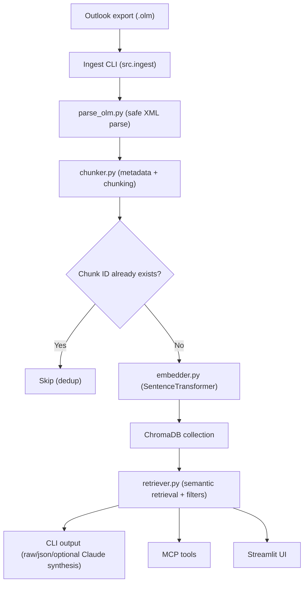
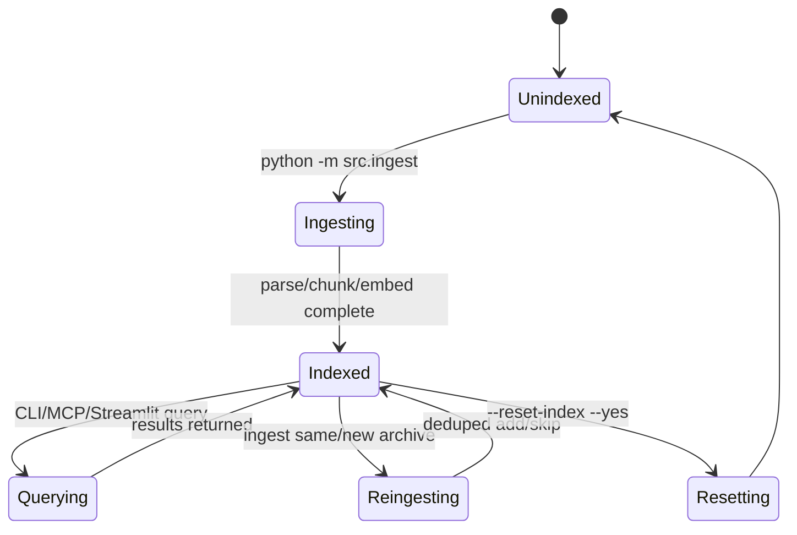

# Email RAG - Search Your Outlook Emails Locally

Local Retrieval-Augmented Generation (RAG) for Outlook `.olm` exports.

Interfaces:
- CLI search and operations
- MCP server tools for agent/tool integrations
- Optional local Streamlit UI

Everything runs locally, except optional Claude answer synthesis when `ANTHROPIC_API_KEY` is set.

## Quick Start

```bash
python3 -m venv .venv
source .venv/bin/activate
pip install -r requirements.txt
```

1. Export mail from Outlook for Mac as `.olm`.
2. Place it in `data/`.
3. Ingest:

```bash
python -m src.ingest data/your-export.olm
```

## How It Works



## Lifecycle



## Operational Commands

### Ingest

```bash
# Full ingest
python -m src.ingest data/your-export.olm

# Partial ingest for testing
python -m src.ingest data/your-export.olm --max-emails 200 --batch-size 250

# Parse/chunk only (no DB writes)
python -m src.ingest data/your-export.olm --dry-run
```

### CLI Search

```bash
# Interactive mode
python -m src.cli

# Single query
python -m src.cli --query "Q3 budget approval"

# Unified filtered query
python -m src.cli --query "contract renewal" --sender legal --date-from 2024-01-01 --date-to 2024-12-31

# JSON output for automation
python -m src.cli --query "security review" --json --no-claude
```

### Stats / Senders / Reset

```bash
python -m src.cli --stats
python -m src.cli --list-senders 25

# Destructive operation (requires --yes)
python -m src.cli --reset-index --yes
```

## MCP Server

Run:

```bash
python -m src.mcp_server
```

MCP tools:
- `email_search`
- `email_search_by_sender`
- `email_search_by_date`
- `email_list_senders`
- `email_stats`
- `email_search_structured` (stable JSON output for automation clients)

## Streamlit UI (Optional)

```bash
streamlit run src/web_app.py
```

Includes:
- query + top-k + sender/date filters
- result browser with metadata and content preview
- sidebar stats and top senders
- JSON download for current results

## Configuration

Use `.env` (see `.env.example`):

```bash
ANTHROPIC_API_KEY=your_anthropic_api_key_here  # Optional (CLI Claude synthesis)
CHROMADB_PATH=data/chromadb
EMBEDDING_MODEL=all-MiniLM-L6-v2
COLLECTION_NAME=emails
TOP_K=10
CLAUDE_MODEL=claude-sonnet-4-20250514
LOG_LEVEL=INFO
```

## Deduplication and Re-ingestion

Ingestion deduplicates by chunk ID. Chunk IDs are derived from `Email.uid`:
- preferred: hash of `message_id`
- fallback: hash of `subject|date|sender_email`

Re-running ingest on the same archive skips already indexed chunks.

## Development

```bash
pip install -r requirements-dev.txt
ruff check .
pytest -q
bandit -r src -q
python -m pip_audit -r requirements.txt
```
