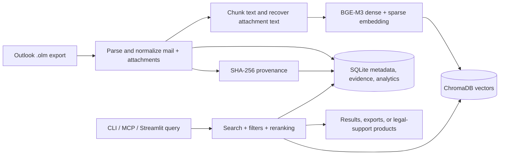
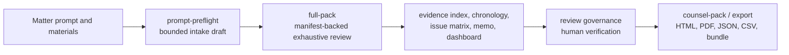
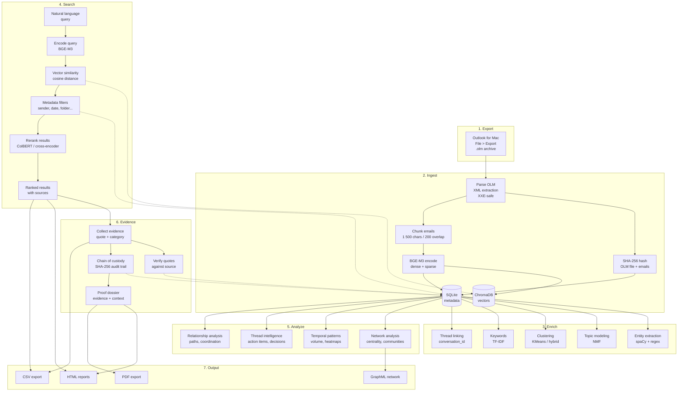

# Email RAG

Search your Outlook emails with natural language — no cloud, no subscriptions, everything stays on your Mac.

> **MCP-native:** Any compatible MCP client can call the built-in tools directly. Your emails never leave your machine. No API keys required.

---

## What This Does

You export your mailbox from Outlook for Mac once, run a one-time indexing step, and then ask your MCP client questions like:

- *"Find emails about the Q3 budget from finance@company.com"*
- *"What did legal say about the contract renewal in January?"*
- *"Show me everything from Sarah about the product launch"*
- *"Who are my top 10 email contacts?"*
- *"Summarize the thread about the server migration"*
- *"What action items came out of last week's emails?"*
- *"Find emails similar to this one about the contract"*
- *"Analyze the writing style of emails from marketing"*
- *"Export the conversation about the contract renewal as a PDF"*
- *"Browse through all my emails from January, 20 at a time"*

Your client reads the indexed emails and gives you precise, sourced answers — without touching Outlook again.

---

## How It Works





**Key properties:**
- All processing runs on your Mac — CPU works, Apple Silicon GPU (MPS) accelerates 3-10×
- Emails are stored in local databases (`data/chromadb/`, `data/email_metadata.db`) that only you can access
- Re-indexing is safe and idempotent — already-indexed emails are skipped automatically
- Semantic search finds relevant emails even when you don't remember the exact words
- NLP pipeline provides clustering, entity extraction, and thread intelligence

## Documentation Map

- [docs/README.md](docs/README.md) for the public docs index
- [docs/CLI_REFERENCE.md](docs/CLI_REFERENCE.md) for terminal usage
- [docs/MCP_TOOLS.md](docs/MCP_TOOLS.md) for the full MCP tool surface
- [docs/RUNTIME_TUNING.md](docs/RUNTIME_TUNING.md) for performance and model-loading guidance
- [docs/API_COMPATIBILITY.md](docs/API_COMPATIBILITY.md) for stability expectations
- [docs/agent/](docs/agent) for the shipped legal-support contract docs

---

## Before You Start

You need:

| Requirement | How to check |
|------------|-------------|
| **Mac** (Outlook for Mac .olm format) | — |
| **Python 3.11 or newer** | `python3 --version` in Terminal |
| **Git** | `git --version` in Terminal |

If you don't have Python 3.11+, download it from [python.org](https://python.org/downloads/).

---

## Setup (First Time Only)

### Step 1 — Get the code

Open Terminal and run:

```bash
git clone <repository-url>
cd outlook-email-rag
```

### Step 2 — Create a virtual environment

This keeps the project's dependencies isolated from the rest of your system:

```bash
python3 -m venv .venv
source .venv/bin/activate
pip install -r requirements.txt
pip install -e .
```

You should see packages being installed. This takes a few minutes the first time because the local models may be downloaded and cached.

> **Tip:** You need to run `source .venv/bin/activate` every time you open a new Terminal window for this project. You'll know it's active when you see `(.venv)` at the start of your prompt.

### Step 3 — Export your mailbox from Outlook

1. Open **Outlook for Mac**
2. Go to **File > Export...** (or **Tools > Export** depending on your version)
3. Choose **Outlook for Mac Data File (.olm)**
4. Select the folders you want to export (or all folders)
5. Save the `.olm` file into the local-only `private/ingest/` folder inside the project

```
outlook-email-rag/
└── private/
    └── ingest/
        └── my-export.olm   <- put it here
```

`private/` is ignored by Git and is meant for real mailbox exports, case files, and local smoke inputs that must not be published.

Keep tracked `data/` and `tests/fixtures/` content sanitized. Do not put real mailboxes, personnel records, or live matter files there.

### Step 4 — Index your emails

```bash
python -m src.ingest private/ingest/my-export.olm
```

This reads every email, splits them into searchable chunks, and stores them in local databases. You'll see progress output like:

```
[INFO] Parsing: private/ingest/my-export.olm
[INFO] Found 1 842 emails
[INFO] Warming up embedding model …
[INFO] Loaded SentenceTransformer from cache: BAAI/bge-m3 (device=mps)
[INFO] Model warmed up: BAAI/bge-m3 (backend=sentence_transformer, device=mps, batch_size=32)
[INFO] Model preload complete (5.5s)
[INFO] Batch 1 done (500 chunks, 98.2s, 5.1 chunks/s)
[INFO] Batch 2 done (500 chunks, 101.4s, 4.9 chunks/s)
...
=== Ingestion Summary ===
Emails parsed:   1 842
Chunks created:  4 210
Chunks added:    4 210
Chunks skipped:  0
Total in DB:     4 210
Elapsed:         14m 22s
```

> **Large mailboxes:** For a quick test first, you can limit to the first 200 emails:
> `python -m src.ingest private/ingest/my-export.olm --max-emails 200`

> **Re-running is safe:** If you export an updated `.olm` later, running ingest again skips emails that are already indexed.

### Step 5 — Start the MCP server

```bash
.venv/bin/python -m src.mcp_server
```

Point your MCP client at the same command if you want tool access from an external assistant.

**That's it.** You can now query your archive from the CLI, web UI, or any MCP client.

---

## Using with an MCP Client

Email RAG exposes 58 MCP tools. Any compatible client can talk to your local email index in plain English.

### How it connects

Configure your client to start the MCP server like this:

```json
{
  "mcpServers": {
    "email_search": {
      "command": ".venv/bin/python",
      "args": ["-m", "src.mcp_server"],
      "cwd": "."
    }
  }
}
```

Use absolute paths if your client launches servers from a different working directory.

### Verifying the connection

After connecting your client, verify that the tools loaded:

1. Open your client's MCP server/status view
2. Look for `email_search` in the server list — it should show as **connected**
3. You should see all 58 tools listed beneath it

If it shows as disconnected:
- Make sure the virtual environment exists: `ls .venv/bin/python`
- Make sure dependencies are installed: `.venv/bin/python -c "from src.mcp_server import mcp; print('OK')"`
- Restart the MCP client after updating its server command

### Asking questions

Just talk to your MCP client naturally. It should pick the right tool automatically based on your question. Here are examples organized by what you can do:

**Dedicated workplace case analysis:**

Use the dedicated `email_case_analysis` workflow when you need a structured review of potentially hostile, exclusionary, retaliatory, discriminatory, manipulative, or mobbing-like communication patterns.

When the shared matter products are stable enough for handoff, use `email_case_export` to write portable counsel-handoff HTML/PDF, exhibit-register CSV/JSON, dashboard CSV/JSON, or a zipped handoff bundle from the same case-analysis payload.

This workflow is meant for conservative evidence review, not for free-form prompting and not for legal conclusions. The final report is designed to distinguish among:

- ordinary workplace conflict
- poor communication or process noise
- targeted hostility concern
- unequal-treatment concern
- retaliation concern
- discrimination concern
- mobbing-like pattern concern
- insufficient evidence

The workflow is intentionally conservative:

- it separates authored text, quoted text, and metadata/omission evidence
- it should surface strongest indicators and strongest counterarguments together
- it should say `insufficient evidence` clearly when the record does not justify a stronger read
- it should not infer motive, legal liability, or protected-category discrimination from weak evidence alone

CLI example:

```bash
python -m src.cli case prompt-preflight --input matter.md --output preflight.json
python -m src.cli case analyze --input case.json --output case-analysis.json
python -m src.cli case full-pack --prompt matter.md --materials-dir ./matter --output handoff.bundle
python -m src.cli case counsel-pack --case-scope scope.json --materials-dir ./matter --output handoff.zip
```

Use `case prompt-preflight` when the operator only has a long natural-language matter description. It extracts a conservative draft intake, identifies missing structured fields such as `trigger_events` or `comparator_actors`, and stays explicitly below the threshold for counsel-grade exhaustive review.

Use `case full-pack` when the operator has a long matter prompt plus a directory of supplied materials but does not want to hand-build the full structured intake first. The command now:

- runs prompt preflight
- builds a conservative `matter_manifest` from the materials directory
- merges optional structured overrides
- stops with explicit blockers when the matter is still underspecified
- otherwise runs the downstream exhaustive legal-support workflow and can write an export artifact

Use `--compile-only` when you only want the blocker-or-ready compiled intake and do not want to run the downstream exhaustive workflow yet.

Minimal intake example:

```json
{
  "case_scope": {
    "target_person": {
      "name": "Max Mustermann",
      "email": "max@example.org"
    },
    "suspected_actors": [
      {
        "name": "Erika Beispiel",
        "email": "erika@example.org"
      }
    ],
    "allegation_focus": ["retaliation", "exclusion"],
    "analysis_goal": "hr_review",
    "date_from": "2025-01-01",
    "date_to": "2025-06-30"
  },
  "source_scope": "emails_and_attachments"
}
```

When `source_scope` is `mixed_case_file`, the intake can include:

- `chat_log_entries`
- native `chat_exports`
- manifest-backed chat artifacts in `matter_manifest`

For operator workflows that already have a bounded case scope plus a directory of supplied files, use `case counsel-pack`. That command builds a conservative manifest from the materials directory, forces an exhaustive manifest-backed legal-support review, and writes a portable counsel-facing artifact through the shared export pipeline.

The dedicated legal-support tools remain strict about exhaustive review:

- prompt preflight drafts intake only
- `case analyze` can run retrieval-bounded exploratory review
- `case counsel-pack` and the dedicated `email_case_*` legal-support product tools still require manifest-backed `exhaustive_matter_review`

For serious retaliation, discrimination, or unequal-treatment review, a stronger intake is recommended:

- `trigger_events` for retaliation-style analysis
- `comparator_actors` for unequal-treatment or discrimination-style analysis
- `org_context` for power and dependency analysis
- `context_notes` for neutral background facts that affect interpretation

Common operator patterns:

Retaliation review:

```json
{
  "case_scope": {
    "target_person": {
      "name": "Max Mustermann",
      "email": "max@example.org"
    },
    "suspected_actors": [
      {
        "name": "Erika Beispiel",
        "email": "erika@example.org",
        "role_hint": "manager"
      }
    ],
    "allegation_focus": ["retaliation"],
    "analysis_goal": "hr_review",
    "trigger_events": [
      {
        "trigger_type": "complaint",
        "date": "2025-03-01",
        "notes": "Formal complaint submitted by the target person."
      }
    ],
    "context_notes": "Team conflict after escalation about workload and deadlines.",
    "date_from": "2025-01-01",
    "date_to": "2025-06-30"
  },
  "source_scope": "emails_and_attachments"
}
```

Unequal-treatment or discrimination-style review:

```json
{
  "case_scope": {
    "target_person": {
      "name": "Max Mustermann",
      "email": "max@example.org"
    },
    "suspected_actors": [
      {
        "name": "Erika Beispiel",
        "email": "erika@example.org",
        "role_hint": "manager"
      }
    ],
    "comparator_actors": [
      {
        "name": "Pat Vergleich",
        "email": "pat@example.org",
        "role_hint": "employee"
      }
    ],
    "allegation_focus": ["unequal_treatment", "discrimination"],
    "analysis_goal": "lawyer_briefing",
    "org_context": {
      "reporting_lines": [
        {
          "manager": {"name": "Erika Beispiel", "email": "erika@example.org"},
          "report": {"name": "Max Mustermann", "email": "max@example.org"},
          "source": "operator"
        }
      ]
    },
    "context_notes": "Both employees were assigned comparable tasks in the same process stage.",
    "date_from": "2025-01-01",
    "date_to": "2025-06-30"
  },
  "source_scope": "emails_and_attachments"
}
```

Mobbing or bossing-style review:

```json
{
  "case_scope": {
    "target_person": {
      "name": "Max Mustermann",
      "email": "max@example.org"
    },
    "suspected_actors": [
      {
        "name": "Erika Beispiel",
        "email": "erika@example.org",
        "role_hint": "manager"
      }
    ],
    "allegation_focus": ["mobbing", "abuse_of_authority", "exclusion"],
    "analysis_goal": "formal_complaint",
    "org_context": {
      "role_facts": [
        {
          "person": {"name": "Erika Beispiel", "email": "erika@example.org"},
          "role_type": "manager",
          "title": "Team Lead",
          "source": "operator"
        }
      ],
      "reporting_lines": [
        {
          "manager": {"name": "Erika Beispiel", "email": "erika@example.org"},
          "report": {"name": "Max Mustermann", "email": "max@example.org"},
          "source": "operator"
        }
      ]
    },
    "context_notes": "Review repeated exclusion, public correction, and hierarchy-based pressure in the same period.",
    "date_from": "2025-01-01",
    "date_to": "2025-06-30"
  },
  "source_scope": "emails_only"
}
```

Neutral chronology:

```json
{
  "case_scope": {
    "target_person": {
      "name": "Max Mustermann",
      "email": "max@example.org"
    },
    "allegation_focus": ["hostility", "exclusion"],
    "analysis_goal": "neutral_chronology",
    "context_notes": "Summarize what happened before any HR or legal interpretation.",
    "date_from": "2025-01-01",
    "date_to": "2025-06-30"
  },
  "source_scope": "emails_only"
}
```

The workflow also emits machine-readable intake warnings when the request is under-specified. Typical downgrade cases are:

- retaliation focus without `trigger_events`
- unequal-treatment or discrimination focus without `comparator_actors`
- power-heavy review without `org_context`
- high-stakes review without `context_notes`
- broad actor analysis without `suspected_actors`

These warnings appear in `case_scope_quality.warnings`, `case_scope_quality.recommended_next_inputs`, and the report's `missing_information` section.

**Searching emails:**

```
Search my emails for anything about the annual budget review from Q1 2024.
```
```
Find emails from legal@company.com about the NDA we signed last year.
```
```
Show me emails about the product launch that were sent to marketing@company.com.
```
```
Find emails similar to this: "We need to reschedule the board meeting due to travel conflicts."
```

**Understanding your archive:**

```
What folders do I have in my archive? How many emails are in each?
```
```
Show me my archive statistics — how many emails, date range, top senders.
```
```
Who are my top 10 email contacts? Show communication stats for each.
```
```
Show me the communication patterns between me and john@company.com.
```

**Thread analysis:**

```
Summarize the thread about the server migration.
```
```
What action items came out of recent emails about the product launch?
```
```
What decisions were made in the thread about the Q4 hiring plan?
```

**Analytics and insights:**

```
Show me my email volume by month for the past year.
```
```
What's my activity pattern? When do I send the most emails?
```
```
Which keywords dominate my inbox?
```
```
Show me the most frequently mentioned organizations in my emails.
```
```
Analyze the writing style of emails from marketing@company.com.
```
```
Are there duplicate emails in my archive?
```

**Reading and exporting emails:**

```
Get the full text of the email with UID abc123.
```
```
Browse all my emails from January, 20 at a time.
```
```
Export the thread about the server migration as an HTML file.
```
```
Export the email with UID xyz789 as a PDF.
```

**Evidence collection:**

```
Mark this email as evidence of bossing — the key quote is "You should consider leaving."
```
```
List all evidence items with relevance 4 or higher.
```
```
Export the evidence report as HTML for my lawyer.
```
```
Re-verify all evidence quotes against the source emails.
```

**Reporting:**

```
Generate an HTML report of my email archive.
```
```
Export my communication network as a graph file I can open in Gephi.
```

**Re-ingesting from an MCP client:**

```
Ingest my new export at private/ingest/latest-export.olm
```

### What happens under the hood

When you ask a question like *"Find emails about the Q3 budget from finance"*, your MCP client:

1. Picks the most appropriate tool — typically `email_triage` for broad scans or `email_search_structured` for filtered searches
2. Sends parameters like `query="Q3 budget"`, `sender="finance"` to the MCP server
3. The server runs a semantic vector search in ChromaDB, filters by sender, deduplicates, and formats results
4. Reads the results and gives you a sourced answer

You never need to remember tool names or parameters — the client handles that automatically.

### Available MCP Tool Families (58 tools)

For detailed parameters, examples, and legal-support refresh behavior, see [docs/MCP_TOOLS.md](docs/MCP_TOOLS.md).

#### Search & Triage (6)

| Tool | What it does |
|------|-------------|
| `email_triage` | Fast scan: up to 100 ultra-compact results (~80 tokens each). Issue 3–5 calls with different queries; pass `scan_id` to auto-deduplicate across calls |
| `email_search_structured` | Semantic search with the full filter set: sender, date, folder, CC/To/BCC, attachments, priority, cluster, hybrid search, reranking, query expansion. `topic_id` is currently a conditional filter that requires pre-populated topic tables. |
| `email_find_similar` | Find emails most similar to a given email UID or text snippet |
| `email_search_by_entity` | Find emails mentioning a specific entity (person, org, URL, phone) |
| `email_thread_lookup` | Retrieve all emails in a thread by `conversation_id` or `thread_topic` |
| `email_scan` | Manage progressive scan sessions (status/flag/candidates/reset) |

#### Reading & Browsing (3)

| Tool | What it does |
|------|-------------|
| `email_deep_context` | Full body text + thread summary + existing evidence + sender stats in one call |
| `email_browse` | Page through emails with filters; `list_categories=True` lists Outlook categories; `is_calendar=True` browses meeting emails |
| `email_export` | Export a single email (by `uid`) or full thread (by `conversation_id`) as HTML or PDF |

#### Archive Info (3)

| Tool | What it does |
|------|-------------|
| `email_stats` | Archive statistics: total emails, date range, top senders, folders |
| `email_list_senders` | Top senders by frequency |
| `email_list_folders` | All folders with email counts |

#### Thread Intelligence (3)

| Tool | What it does |
|------|-------------|
| `email_thread_summary` | Extractive summary of a conversation thread |
| `email_action_items` | Extract action items and assignments from threads or recent emails |
| `email_decisions` | Extract decisions made in email threads |

#### Topics & Clusters (3)

| Tool | What it does |
|------|-------------|
| `email_topics` | Topic lookup for archives whose topic tables were populated outside the default ingest flow |
| `email_clusters` | Email clusters with sizes; set `cluster_id` to list emails in a cluster |
| `email_discovery` | `mode='keywords'` for top TF-IDF keywords; `mode='suggestions'` for search suggestions |

#### Entities (3)

| Tool | What it does |
|------|-------------|
| `email_list_entities` | Most frequently mentioned entities with counts |
| `email_entity_network` | Entities that co-occur in the same emails |
| `email_entity_timeline` | Track how often an entity appears over time |

#### Attachments (1)

| Tool | What it does |
|------|-------------|
| `email_attachments` | `mode='list'` to browse, `mode='search'` to find emails with matching attachments, `mode='stats'` for aggregate stats (counts, sizes, type distribution) |

#### Temporal Analysis (1)

| Tool | What it does |
|------|-------------|
| `email_temporal` | `analysis='volume'` for trends (day/week/month); `analysis='activity'` for hour×day heatmap; `analysis='response_times'` for recent-sample response times per sender based on canonical reply pairs |

#### Data Quality (1)

| Tool | What it does |
|------|-------------|
| `email_quality` | `check='duplicates'` for near-duplicate pairs; `check='languages'` for language distribution; `check='sentiment'` for sentiment overview |

#### Network & Relationships (6)

| Tool | What it does |
|------|-------------|
| `email_network_analysis` | Centrality metrics, communities, and bridge nodes in the communication graph |
| `email_contacts` | Top contacts for an address; set `compare_with` for bidirectional stats between two addresses |
| `relationship_paths` | Communication paths between two people through intermediaries |
| `shared_recipients` | Recipients who received emails from multiple specified senders |
| `coordinated_timing` | Time windows where multiple senders were simultaneously active |
| `relationship_summary` | One-call profile: top contacts, community, bridge score, send/receive counts |

#### Evidence (9)

| Tool | What it does |
|------|-------------|
| `evidence_add` | Add an evidence item with auto-verification of the quote against the source email |
| `evidence_add_batch` | Add up to 20 evidence items in one call |
| `evidence_query` | List or search evidence items; set `query` for text search, `sort='date'` for timeline view |
| `evidence_get` | Get a single evidence item with full details |
| `evidence_update` | Update category, quote, summary, relevance, or notes |
| `evidence_remove` | Remove an evidence item |
| `evidence_verify` | Re-verify all quotes against current source email body text |
| `evidence_overview` | Combined statistics and category breakdown |
| `evidence_export` | Export evidence as HTML report or CSV |

#### Dossier & Chain of Custody (4)

| Tool | What it does |
|------|-------------|
| `email_dossier` | Proof dossier (HTML/PDF) combining evidence, emails, relationships, and custody chain; set `preview_only=True` to check scope first |
| `custody_chain` | View the audit trail filtered by email UID, event type, or date range |
| `email_provenance` | Full provenance for an email: OLM source hash, ingestion run, custody events |
| `evidence_provenance` | Full chain for an evidence item: details + source email provenance + history |

#### Reporting (1)

| Tool | What it does |
|------|-------------|
| `email_report` | `type='archive'` for an HTML overview report; `type='network'` for a GraphML export; `type='writing'` for writing style metrics per sender |

#### Ingestion & Admin (2)

| Tool | What it does |
|------|-------------|
| `email_ingest` | Trigger ingestion of an `.olm` file from an MCP client (supports `extract_attachments`, `embed_images`) |
| `email_admin` | Diagnostics and maintenance: `action='diagnostics'` shows resolved runtime settings, embedder/backend state, MCP budgets, and sparse-index status; `action='reembed/reingest_bodies/reingest_metadata/reingest_analytics'` backfills missing data |
### Registering in other MCP clients

If you want to use the MCP server outside the project directory, use **absolute paths**:

```json
{
  "mcpServers": {
    "email_search": {
      "command": "/Users/yourname/outlook-email-rag/.venv/bin/python",
      "args": ["-m", "src.mcp_server"],
      "cwd": "/Users/yourname/outlook-email-rag"
    }
  }
}
```

---

## CLI

A standalone terminal interface for searching and analyzing your email archive — no MCP client required.

```bash
# Interactive mode
python -m src.cli

# Single query
python -m src.cli search "Q3 budget" --sender finance --rerank

# Analytics
python -m src.cli analytics volume month

# Root-level flags can come before the subcommand
python -m src.cli --log-level INFO analytics heatmap
```

Supports 8 subcommand groups (`search`, `browse`, `export`, `case`, `evidence`, `analytics`, `training`, `admin`). See [docs/CLI_REFERENCE.md](docs/CLI_REFERENCE.md) for the full reference.
Temporal analytics bucket timestamps in `ANALYTICS_TIMEZONE` (default: local system timezone). Set an IANA zone such as `Europe/Berlin` to make charts and heatmaps use one explicit display timezone.
Topic filters and `email_topics` remain present in the codebase, but the default ingest workflow does not populate topic tables yet.

---

## Streamlit Web UI

A visual search interface that runs in your browser. This is the exploratory GUI for search, analytics, network, and evidence browsing. Counsel-ready legal-support review still belongs to the CLI or MCP `case full-pack` / `case counsel-pack` workflows.


### Starting the UI

```bash
source .venv/bin/activate
streamlit run src/web_app.py
```

Then open [http://localhost:8501](http://localhost:8501) in your browser.

### Features

- **Search form** with fields for query, sender, subject, folder, CC, and To
- **Has-attachments** checkbox filter
- **Date pickers** for start and end dates
- **Relevance threshold** slider (0.0–1.0)
- **Advanced search options**: hybrid search (semantic + keyword), re-ranking (ColBERT or cross-encoder), and query expansion
- **Sort options**: by relevance, newest/oldest, or sender A-Z
- **Paginated results** (20 per page) with email type and attachment badges
- **Thread view** button to explore full conversation threads
- **CSV export** of search results
- **Folder sidebar** showing all folders with email counts
- **Empty-state guidance** when no emails are indexed yet

---

## Configuration

Create a `.env` file in the project root to override defaults (all settings are optional):

```bash
# .env
CHROMADB_PATH=data/chromadb       # where the vector database lives
EMBEDDING_MODEL=BAAI/bge-m3       # local embedding model (1024-d, 100+ languages)
COLLECTION_NAME=emails             # ChromaDB collection name
TOP_K=10                           # default number of results
LOG_LEVEL=INFO                     # INFO or DEBUG
DEVICE=auto                        # auto | mps | cuda | cpu
RUNTIME_PROFILE=quality            # balanced | quality | low-memory | offline-test
EMBEDDING_LOAD_MODE=auto           # auto | local_only | download
RERANK_MODEL=BAAI/bge-reranker-v2-m3  # reranking model (multilingual, BGE-M3 aligned)

# `quality` already enables hybrid search, reranking, sparse retrieval, and ColBERT.
# Uncomment any of the following only when you intentionally want to override the profile:
# RERANK_ENABLED=false
# HYBRID_ENABLED=false
# SPARSE_ENABLED=false
# COLBERT_RERANK_ENABLED=false

EMBEDDING_BATCH_SIZE=0             # 0 = auto-detect (MPS: 32, CUDA: 32, CPU: 16)
MPS_CACHE_CLEAR_ENABLED=0          # opt-in; some Torch/MPS stacks crash on empty_cache()
MPS_CACHE_CLEAR_INTERVAL=1         # only used when MPS_CACHE_CLEAR_ENABLED=1

# Ingestion performance tuning (Apple Silicon)
INGEST_BATCH_COOLDOWN=1            # seconds between batches (2 = stronger thermal protection)
INGEST_WAL_CHECKPOINT_INTERVAL=10  # checkpoint SQLite WAL every N batches
```

Copy `.env.example` as a starting point: `cp .env.example .env`

For runtime profiles, offline/cache-only model loading, Apple Silicon guidance, and detailed performance notes, see [docs/RUNTIME_TUNING.md](docs/RUNTIME_TUNING.md).

---

## Troubleshooting

### "No emails found" after ingesting

Check that ingestion completed successfully:

```bash
python -m src.cli --stats
```

If total is 0, try re-running ingest with verbose output:

```bash
LOG_LEVEL=DEBUG python -m src.ingest private/ingest/my-export.olm --max-emails 50
```

### MCP tools not appearing in your client

1. Make sure the client is launching the project-local server command
2. Check that the virtual environment was created: `ls .venv/bin/python`
3. Reload the MCP server in the client and look for `email_search`
4. If it shows as disconnected, check that the configured command points at this repo's `.venv/bin/python`

### Import errors when running ingest

Make sure the virtual environment is active:

```bash
source .venv/bin/activate
python -m src.ingest --help
```

### Ingest is slow

This is expected — each chunk requires a full BGE-M3 forward pass (560M parameters). On Apple M4 with MPS, expect **5 chunks/s initially, settling to ~3 chunks/s** after thermal throttling kicks in (~15 min). A mailbox with 20,000 emails (~47K chunks) takes roughly **4 hours** on M4/16GB.

**First run** is the slowest because HuggingFace downloads the model weights (~2.3 GB). Subsequent runs load from cache in ~5 seconds.

If throughput degrades over time (first batches fast, later batches slow), this is **thermal throttling on Apple Silicon**, not a software bug. The chip reduces GPU frequency under sustained load. Mitigations:

```bash
# Add to .env — 1 second is the current default; 2 seconds gives stronger thermal protection
INGEST_BATCH_COOLDOWN=2
```

To diagnose throughput, each batch now logs the encode/write split:

```
Stored 500 chunks (102.3s total: encode=78.1s, chromadb=24.2s, 5 chunks/s)
```

Use `--timing` for a full phase breakdown (parse, embed, sqlite, entities, analytics):

```bash
python -m src.ingest private/ingest/my-export.olm --timing
```

See [Performance & Hardware](#performance--hardware) for detailed benchmarks and tuning options.

## Architecture

```mermaid
block-beta
    columns 4

    block:inputs["Inputs"]:1
        olm["Outlook .olm"]
        files["Supplied matter files"]
    end

    block:processing["Processing"]:1
        parse["Parse + normalize"]
        enrich["Entities, threads,\nanalytics, evidence"]
        legal["Manifest-backed\nlegal-support products"]
    end

    block:storage["Storage"]:1
        chromadb[("ChromaDB vectors")]
        sqlite[("SQLite metadata,\nevidence, custody")]
    end

    block:interfaces["Interfaces"]:1
        cli["CLI"]
        mcp["MCP server\n58 tools"]
        ui["Streamlit\nexploratory UI"]
        export["HTML / PDF / CSV /\nJSON / bundle exports"]
    end

    olm --> parse
    files --> legal
    parse --> enrich
    parse --> chromadb
    parse --> sqlite
    enrich --> sqlite
    sqlite --> legal
    chromadb --> cli
    sqlite --> cli
    chromadb --> mcp
    sqlite --> mcp
    sqlite --> ui
    legal --> export
```



**Component responsibilities:**

| File | Role |
|------|------|
| `src/parse_olm.py` | Reads `.olm` ZIP archives, parses XML email messages safely (XXE-protected) |
| `src/chunker.py` | Splits emails into 1 500-char chunks with 200-char overlap; handles attachments |
| `src/embedder.py` | Generates embeddings with BGE-M3 (via MultiVectorEmbedder) and writes to ChromaDB |
| `src/retriever.py` | Semantic search, 16-param filter logic, hybrid search, reranking, stats |
| `src/email_db.py` | SQLite metadata store (mixin-based: schema, attachments, custody, entities, analytics, evidence) |
| `src/db_schema.py` | SQLite schema DDL and migrations (v3–v9) |
| `src/db_attachments.py` | Attachment query mixin |
| `src/db_custody.py` | Chain-of-custody mixin |
| `src/db_entities.py` | Entity storage mixin |
| `src/db_analytics.py` | Analytics mixin (language detection, sentiment) |
| `src/db_evidence.py` | Evidence CRUD mixin |
| `src/email_exporter.py` | Export threads/emails as styled HTML or PDF (Jinja2 + optional weasyprint) |
| `src/evidence_exporter.py` | Export evidence reports as HTML, CSV, or PDF for legal review |
| `src/dossier_generator.py` | Proof dossier combining evidence, emails, relationships, and custody chain |
| `src/mcp_models.py` | Pydantic input models for all MCP tool parameters |
| `src/mcp_server.py` | FastMCP server exposing 58 tools to MCP clients |
| `src/tools/` | MCP tool subpackage — 58 tools across 15 domain modules, including dedicated workplace case analysis and legal-support surfaces |
| `src/ingest.py` | Orchestrates parse -> chunk -> embed -> store pipeline |
| `src/cli.py` | Rich terminal interface with 8 subcommand groups — legacy flat-flag syntax still supported |
| `src/web_app.py` | Streamlit search UI with filters, thread view, CSV export |
| `src/web_ui.py` | Streamlit UI helpers and formatting |
| `src/config.py` | Settings from environment (`.env` support) |
| `src/storage.py` | ChromaDB client and collection helpers |
| `src/validation.py` | Shared input validators (dates, positive_int) |
| `src/sanitization.py` | Output safety (ANSI stripping, control character removal) |
| `src/formatting.py` | Result formatting for LLM clients and CLI |
| `src/html_converter.py` | HTML-to-text conversion preserving structure |
| `src/rfc2822.py` | RFC 2822 header, MIME, and iCalendar parsing |
| `src/result_filters.py` | Result filtering and deduplication logic |
| `src/attachment_extractor.py` | Extract text from PDF, DOCX, XLSX, CSV, HTML, TXT attachments |
| `src/network_analysis.py` | Communication network analysis with NetworkX (centrality, communities) |
| `src/temporal_analysis.py` | Time-series analysis with pandas (volume, heatmaps, response times) |
| `src/entity_extractor.py` | Regex-based entity extraction (orgs, URLs, phones, @mentions) |
| `src/nlp_entity_extractor.py` | spaCy NER for person/org/location extraction |
| `src/topic_modeler.py` | NMF topic modeling with TF-IDF |
| `src/keyword_extractor.py` | TF-IDF keyword extraction (global and per-sender/folder) |
| `src/email_clusterer.py` | KMeans email clustering with auto-labeling |
| `src/thread_summarizer.py` | Extractive thread summarization |
| `src/thread_intelligence.py` | Action item and decision extraction from threads |
| `src/query_expander.py` | Semantic query expansion using vocabulary similarity |
| `src/query_suggestions.py` | Search suggestion generation from indexed data |
| `src/multi_vector_embedder.py` | BGE-M3 multi-vector embedder — dense, sparse, ColBERT; MPS/CUDA/CPU auto-detection |
| `src/sparse_index.py` | In-memory inverted index for learned sparse vectors (replaces BM25 when available) |
| `src/colbert_reranker.py` | ColBERT token-level MaxSim reranking using BGE-M3 |
| `src/image_embedder.py` | Visualized-BGE-M3 cross-modal image embedding (1024-d) |
| `src/training_data_generator.py` | Contrastive triplet generation from email threads for fine-tuning |
| `src/fine_tuner.py` | Domain fine-tuning via FlagEmbedding or SentenceTransformers |
| `src/bm25_index.py` | BM25 keyword index for hybrid search (fallback when sparse vectors unavailable) |
| `src/reranker.py` | Cross-encoder reranking for result precision (fallback when ColBERT unavailable) |
| `src/dedup_detector.py` | Near-duplicate email detection using character n-grams |
| `src/language_detector.py` | Language detection and distribution statistics |
| `src/sentiment_analyzer.py` | Rule-based sentiment analysis |
| `src/writing_analyzer.py` | Writing style and readability metrics (Flesch, grade level) |
| `src/report_generator.py` | Self-contained HTML report generation (Jinja2) |
| `src/dashboard_charts.py` | Chart generation for Streamlit dashboard |
| `src/__main__.py` | `python -m src` entry point for MCP server |
| `src/__init__.py` | Package marker |

---

## Data Lifecycle



**Deduplication:** Each chunk has a stable ID derived from the email's `message_id` header (or a hash of subject + date + sender as fallback). Re-running ingest skips chunks that are already stored.

**Chain of custody:** Every ingestion, evidence addition, and modification is logged with SHA-256 content hashes, timestamps, and actor identity in the `custody_chain` SQLite table.

---

## Performance & Hardware

The default model is [BAAI/bge-m3](https://huggingface.co/BAAI/bge-m3). Inference runs on-device using Apple Metal (MPS), NVIDIA CUDA, or CPU. Email content stays local, but first-run model loading may contact Hugging Face to download or validate cached weights.

For the full runtime guide, see [docs/RUNTIME_TUNING.md](docs/RUNTIME_TUNING.md).

Quick guidance:

- Apple MacBook Air M4 / 16 GB: `DEVICE=auto`, `RUNTIME_PROFILE=quality`, `EMBEDDING_LOAD_MODE=auto`, `EMBEDDING_BATCH_SIZE=0`, `MPS_FLOAT16=false`
- Offline or CI-like runs: `RUNTIME_PROFILE=offline-test`, `EMBEDDING_LOAD_MODE=local_only`
- Diagnostics: use ingestion startup logs or `email_admin(action="diagnostics")` to inspect the resolved runtime state instead of inferring it from `.env`
- Sustained Apple Silicon ingest still slows down over time because of thermal throttling; `INGEST_BATCH_COOLDOWN=1` is the safer default on fanless hardware

---

## Privacy & Security

- **All data stays local.** No email content is sent to any external service.
- **No API keys.** MCP clients read tool results directly — this project does not make provider API calls.
- **Safe XML parsing.** The OLM parser disables external entity resolution (XXE), network access, and resource-exhaustion attacks.
- **Output sanitization.** ANSI escape codes and control characters in email content are stripped before display.
- **Input validation.** All MCP tool inputs are validated with Pydantic before use.

---

## Development

```bash
pip install -r requirements-dev.txt

# or with pip install -e .[dev]

ruff check .          # linting
ruff format --check .
mypy src
pytest -q --tb=short --cov=src --cov-report=term-missing --cov-fail-under=80
python scripts/streamlit_smoke.py
bandit -r src -q -ll -ii
bash scripts/run_acceptance_matrix.sh local    # developer-local verification; may skip pip_audit if offline
bash scripts/run_acceptance_matrix.sh release  # go-live verification; requires a real pip_audit result
```

See [docs/API_COMPATIBILITY.md](docs/API_COMPATIBILITY.md) for the interface stability policy.

---

## Project Structure

```text
outlook-email-rag/
├── src/
│   ├── __init__.py              # package marker
│   ├── __main__.py              # python -m src -> MCP server
│   ├── mcp_server.py            # 58 MCP tools for MCP clients
│   ├── retriever.py             # search, filters, hybrid, reranking
│   ├── ingest.py                # ingestion pipeline
│   ├── parse_olm.py             # OLM XML parser
│   ├── html_converter.py        # HTML-to-text conversion
│   ├── rfc2822.py               # RFC 2822 header/MIME/iCal parsing
│   ├── chunker.py               # email + attachment chunking
│   ├── embedder.py              # embedding + ChromaDB writes
│   ├── email_db.py              # SQLite metadata store (mixin-based)
│   ├── db_schema.py             # SQLite schema DDL + migrations (v3–v9)
│   ├── db_attachments.py        # attachment query mixin
│   ├── db_custody.py            # chain-of-custody mixin
│   ├── db_entities.py           # entity storage mixin
│   ├── db_analytics.py          # analytics mixin (language, sentiment)
│   ├── db_evidence.py           # evidence CRUD mixin
│   ├── email_exporter.py        # thread/email HTML/PDF export
│   ├── evidence_exporter.py     # evidence report HTML/CSV/PDF export
│   ├── config.py                # settings from environment
│   ├── storage.py               # ChromaDB helpers
│   ├── validation.py            # shared validators
│   ├── sanitization.py          # output safety
│   ├── formatting.py            # result formatting
│   ├── result_filters.py        # result filtering + dedup logic
│   ├── cli.py                   # terminal interface
│   ├── web_app.py               # Streamlit UI
│   ├── web_ui.py                # Streamlit helpers
│   ├── attachment_extractor.py  # PDF/DOCX/XLSX/CSV text extraction
│   ├── network_analysis.py      # communication network (NetworkX)
│   ├── temporal_analysis.py     # time-series analytics (pandas)
│   ├── entity_extractor.py      # regex entity extraction
│   ├── nlp_entity_extractor.py  # spaCy NER
│   ├── topic_modeler.py         # NMF topic modeling
│   ├── keyword_extractor.py     # TF-IDF keywords
│   ├── email_clusterer.py       # KMeans clustering
│   ├── thread_summarizer.py     # extractive summarization
│   ├── thread_intelligence.py   # action items + decisions
│   ├── query_expander.py        # semantic query expansion
│   ├── query_suggestions.py     # search suggestions
│   ├── multi_vector_embedder.py  # BGE-M3 multi-vector (dense+sparse+ColBERT)
│   ├── sparse_index.py          # learned sparse vector index
│   ├── colbert_reranker.py      # ColBERT MaxSim reranking
│   ├── image_embedder.py        # Visualized-BGE-M3 image embedding
│   ├── training_data_generator.py # contrastive triplets from threads
│   ├── fine_tuner.py            # domain fine-tuning
│   ├── bm25_index.py            # BM25 keyword index (fallback)
│   ├── reranker.py              # BGE-M3 reranking (cross-encoder fallback)
│   ├── dedup_detector.py        # duplicate detection
│   ├── language_detector.py     # language detection
│   ├── sentiment_analyzer.py    # sentiment analysis
│   ├── writing_analyzer.py      # writing style metrics
│   ├── report_generator.py      # HTML report generation
│   ├── dashboard_charts.py      # Streamlit chart helpers
│   ├── mcp_models.py            # Pydantic input models for MCP tools
│   ├── dossier_generator.py     # proof dossier (evidence + context)
│   ├── scan_session.py          # scan session state management
│   ├── tools/                   # MCP tool modules (58 tools in 15 domain modules)
│   │   ├── __init__.py          # register_all() dispatcher
│   │   ├── utils.py             # shared helpers (ToolDeps, formatters)
│   │   ├── case_analysis.py     # dedicated workplace case analysis (1 tool)
│   │   ├── search.py            # core search + triage (6 tools)
│   │   ├── browse.py            # email reading & export (3 tools)
│   │   ├── attachments.py       # attachment discovery (1 tool)
│   │   ├── diagnostics.py       # admin operations (1 tool)
│   │   ├── data_quality.py      # data quality checks (1 tool)
│   │   ├── entities.py          # entity search & NLP (4 tools)
│   │   ├── evidence.py          # evidence CRUD, custody, dossier (13 tools)
│   │   ├── network.py           # network & relationships (6 tools)
│   │   ├── reporting.py         # reports & writing analysis (1 tool)
│   │   ├── temporal.py          # temporal analysis (1 tool)
│   │   ├── threads.py           # thread intelligence (4 tools)
│   │   ├── topics.py            # topics, clusters, discovery (4 tools)
│   │   └── scan.py              # scan session management (1 tool)
│   └── templates/
│       ├── report.html          # archive report template
│       ├── thread_export.html   # email/thread export template
│       ├── evidence_report.html # evidence report template
│       └── dossier.html         # proof dossier template
├── tests/                       # 1360+ tests
├── private/                     # ignored local-only mailbox exports and live matter files
│   └── ingest/                  # put real .olm exports here
├── data/                        # local runtime databases and sanitized examples
├── docs/
│   ├── README.md
│   ├── API_COMPATIBILITY.md
│   ├── CLI_REFERENCE.md
│   ├── MCP_TOOLS.md
│   └── RUNTIME_TUNING.md
├── .env.example
├── requirements.txt
├── requirements-dev.txt
├── pyproject.toml
└── CHANGELOG.md
```
