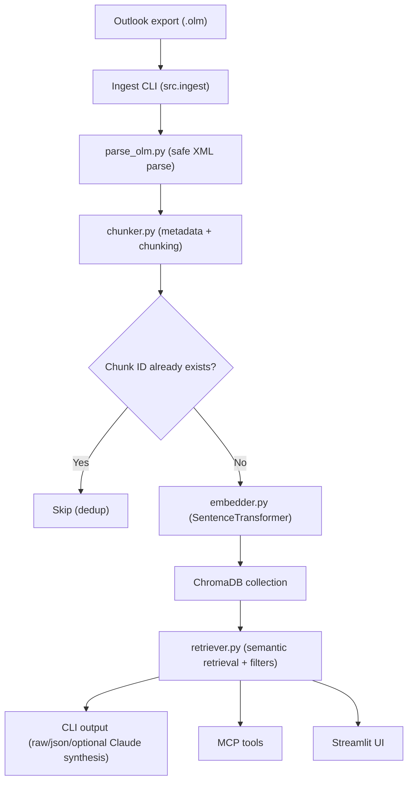
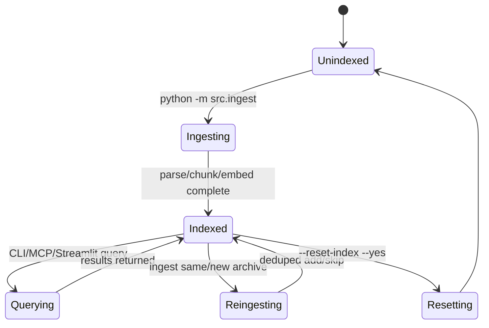

# Email RAG - Search Your Outlook Emails Locally

Local Retrieval-Augmented Generation (RAG) for Outlook `.olm` exports.

Interfaces:
- CLI search and operations
- MCP server tools for agent/tool integrations
- Optional local Streamlit UI

Everything runs locally, except optional Claude answer synthesis when `ANTHROPIC_API_KEY` is set.

## Quick Start

```bash
# Email RAG — Search Your Outlook Emails with Claude

A local RAG (Retrieval-Augmented Generation) system that lets Claude search through your Outlook for Mac email archive. Works as both a CLI tool and an MCP server for Claude Code.

## Architecture

```
┌─────────────┐    ┌──────────┐    ┌──────────┐    ┌───────────┐
│ Outlook .olm │───▶│  Parser  │───▶│ Embedder │───▶│ ChromaDB  │
│   Export     │    │ (XML→JSON)│   │(MiniLM)  │    │ (Local)   │
└─────────────┘    └──────────┘    └──────────┘    └─────┬─────┘
                                                         │
                                          ┌──────────────┘
                                          ▼
                                   ┌─────────────┐    ┌─────────┐
                                   │  Retriever   │───▶│  Claude  │
                                   │ (search tool)│    │ (answer) │
                                   └─────────────┘    └─────────┘
```

## Quick Start

### 1. Install Dependencies

```bash
cd email-rag
python3 -m venv .venv
source .venv/bin/activate
pip install -r requirements.txt
```

1. Export mail from Outlook for Mac as `.olm`.
2. Place it in `data/`.
3. Ingest:

```bash
python -m src.ingest data/your-export.olm
```

## How It Works



## Lifecycle



## Operational Commands

### Ingest

```bash
# Full ingest
python -m src.ingest data/your-export.olm

# Partial ingest for testing
python -m src.ingest data/your-export.olm --max-emails 200 --batch-size 250

# Parse/chunk only (no DB writes)
python -m src.ingest data/your-export.olm --dry-run
```

### CLI Search

```bash
# Interactive mode
python -m src.cli

# Single query
python -m src.cli --query "Q3 budget approval"

# Unified filtered query
python -m src.cli --query "contract renewal" --sender legal --date-from 2024-01-01 --date-to 2024-12-31

# JSON output for automation
python -m src.cli --query "security review" --json --no-claude
```

### Stats / Senders / Reset

```bash
python -m src.cli --stats
python -m src.cli --list-senders 25

# Destructive operation (requires --yes)
python -m src.cli --reset-index --yes
```

## MCP Server

Run:

```bash
python -m src.mcp_server
```

MCP tools:
- `email_search`
- `email_search_by_sender`
- `email_search_by_date`
- `email_list_senders`
- `email_stats`
- `email_search_structured` (stable JSON output for automation clients)

## Streamlit UI (Optional)

```bash
streamlit run src/web_app.py
```

Includes:
- query + top-k + sender/date filters
- result browser with metadata and content preview
- sidebar stats and top senders
- JSON download for current results

## Configuration

Use `.env` (see `.env.example`):

```bash
ANTHROPIC_API_KEY=your_anthropic_api_key_here  # Optional (CLI Claude synthesis)
CHROMADB_PATH=data/chromadb
EMBEDDING_MODEL=all-MiniLM-L6-v2
COLLECTION_NAME=emails
TOP_K=10
CLAUDE_MODEL=claude-sonnet-4-20250514
LOG_LEVEL=INFO
```

## Deduplication and Re-ingestion

Ingestion deduplicates by chunk ID. Chunk IDs are derived from `Email.uid`:
- preferred: hash of `message_id`
- fallback: hash of `subject|date|sender_email`

Re-running ingest on the same archive skips already indexed chunks.

## Development

```bash
pip install -r requirements-dev.txt
ruff check .
pytest -q
bandit -r src -q
python -m pip_audit -r requirements.txt
```
### 2. Export Your Emails from Outlook for Mac

1. Open Outlook for Mac
2. Go to **Tools → Export**
3. Select **Outlook for Mac Data File (.olm)**
4. Choose what to export (Mail is required, others optional)
5. Save the `.olm` file — place it in the `data/` directory

### 3. Ingest Your Emails

```bash
# Parse and embed your .olm file
python -m src.ingest data/your-export.olm
```

This will:
- Extract all emails from the `.olm` archive
- Chunk them for embedding
- Embed them using the local MiniLM model
- Store everything in a local ChromaDB database at `data/chromadb/`

First run downloads the embedding model (~90MB). Subsequent runs are fast.

### 4. Search via CLI

```bash
# Interactive search
python -m src.cli

# Single query
python -m src.cli --query "What did John say about the Q3 budget?"
```

### 5. Use with Claude Code (MCP Server)

Add to your Claude Code MCP config (`~/.claude/claude_desktop_config.json` or equivalent):

```json
{
  "mcpServers": {
    "email_search": {
      "command": "/path/to/email-rag/.venv/bin/python",
      "args": ["-m", "src.mcp_server"],
      "cwd": "/path/to/email-rag"
    }
  }
}
```

Then in Claude Code, just ask naturally:
> "Search my emails for anything about the server migration from last October"

Claude will call the `email_search` tool, retrieve relevant emails, and answer with context.

## MCP Tools Provided

| Tool | Description |
|------|-------------|
| `email_search` | Semantic search across all emails. Returns the most relevant email chunks for a query. |
| `email_search_by_sender` | Search emails filtered by sender address or name. |
| `email_search_by_date` | Search within a specific date range. |
| `email_list_senders` | List all unique senders in the archive (useful for discovering who's in there). |
| `email_stats` | Get stats about the email archive (count, date range, top senders). |

## Configuration

Set these environment variables or create a `.env` file:

```bash
# Required for Claude-powered answers in CLI mode
ANTHROPIC_API_KEY=sk-ant-...

# Optional
CHROMADB_PATH=data/chromadb          # Where to store the vector DB
EMBEDDING_MODEL=all-MiniLM-L6-v2    # Sentence-transformer model
```

## Project Structure

```
email-rag/
├── README.md
├── requirements.txt
├── .env.example
├── data/                  # Your .olm files and ChromaDB storage
│   └── chromadb/          # Auto-created vector database
└── src/
    ├── __init__.py
    ├── parse_olm.py       # .olm archive parser
    ├── chunker.py         # Email → embedding chunks
    ├── embedder.py        # Embedding + ChromaDB storage
    ├── retriever.py       # Search / retrieval logic
    ├── ingest.py          # End-to-end ingestion pipeline
    ├── cli.py             # Interactive CLI with Claude answers
    └── mcp_server.py      # MCP server for Claude Code
```

## Notes

- **Privacy**: Everything runs locally. Your emails never leave your machine (except when sent to Claude API for answering).
- **Embedding model**: `all-MiniLM-L6-v2` runs entirely on your Mac's CPU. No GPU needed.
- **ChromaDB**: Persistent local storage. No server to run.
- **Incremental ingestion**: Running ingest again will skip already-processed chunks using the chunk ID (derived from `Email.uid`, which falls back to subject/date/sender when `message_id` is missing).
