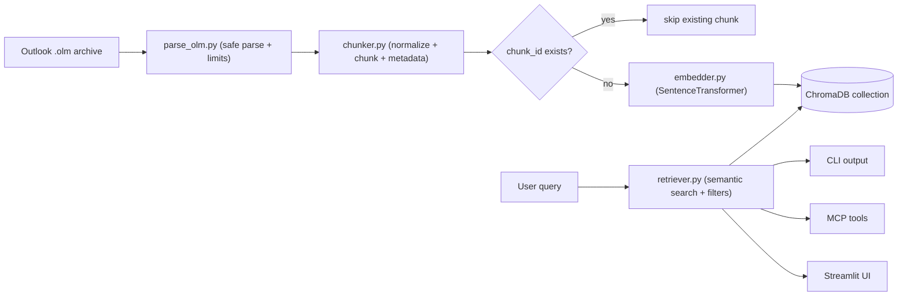

# Email RAG

Local Retrieval-Augmented Generation (RAG) for Outlook `.olm` exports.

Interfaces:

- CLI search and operational commands
- MCP server tools for agent integrations
- Optional local Streamlit UI

Everything runs locally, except optional Claude answer synthesis when `ANTHROPIC_API_KEY` is set.

## Architecture

High-level architecture is ingestion -> local vector storage -> filtered retrieval -> interface rendering.
The canonical process flow is documented in [How It Works](#how-it-works) and [Data Lifecycle](#data-lifecycle).

## How It Works

1. Parse Outlook `.olm` archive entries with XML safety limits.
2. Normalize and chunk message content with stable metadata.
3. Deduplicate chunks by deterministic IDs.
4. Embed new chunks and persist vectors in local ChromaDB.
5. Retrieve by semantic similarity and apply optional filters.
6. Render results via CLI, MCP tools, or Streamlit UI.



## Data Lifecycle

```mermaid
sequenceDiagram
  participant U as User
  participant ING as ingest.py
  participant PAR as parse_olm.py
  participant CH as chunker.py
  participant EMB as embedder.py
  participant DB as ChromaDB
  participant RET as retriever.py
  participant OUT as CLI/MCP/UI

  U->>ING: ingest archive
  ING->>PAR: parse XML messages
  PAR-->>ING: Email objects
  ING->>CH: build chunks + metadata
  CH-->>ING: chunk stream

  loop for each chunk
    ING->>DB: check existing chunk_id
    alt new chunk
      ING->>EMB: embed text
      EMB-->>ING: vector
      ING->>DB: upsert id+vector+metadata
    else existing chunk
      ING-->>ING: skip
    end
  end

  U->>RET: search(query, filters)
  RET->>DB: vector query
  DB-->>RET: ranked candidates
  RET-->>OUT: filtered + sorted results
  OUT-->>U: answer/json/rendered view
```

## Quick Start

### 1. Install dependencies

```bash
python3 -m venv .venv
source .venv/bin/activate
pip install -r requirements.txt
```

### 2. Export mail from Outlook for Mac

1. Open Outlook for Mac.
2. Go to `Tools -> Export`.
3. Select `Outlook for Mac Data File (.olm)`.
4. Export mail and place the `.olm` file in `data/`.

### 3. Ingest

```bash
python -m src.ingest data/your-export.olm
```

Useful variants:

```bash
# Partial ingest for testing
python -m src.ingest data/your-export.olm --max-emails 200 --batch-size 250

# Parse/chunk only (no DB writes)
python -m src.ingest data/your-export.olm --dry-run
```

### 4. Search via CLI

```bash
# Interactive mode
python -m src.cli

# Single query
python -m src.cli --query "Q3 budget approval"

# Filtered query
python -m src.cli --query "contract renewal" --sender legal --date-from 2024-01-01 --date-to 2024-12-31

# Subject/folder filters with relevance threshold
python -m src.cli --query "budget" --subject approval --folder finance --min-score 0.75

# JSON output for automation
python -m src.cli --query "security review" --json --no-claude
```

Additional operational commands:

```bash
python -m src.cli --stats
python -m src.cli --list-senders 25

# Destructive operation (requires --yes)
python -m src.cli --reset-index --yes
```

## MCP Server

Run:

```bash
python -m src.mcp_server
```

Available tools:

- `email_search`
- `email_search_by_sender`
- `email_search_by_date`
- `email_list_senders`
- `email_stats`
- `email_search_structured`

See the compatibility contract in [docs/API_COMPATIBILITY.md](docs/API_COMPATIBILITY.md).

Example Claude Code MCP config:

```json
{
  "mcpServers": {
    "email_search": {
      "command": "/path/to/email-rag/.venv/bin/python",
      "args": ["-m", "src.mcp_server"],
      "cwd": "/path/to/email-rag"
    }
  }
}
```

## Streamlit UI (Optional)

```bash
streamlit run src/web_app.py
```

Features:

- query form with advanced sender/subject/folder/date filters
- adjustable relevance threshold (`min_score`) and result sorting modes
- richer result browser with relevance bars, preview length control, and full-chunk expansion
- sidebar archive stats with top-sender activity bars
- JSON download for current result set including filters/sort metadata

## Configuration

Use `.env` (see `.env.example`):

```bash
ANTHROPIC_API_KEY=your_anthropic_api_key_here
CHROMADB_PATH=data/chromadb
EMBEDDING_MODEL=all-MiniLM-L6-v2
COLLECTION_NAME=emails
TOP_K=10
CLAUDE_MODEL=claude-sonnet-4-20250514
LOG_LEVEL=INFO
```

## Interface Stability

For `0.1.x`, CLI and MCP interfaces are treated as stable.

- Compatibility policy: [docs/API_COMPATIBILITY.md](docs/API_COMPATIBILITY.md)
- Change history and breaking-change callouts: [CHANGELOG.md](CHANGELOG.md)

## Deduplication and Re-ingestion

Ingestion deduplicates by chunk ID. Chunk IDs are derived from `Email.uid`:

- preferred: hash of `message_id`
- fallback: hash of `subject|date|sender_email`

Re-running ingest on the same archive skips already indexed chunks.

## Development

```bash
pip install -r requirements-dev.txt
ruff check .
pytest -q
bandit -r src -q
python -m pip_audit -r requirements.txt
```

Acceptance matrix:

```bash
# Local profile
bash scripts/run_acceptance_matrix.sh

# CI-equivalent profile
bash scripts/run_acceptance_matrix.sh ci
```

Workspace cleanup:

```bash
bash scripts/clean_workspace.sh --dry-run
bash scripts/clean_workspace.sh
```

References:

- acceptance matrix: `docs/TEST_ACCEPTANCE_MATRIX.md`
- release checklist: `docs/RELEASE_CHECKLIST.md`

## Project Structure

```text
outlook-email-rag/
├── README.md
├── CHANGELOG.md
├── CONTRIBUTING.md
├── SECURITY.md
├── CODE_OF_CONDUCT.md
├── docs/
│   ├── API_COMPATIBILITY.md
│   ├── RELEASE_CHECKLIST.md
│   ├── RELEASE_FILE_MANIFEST.md
│   └── TEST_ACCEPTANCE_MATRIX.md
├── .github/
│   ├── ISSUE_TEMPLATE/
│   ├── pull_request_template.md
│   └── workflows/
│       ├── ci.yml
│       └── release.yml
├── scripts/
│   ├── clean_workspace.sh
│   └── run_acceptance_matrix.sh
├── src/
├── tests/
├── requirements.txt
├── requirements-dev.txt
└── .env.example
```

## Notes

- Privacy: email data stays local unless you explicitly use Claude synthesis.
- Embedding model: `all-MiniLM-L6-v2` runs on CPU.
- ChromaDB is persistent local storage; no separate DB server is required.
