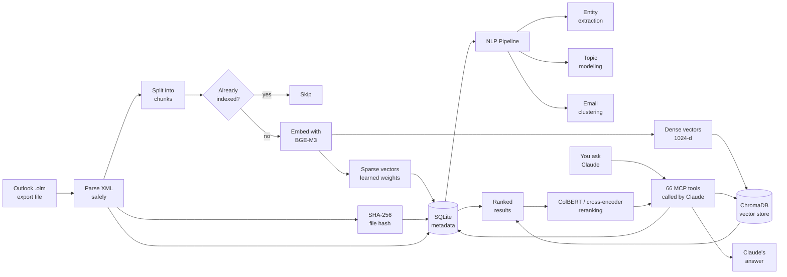
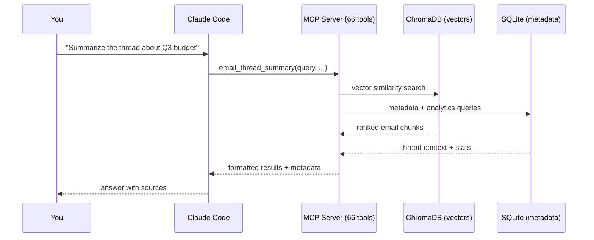
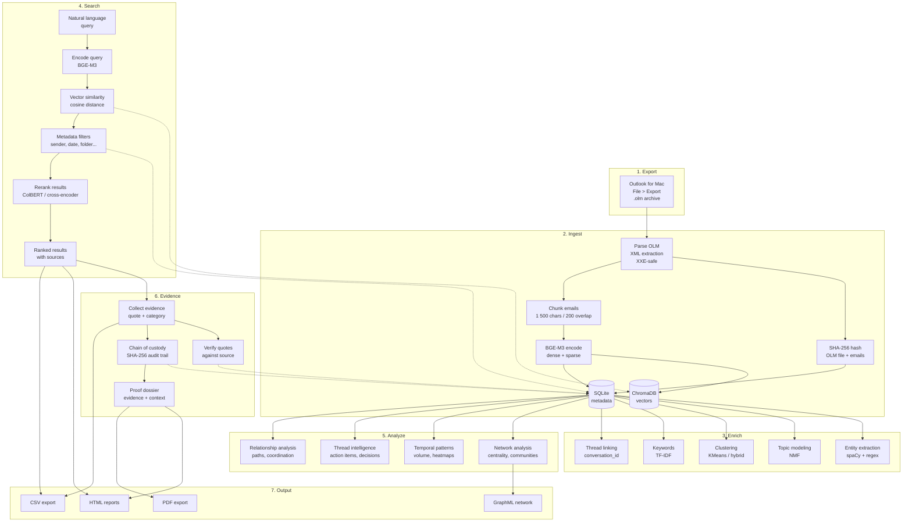

# Email RAG

Search your Outlook emails with natural language using Claude — no cloud, no subscriptions, everything stays on your Mac.

> **Claude-native:** Claude Code calls the built-in MCP tools directly. Your emails never leave your machine. No API keys required.

---

## What This Does

You export your mailbox from Outlook for Mac once, run a one-time indexing step, and then ask Claude questions like:

- *"Find emails about the Q3 budget from finance@company.com"*
- *"What did legal say about the contract renewal in January?"*
- *"Show me everything from Sarah about the product launch"*
- *"Who are my top 10 email contacts?"*
- *"Summarize the thread about the server migration"*
- *"What action items came out of last week's emails?"*
- *"What topics dominate my inbox?"*
- *"Find emails similar to this one about the contract"*
- *"Analyze the writing style of emails from marketing"*
- *"Export the conversation about the contract renewal as a PDF"*
- *"Browse through all my emails from January, 20 at a time"*

Claude reads the indexed emails and gives you precise, sourced answers — without touching Outlook again.

---

## How It Works





**Key properties:**
- All processing runs on your Mac — CPU works, Apple Silicon GPU (MPS) accelerates 3-10×
- Emails are stored in local databases (`data/chromadb/`, `data/email_metadata.db`) that only you can access
- Re-indexing is safe and idempotent — already-indexed emails are skipped automatically
- Semantic search finds relevant emails even when you don't remember the exact words
- NLP pipeline provides topic modeling, clustering, entity extraction, and thread intelligence

---

## Before You Start

You need:

| Requirement | How to check |
|------------|-------------|
| **Mac** (Outlook for Mac .olm format) | — |
| **Python 3.11 or newer** | `python3 --version` in Terminal |
| **Claude Code** | `claude --version` in Terminal |
| **Git** | `git --version` in Terminal |

If you don't have Python 3.11+, download it from [python.org](https://python.org/downloads/).
If you don't have Claude Code, follow the [Claude Code quickstart](https://docs.anthropic.com/en/claude-code/quickstart).

---

## Setup (First Time Only)

### Step 1 — Get the code

Open Terminal and run:

```bash
git clone https://github.com/sebastianspicker/outlook-email-rag.git
cd outlook-email-rag
```

### Step 2 — Create a virtual environment

This keeps the project's dependencies isolated from the rest of your system:

```bash
python3 -m venv .venv
source .venv/bin/activate
pip install -r requirements.txt
```

You should see packages being installed. This takes a few minutes the first time (it downloads the embedding model).

> **Tip:** You need to run `source .venv/bin/activate` every time you open a new Terminal window for this project. You'll know it's active when you see `(.venv)` at the start of your prompt.

### Step 3 — Export your mailbox from Outlook

1. Open **Outlook for Mac**
2. Go to **File > Export...** (or **Tools > Export** depending on your version)
3. Choose **Outlook for Mac Data File (.olm)**
4. Select the folders you want to export (or all folders)
5. Save the `.olm` file into the `data/` folder inside the project

```
outlook-email-rag/
└── data/
    └── my-export.olm   <- put it here
```

### Step 4 — Index your emails

```bash
python -m src.ingest data/my-export.olm
```

This reads every email, splits them into searchable chunks, and stores them in local databases. You'll see progress output like:

```
[INFO] Parsing: data/my-export.olm
[INFO] Progress: 100 emails processed
[INFO] Progress: 200 emails processed
...
=== Ingestion Summary ===
Emails parsed:   1 842
Chunks created:  4 210
Chunks added:    4 210
Chunks skipped:  0
Total in DB:     4 210
Elapsed:         47.3s
```

> **Large mailboxes:** For a quick test first, you can limit to the first 200 emails:
> `python -m src.ingest data/my-export.olm --max-emails 200`

> **Re-running is safe:** If you export an updated `.olm` later, running ingest again skips emails that are already indexed.

### Step 5 — Open the project in Claude Code

```bash
claude .
```

The project includes a `.claude/settings.json` that automatically registers the MCP server. Claude Code will detect it and load the email search tools.

**That's it.** You can now ask Claude about your emails.

---

## Using with Claude Code (MCP Server)

This is the primary way to use Email RAG. Claude Code talks to your email index through 66 MCP tools — you just ask questions in plain English.

### How it connects

The project includes a `.claude/settings.json` file that tells Claude Code how to start the MCP server:

```json
{
  "mcpServers": {
    "email_search": {
      "command": ".venv/bin/python",
      "args": ["-m", "src.mcp_server"],
      "cwd": "."
    }
  }
}
```

When you run `claude .` from the project directory, Claude Code reads this file and starts the MCP server automatically. You don't need to configure anything manually.

### Verifying the connection

After opening the project in Claude Code, you can check that the tools loaded:

1. Type `/mcp` in the Claude Code prompt
2. Look for `email_search` in the server list — it should show as **connected**
3. You should see all 66 tools listed beneath it

If it shows as disconnected:
- Make sure the virtual environment exists: `ls .venv/bin/python`
- Make sure dependencies are installed: `.venv/bin/python -c "from src.mcp_server import mcp; print('OK')"`
- Restart Claude Code with `claude .` from the project root

### Asking questions

Just talk to Claude naturally. It picks the right MCP tool automatically based on your question. Here are examples organized by what you can do:

**Searching emails:**

```
Search my emails for anything about the annual budget review from Q1 2024.
```
```
Find emails from legal@company.com about the NDA we signed last year.
```
```
Show me emails about the product launch that were sent to marketing@company.com.
```
```
Find emails similar to this: "We need to reschedule the board meeting due to travel conflicts."
```

**Understanding your archive:**

```
What folders do I have in my archive? How many emails are in each?
```
```
Show me my archive statistics — how many emails, date range, top senders.
```
```
Who are my top 10 email contacts? Show communication stats for each.
```
```
Show me the communication patterns between me and john@company.com.
```

**Thread analysis:**

```
Summarize the thread about the server migration.
```
```
What action items came out of recent emails about the product launch?
```
```
What decisions were made in the thread about the Q4 hiring plan?
```

**Analytics and insights:**

```
Show me my email volume by month for the past year.
```
```
What's my activity pattern? When do I send the most emails?
```
```
What topics are most common in my inbox?
```
```
Show me the most frequently mentioned organizations in my emails.
```
```
Analyze the writing style of emails from marketing@company.com.
```
```
Are there duplicate emails in my archive?
```

**Reading and exporting emails:**

```
Get the full text of the email with UID abc123.
```
```
Browse all my emails from January, 20 at a time.
```
```
Export the thread about the server migration as an HTML file.
```
```
Export the email with UID xyz789 as a PDF.
```

**Evidence collection:**

```
Mark this email as evidence of bossing — the key quote is "You should consider leaving."
```
```
List all evidence items with relevance 4 or higher.
```
```
Export the evidence report as HTML for my lawyer.
```
```
Re-verify all evidence quotes against the source emails.
```

**Reporting:**

```
Generate an HTML report of my email archive.
```
```
Export my communication network as a graph file I can open in Gephi.
```

**Re-ingesting from within Claude:**

```
Ingest my new export at data/latest-export.olm
```

### What happens under the hood

When you ask a question like *"Find emails about the Q3 budget from finance"*, Claude:

1. Picks the `email_search_by_sender` tool (or `email_search_structured` for complex queries)
2. Sends parameters like `query="Q3 budget"`, `sender="finance"` to the MCP server
3. The server runs a semantic vector search in ChromaDB, filters by sender, deduplicates, and formats results
4. Claude reads the results and gives you a sourced answer

You never need to remember tool names or parameters — Claude handles that automatically.

### Available MCP Tools (66)

Claude picks the right tool automatically, but here's the full reference:

#### Core Search (8)

| Tool | What it does |
|------|-------------|
| `email_search` | Semantic search across all emails |
| `email_search_by_sender` | Search scoped to a specific sender |
| `email_search_by_date` | Search within a date range |
| `email_search_by_recipient` | Search by To recipient |
| `email_search_structured` | Search with all filters: sender, subject, folder, CC, To, BCC, dates, attachments, priority, email type, topic, cluster, reranking, hybrid search |
| `email_search_thread` | Retrieve all emails in a conversation thread |
| `email_smart_search` | Intelligent search that auto-routes based on query analysis |
| `email_find_similar` | Find emails most similar to a given email or text |

#### Archive Info (4)

| Tool | What it does |
|------|-------------|
| `email_list_senders` | List the most frequent senders in your archive |
| `email_list_folders` | List all folders with email counts |
| `email_stats` | Archive statistics (total emails, date range, senders, folders) |
| `email_query_suggestions` | Get search suggestions based on indexed data |

#### Email Reading & Export (4)

| Tool | What it does |
|------|-------------|
| `email_get_full` | Get a single email with its complete body text |
| `email_browse` | Browse emails in pages for systematic review (with filters) |
| `email_export_thread` | Export a conversation thread as formatted HTML or PDF |
| `email_export_single` | Export a single email as formatted HTML or PDF |

#### Ingestion (2)

| Tool | What it does |
|------|-------------|
| `email_ingest` | Trigger ingestion of an `.olm` file from within Claude (supports `extract_attachments` and `embed_images`) |
| `email_reingest_bodies` | Backfill full body text for emails missing it in SQLite |

#### Diagnostics (2)

| Tool | What it does |
|------|-------------|
| `email_model_info` | Show embedding model, backend (BGE-M3 / SentenceTransformer), device, sparse & ColBERT status |
| `email_sparse_status` | Show sparse vector index status — vector count, whether the index is built |

#### Network Analysis (3)

| Tool | What it does |
|------|-------------|
| `email_top_contacts` | Find top communication partners for an email address |
| `email_communication_between` | Get bidirectional stats between two email addresses |
| `email_network_analysis` | Centrality, communities, and bridge nodes in your network |

#### Temporal Analysis (3)

| Tool | What it does |
|------|-------------|
| `email_volume_over_time` | Email volume grouped by day, week, or month |
| `email_activity_pattern` | Activity heatmap: hour-of-day vs day-of-week |
| `email_response_times` | Average response times per sender (in hours) |

#### Entity & NLP (5)

| Tool | What it does |
|------|-------------|
| `email_search_by_entity` | Find emails mentioning a specific entity |
| `email_list_entities` | List most frequently mentioned entities |
| `email_entity_network` | Find entities that co-occur in the same emails |
| `email_find_people` | Search emails by person name mentioned in body |
| `email_entity_timeline` | Show how often an entity appears over time |

#### Thread Intelligence (3)

| Tool | What it does |
|------|-------------|
| `email_thread_summary` | Summarize a conversation thread (extractive) |
| `email_action_items` | Extract action items from threads or recent emails |
| `email_decisions` | Extract decisions from email threads |

#### Topics & Clusters (5)

| Tool | What it does |
|------|-------------|
| `email_topics` | List discovered topics with labels and email counts |
| `email_search_by_topic` | Find emails assigned to a specific topic |
| `email_keywords` | Top keywords across archive or filtered by sender/folder |
| `email_clusters` | List email clusters with sizes and representative subjects |
| `email_cluster_emails` | Get emails in a specific cluster |

#### Data Quality (3)

| Tool | What it does |
|------|-------------|
| `email_find_duplicates` | Find near-duplicate emails using n-gram similarity |
| `email_language_stats` | Language distribution across all indexed emails |
| `email_sentiment_overview` | Sentiment distribution across indexed emails |

#### Reporting & Export (3)

| Tool | What it does |
|------|-------------|
| `email_generate_report` | Generate a self-contained HTML report of the archive |
| `email_export_network` | Export communication network as GraphML |
| `email_writing_analysis` | Analyze writing style and readability across senders |

#### Evidence Management (12)

| Tool | What it does |
|------|-------------|
| `evidence_add` | Add an evidence item linked to an email (with auto-verification) |
| `evidence_add_batch` | Add up to 20 evidence items in one call |
| `evidence_list` | List/filter evidence items by category, relevance, or email |
| `evidence_get` | Get a single evidence item with full details |
| `evidence_update` | Update category, quote, summary, relevance, or notes |
| `evidence_remove` | Remove an evidence item |
| `evidence_search` | Search within evidence items by text (quote, summary, notes) |
| `evidence_verify` | Re-verify all quotes against source email body text |
| `evidence_export` | Export evidence as HTML report or CSV for a lawyer |
| `evidence_stats` | Get evidence collection statistics |
| `evidence_timeline` | View evidence chronologically for narrative building |
| `evidence_categories` | List all 10 canonical categories with counts |

#### Chain of Custody (3)

| Tool | What it does |
|------|-------------|
| `custody_chain` | View chain-of-custody audit trail with optional filters |
| `email_provenance` | Full provenance: OLM source hash, ingestion run, custody events |
| `evidence_provenance` | Full evidence chain: item details + source email provenance + history |

#### Relationship Analysis (4)

| Tool | What it does |
|------|-------------|
| `relationship_paths` | Find communication paths between two people through intermediaries |
| `shared_recipients` | Identify recipients common to multiple senders |
| `coordinated_timing` | Detect time windows where multiple senders were active simultaneously |
| `relationship_summary` | One-call profile: top contacts, community, bridge score, send/receive ratio |

#### Proof Dossier (2)

| Tool | What it does |
|------|-------------|
| `dossier_generate` | Generate comprehensive proof dossier as HTML/PDF (evidence + emails + relationships + custody) |
| `dossier_preview` | Preview dossier contents (counts, categories, date range) without generating |

### Registering in other Claude environments

If you want to use the MCP server outside the project directory (for example, from a global Claude Code config or the Claude desktop app), you need to use **absolute paths**:

```json
{
  "mcpServers": {
    "email_search": {
      "command": "/Users/yourname/outlook-email-rag/.venv/bin/python",
      "args": ["-m", "src.mcp_server"],
      "cwd": "/Users/yourname/outlook-email-rag"
    }
  }
}
```

For **Claude Code** global config, add this to `~/.claude/settings.json`.

For the **Claude desktop app**, add this to `~/Library/Application Support/Claude/claude_desktop_config.json` (macOS) or `%APPDATA%\Claude\claude_desktop_config.json` (Windows).

---

## Using the CLI

The command-line interface is a standalone way to search and analyze your email archive directly from Terminal. It doesn't require Claude Code — it works entirely on its own.

### Starting the CLI

Make sure the virtual environment is active first:

```bash
source .venv/bin/activate
```

### Interactive mode

Run without arguments to enter an interactive search loop:

```bash
python -m src.cli
```

You'll see a summary of your archive and a search prompt:

```
+-------------- Email RAG ---------------+
| Emails: 1842 | Chunks: 4210 |          |
| Senders: 312 | Range: 2023-01 -> 2024  |
| Type 'quit' to exit, 'stats', ...      |
+-----------------------------------------+

Search: _
```

Type a query, press Enter, and you get a table of results. Type `stats` for archive statistics, `senders` for the top sender list, or `quit` to exit.

### Single query mode

For one-off searches, use `--query` (or `-q`):

```bash
python -m src.cli --query "Q3 budget approval"
```

Output shows each result with relevance score, sender, date, subject, and the matching text:

```
============================================================
Result 1 (relevance: 0.87)
Subject: Re: Q3 Budget Approval
Sender:  finance@company.com
Date:    2024-07-15
Folder:  Inbox

The Q3 budget has been approved with the following allocations...
(~180 tokens)
```

### Filtering results

Combine `--query` with any filter flag to narrow results:

```bash
# By sender (partial match on name or email)
python -m src.cli --query "contract renewal" --sender legal

# By date range (ISO format)
python -m src.cli --query "invoice" \
    --date-from 2024-01-01 \
    --date-to 2024-06-30

# By recipient
python -m src.cli --query "proposal" --to john@example.com

# Only emails with attachments
python -m src.cli --query "report" --has-attachments

# By folder (partial match)
python -m src.cli --query "update" --folder "Sent Items"

# By CC recipient
python -m src.cli --query "review" --cc manager@company.com

# By BCC recipient
python -m src.cli --query "announcement" --bcc board@company.com

# By email type (reply, forward, or original)
python -m src.cli --query "meeting notes" --email-type reply

# By minimum priority level
python -m src.cli --query "urgent" --priority 3

# Combine multiple filters
python -m src.cli --query "contract" \
    --sender legal \
    --date-from 2024-01-01 \
    --has-attachments \
    --min-score 0.5
```

### Search modes

Three search modes provide different trade-offs between speed and accuracy:

```bash
# Standard semantic search (default — fast)
python -m src.cli --query "budget discussion"

# Hybrid: semantic + BM25 keyword search (better for exact terms)
python -m src.cli --query "invoice #INV-2024-0847" --hybrid

# With cross-encoder reranking (slower but most precise)
python -m src.cli --query "budget discussion" --rerank

# Query expansion: auto-adds related terms
python -m src.cli --query "security" --expand-query

# Combine all three
python -m src.cli --query "infrastructure costs" --hybrid --rerank --expand-query

# Filter by discovered topic or cluster
python -m src.cli --query "migration" --topic 5
python -m src.cli --query "hiring" --cluster-id 3
```

### Output format

```bash
# Human-readable text (default)
python -m src.cli --query "budget" --format text

# Machine-readable JSON
python -m src.cli --query "budget" --format json

# Legacy JSON shorthand
python -m src.cli --query "budget" --json

# Control number of results (default: 10, max: 1000)
python -m src.cli --query "budget" --top-k 20
```

### Analytics commands

These don't require a query — they analyze your entire archive:

```bash
# Archive statistics (total emails, chunks, senders, date range)
python -m src.cli --stats

# Top senders (show top 20)
python -m src.cli --list-senders 20

# Top contacts for a specific email address
python -m src.cli --top-contacts user@company.com

# Email volume over time
python -m src.cli --volume day     # daily
python -m src.cli --volume week    # weekly
python -m src.cli --volume month   # monthly

# Activity heatmap (hour x day-of-week)
python -m src.cli --heatmap

# Average response times per sender
python -m src.cli --response-times

# Most frequently mentioned entities (organizations, URLs, etc.)
python -m src.cli --entities
python -m src.cli --entities organization   # filter by type

# Search suggestions based on your data
python -m src.cli --suggest
```

### Browsing emails

Browse your archive page by page for systematic review:

```bash
# Browse newest emails (default: 20 per page)
python -m src.cli --browse

# Navigate pages
python -m src.cli --browse --page 3 --page-size 10

# Filter by folder or sender
python -m src.cli --browse --folder Inbox
python -m src.cli --browse --sender legal@company.com
```

### Exporting emails

Export conversation threads or individual emails as formatted HTML (or PDF with weasyprint):

```bash
# Export a conversation thread by conversation ID
python -m src.cli --export-thread conv_abc123

# Export a single email by UID
python -m src.cli --export-email uid_xyz789

# Choose format (html or pdf) and output path
python -m src.cli --export-thread conv_abc123 --export-format pdf --output thread.pdf
python -m src.cli --export-email uid_xyz789 --output email.html
```

> **PDF support** requires `weasyprint`: `pip install weasyprint`. Without it, export falls back to HTML automatically.

### Evidence management

List, export, and verify evidence items collected through the MCP tools:

```bash
# List all evidence items
python -m src.cli --evidence-list

# Filter by category or minimum relevance
python -m src.cli --evidence-list --category discrimination
python -m src.cli --evidence-list --min-relevance 4

# Export evidence report (HTML by default)
python -m src.cli --evidence-export evidence_report.html

# Export as CSV (for Excel)
python -m src.cli --evidence-export evidence.csv --evidence-export-format csv

# Get evidence statistics (counts by category, verified vs unverified)
python -m src.cli --evidence-stats

# Re-verify all evidence quotes against source emails
python -m src.cli --evidence-verify
```

### Reporting commands

```bash
# Generate an HTML report (default: report.html)
python -m src.cli --generate-report
python -m src.cli --generate-report my_report.html

# Export communication network as GraphML
python -m src.cli --export-network
python -m src.cli --export-network my_network.graphml
```

### Index management

```bash
# Delete and recreate the index (requires --yes)
python -m src.cli --reset-index --yes
```

### Complete flag reference

| Flag | Type | Description |
|------|------|-------------|
| `--query`, `-q` | string | Search query (required for search mode) |
| `--top-k` | int | Number of results (default: 10, max: 1000) |
| `--sender` | string | Filter by sender (partial match on name or email) |
| `--subject` | string | Filter by subject (partial match) |
| `--folder` | string | Filter by folder (partial match) |
| `--cc` | string | Filter by CC recipient (partial match) |
| `--to` | string | Filter by To recipient (partial match) |
| `--bcc` | string | Filter by BCC recipient (partial match) |
| `--has-attachments` | flag | Only emails with attachments |
| `--priority` | int | Minimum priority level |
| `--email-type` | choice | `reply`, `forward`, or `original` |
| `--date-from` | YYYY-MM-DD | Start date (inclusive) |
| `--date-to` | YYYY-MM-DD | End date (inclusive) |
| `--min-score` | float | Minimum relevance score (0.0–1.0) |
| `--rerank` | flag | Re-rank with cross-encoder |
| `--hybrid` | flag | Hybrid semantic + BM25 search |
| `--expand-query` | flag | Expand query with related terms |
| `--topic` | int | Filter by discovered topic ID |
| `--cluster-id` | int | Filter by email cluster ID |
| `--format` | choice | Output format: `text` or `json` |
| `--json` | flag | Shorthand for `--format json` |
| `--stats` | flag | Print archive statistics |
| `--list-senders` | int | List top N senders |
| `--top-contacts` | string | Top contacts for an email address |
| `--volume` | choice | Email volume: `day`, `week`, or `month` |
| `--entities` | string? | List top entities (optionally by type) |
| `--heatmap` | flag | Activity heatmap |
| `--response-times` | flag | Response time statistics |
| `--suggest` | flag | Search suggestions |
| `--browse` | flag | Browse emails page by page |
| `--page` | int | Page number for `--browse` (default: 1) |
| `--page-size` | int | Emails per page for `--browse` (default: 20) |
| `--export-thread` | string | Export a conversation thread by conversation ID |
| `--export-email` | string | Export a single email by UID |
| `--export-format` | choice | Export format: `html` or `pdf` (default: `html`) |
| `--output`, `-o` | string | Output file path for exports |
| `--generate-report` | string? | Generate HTML report (default: `report.html`) |
| `--export-network` | string? | Export GraphML network (default: `network.graphml`) |
| `--evidence-list` | flag | List all evidence items |
| `--evidence-export` | string | Export evidence report to file |
| `--evidence-export-format` | choice | Evidence export format: `html`, `csv`, or `pdf` (default: `html`) |
| `--evidence-stats` | flag | Show evidence collection statistics |
| `--evidence-verify` | flag | Re-verify all evidence quotes against source emails |
| `--category` | string | Filter evidence by category |
| `--min-relevance` | int | Filter evidence by minimum relevance (1-5) |
| `--dossier` | string | Generate proof dossier and write to file |
| `--dossier-format` | choice | Dossier format: `html` or `pdf` (default: `html`) |
| `--custody-chain` | flag | View chain-of-custody audit trail |
| `--provenance` | string | View email provenance by UID (OLM source hash, ingestion run, custody events) |
| `--generate-training-data` | string? | Generate contrastive triplets from threads (default: `training_data.jsonl`) |
| `--fine-tune` | string? | Fine-tune embedding model on generated triplets |
| `--fine-tune-output` | string | Output directory for fine-tuned model (default: `models/fine-tuned`) |
| `--fine-tune-epochs` | int | Number of fine-tuning epochs (default: 3) |
| `--reset-index` | flag | Delete and recreate the index (requires `--yes`) |
| `--yes` | flag | Confirm destructive operations |
| `--chromadb-path` | string | Override ChromaDB path |
| `--log-level` | string | Logging level (`DEBUG`, `INFO`, etc.) |
| `--version` | flag | Print version and exit |

### CLI Subcommands (recommended)

The CLI also supports a modern subcommand syntax with better discoverability. Legacy flat-flag syntax continues to work but emits a deprecation warning.

```bash
# Search
python -m src.cli search "Q3 budget" --sender finance
python -m src.cli search --query "contract renewal" --date-from 2024-01-01 --rerank

# Browse
python -m src.cli browse --folder Inbox --page 2 --page-size 30

# Export
python -m src.cli export thread CONV_ID --format pdf --output thread.pdf
python -m src.cli export email UID --output email.html
python -m src.cli export report --output report.html
python -m src.cli export network --output network.graphml

# Evidence
python -m src.cli evidence list --category discrimination --min-relevance 4
python -m src.cli evidence export evidence_report.html --format html
python -m src.cli evidence stats
python -m src.cli evidence verify
python -m src.cli evidence dossier dossier.html --format pdf
python -m src.cli evidence custody
python -m src.cli evidence provenance UID

# Analytics
python -m src.cli analytics stats
python -m src.cli analytics senders 20
python -m src.cli analytics contacts user@company.com
python -m src.cli analytics volume month
python -m src.cli analytics entities --type organization
python -m src.cli analytics heatmap
python -m src.cli analytics response-times

# Training
python -m src.cli training generate-data triplets.jsonl
python -m src.cli training fine-tune triplets.jsonl --epochs 5

# Admin
python -m src.cli admin reset-index --yes
```

Run `python -m src.cli <subcommand> --help` for subcommand-specific help.

---

## Streamlit Web UI

A visual search interface that runs in your browser. This is a good option if you want a GUI but don't use Claude Code.

### Starting the UI

```bash
source .venv/bin/activate
streamlit run src/web_app.py
```

Then open [http://localhost:8501](http://localhost:8501) in your browser.

### Features

- **Search form** with fields for query, sender, subject, folder, CC, and To
- **Has-attachments** checkbox filter
- **Date pickers** for start and end dates
- **Relevance threshold** slider (0.0–1.0)
- **Advanced search options**: hybrid search (semantic + keyword), re-ranking (ColBERT or cross-encoder), and query expansion
- **Sort options**: by relevance, newest/oldest, or sender A-Z
- **Paginated results** (20 per page) with email type and attachment badges
- **Thread view** button to explore full conversation threads
- **CSV export** of search results
- **Folder sidebar** showing all folders with email counts
- **Empty-state guidance** when no emails are indexed yet

---

## Configuration

Create a `.env` file in the project root to override defaults (all settings are optional):

```bash
# .env
CHROMADB_PATH=data/chromadb       # where the vector database lives
EMBEDDING_MODEL=BAAI/bge-m3       # local embedding model (1024-d, 100+ languages)
COLLECTION_NAME=emails             # ChromaDB collection name
TOP_K=10                           # default number of results
LOG_LEVEL=INFO                     # INFO or DEBUG
DEVICE=auto                        # auto | mps | cuda | cpu
RERANK_ENABLED=false               # cross-encoder reranking (slower, more precise)
RERANK_MODEL=BAAI/bge-reranker-v2-m3  # reranking model (multilingual, BGE-M3 aligned)
HYBRID_ENABLED=false               # hybrid semantic + BM25 keyword search

# BGE-M3 multi-vector features (all optional, default: disabled)
SPARSE_ENABLED=false               # learned sparse vectors (replaces BM25)
COLBERT_RERANK_ENABLED=false       # ColBERT token-level reranking
EMBEDDING_BATCH_SIZE=0             # 0 = auto-detect (MPS: 8, CUDA: 32, CPU: 16)
```

Copy `.env.example` as a starting point: `cp .env.example .env`

---

## Troubleshooting

### "No emails found" after ingesting

Check that ingestion completed successfully:

```bash
python -m src.cli --stats
```

If total is 0, try re-running ingest with verbose output:

```bash
LOG_LEVEL=DEBUG python -m src.ingest data/my-export.olm --max-emails 50
```

### MCP tools not appearing in Claude Code

1. Make sure you're in the project directory when you run `claude .`
2. Check that the virtual environment was created: `ls .venv/bin/python`
3. Reload the MCP server in Claude Code: type `/mcp` and look for `email_search`
4. If it shows as disconnected, check that `source .venv/bin/activate` was run before `claude .`

### Import errors when running ingest

Make sure the virtual environment is active:

```bash
source .venv/bin/activate
python -m src.ingest --help
```

### Ingest is slow

This is normal on first run — the embedding model needs to process every email. A mailbox with 5 000 emails typically takes 3-10 minutes on a modern Mac.

### "command not found: claude"

Install Claude Code: follow the [official quickstart](https://docs.anthropic.com/en/claude-code/quickstart).

---

## Architecture

```mermaid
block-beta
    columns 4

    block:ingestion["Ingestion"]:1
        parse["parse_olm.py\nXML → Email objects"]
        chunk["chunker.py\n1 500-char chunks\n200-char overlap"]
        embed["multi_vector_embedder.py\nBGE-M3 dense + sparse\n(MPS/CUDA/CPU)"]
        hash["SHA-256 hashing\ncustody chain"]
    end

    block:storage["Storage"]:1
        chromadb[("ChromaDB\nvector store\ncosine similarity")]
        sqlite[("SQLite\nmetadata + evidence\n+ custody chain")]
    end

    block:nlp["NLP & Search"]:1
        entities["nlp_entity_extractor.py\nspaCy NER"]
        topics["topic_modeler.py\nNMF topics"]
        clusters["email_clusterer.py\nKMeans + hybrid"]
        threads["thread_intelligence.py\nsummarization"]
        keywords["keyword_extractor.py\nTF-IDF"]
        sparse["sparse_index.py\nlearned sparse vectors"]
        colbert["colbert_reranker.py\nMaxSim reranking"]
    end

    block:interfaces["Interfaces"]:1
        mcp["mcp_server.py + tools/\n66 MCP tools\n(primary)"]
        cli["cli.py\n7 subcommand groups"]
        ui["web_app.py\nStreamlit UI"]
    end

    parse --> chunk
    chunk --> embed
    embed --> chromadb
    embed --> sqlite
    chromadb --> mcp
    sqlite --> mcp
    chromadb --> cli
    sqlite --> cli
    chromadb --> ui
    sqlite --> ui
```



**Component responsibilities:**

| File | Role |
|------|------|
| `src/parse_olm.py` | Reads `.olm` ZIP archives, parses XML email messages safely (XXE-protected) |
| `src/chunker.py` | Splits emails into 1 500-char chunks with 200-char overlap; handles attachments |
| `src/embedder.py` | Generates embeddings with BGE-M3 (via MultiVectorEmbedder) and writes to ChromaDB |
| `src/retriever.py` | Semantic search, 16-param filter logic, hybrid search, reranking, stats |
| `src/email_db.py` | SQLite metadata store for analytics (emails, recipients, contacts, edges) |
| `src/email_exporter.py` | Export threads/emails as styled HTML or PDF (Jinja2 + optional weasyprint) |
| `src/evidence_exporter.py` | Export evidence reports as HTML, CSV, or PDF for legal review |
| `src/dossier_generator.py` | Proof dossier combining evidence, emails, relationships, and custody chain |
| `src/mcp_models.py` | Pydantic input models for all MCP tool parameters |
| `src/mcp_server.py` | FastMCP server exposing 66 tools for Claude Code |
| `src/tools/` | MCP tool subpackage — 54 tools across 9 domain modules (browse, evidence, entities, network, etc.) |
| `src/ingest.py` | Orchestrates parse -> chunk -> embed -> store pipeline |
| `src/cli.py` | Rich terminal interface with 7 subcommand groups and 58 flags — legacy flat-flag syntax still supported |
| `src/web_app.py` | Streamlit search UI with filters, thread view, CSV export |
| `src/web_ui.py` | Streamlit UI helpers and formatting |
| `src/config.py` | Settings from environment (`.env` support) |
| `src/storage.py` | ChromaDB client and collection helpers |
| `src/validation.py` | Shared input validators (dates, positive_int) |
| `src/sanitization.py` | Output safety (ANSI stripping, control character removal) |
| `src/formatting.py` | Result formatting for Claude and CLI |
| `src/attachment_extractor.py` | Extract text from PDF, DOCX, XLSX, CSV, HTML, TXT attachments |
| `src/network_analysis.py` | Communication network analysis with NetworkX (centrality, communities) |
| `src/temporal_analysis.py` | Time-series analysis with pandas (volume, heatmaps, response times) |
| `src/entity_extractor.py` | Regex-based entity extraction (orgs, URLs, phones, @mentions) |
| `src/nlp_entity_extractor.py` | spaCy NER for person/org/location extraction |
| `src/topic_modeler.py` | NMF topic modeling with TF-IDF |
| `src/keyword_extractor.py` | TF-IDF keyword extraction (global and per-sender/folder) |
| `src/email_clusterer.py` | KMeans email clustering with auto-labeling |
| `src/thread_summarizer.py` | Extractive thread summarization |
| `src/thread_intelligence.py` | Action item and decision extraction from threads |
| `src/query_expander.py` | Semantic query expansion using vocabulary similarity |
| `src/query_suggestions.py` | Search suggestion generation from indexed data |
| `src/multi_vector_embedder.py` | BGE-M3 multi-vector embedder — dense, sparse, ColBERT; MPS/CUDA/CPU auto-detection |
| `src/sparse_index.py` | In-memory inverted index for learned sparse vectors (replaces BM25 when available) |
| `src/colbert_reranker.py` | ColBERT token-level MaxSim reranking using BGE-M3 |
| `src/image_embedder.py` | Visualized-BGE-M3 cross-modal image embedding (1024-d) |
| `src/training_data_generator.py` | Contrastive triplet generation from email threads for fine-tuning |
| `src/fine_tuner.py` | Domain fine-tuning via FlagEmbedding or SentenceTransformers |
| `src/bm25_index.py` | BM25 keyword index for hybrid search (fallback when sparse vectors unavailable) |
| `src/reranker.py` | Cross-encoder reranking for result precision (fallback when ColBERT unavailable) |
| `src/dedup_detector.py` | Near-duplicate email detection using character n-grams |
| `src/language_detector.py` | Language detection and distribution statistics |
| `src/sentiment_analyzer.py` | Rule-based sentiment analysis |
| `src/writing_analyzer.py` | Writing style and readability metrics (Flesch, grade level) |
| `src/report_generator.py` | Self-contained HTML report generation (Jinja2) |
| `src/dashboard_charts.py` | Chart generation for Streamlit dashboard |
| `src/__main__.py` | `python -m src` entry point for MCP server |
| `src/__init__.py` | Package marker |

---

## Data Lifecycle



**Deduplication:** Each chunk has a stable ID derived from the email's `message_id` header (or a hash of subject + date + sender as fallback). Re-running ingest skips chunks that are already stored.

**Chain of custody:** Every ingestion, evidence addition, and modification is logged with SHA-256 content hashes, timestamps, and actor identity in the `custody_chain` SQLite table.

---

## Privacy & Security

- **All data stays local.** No email content is sent to any external service.
- **No API keys.** Claude Code reads MCP tool results directly — no Anthropic API calls are made by this project.
- **Safe XML parsing.** The OLM parser disables external entity resolution (XXE), network access, and resource-exhaustion attacks.
- **Output sanitization.** ANSI escape codes and control characters in email content are stripped before display.
- **Input validation.** All MCP tool inputs are validated with Pydantic before use.

---

## Development

```bash
pip install -r requirements-dev.txt

# or with pip install -e .[dev]

ruff check .          # linting
pytest -q             # tests (980+ tests)
bandit -r src -q      # security scan
```

See [docs/API_COMPATIBILITY.md](docs/API_COMPATIBILITY.md) for the interface stability policy.

---

## Project Structure

```text
outlook-email-rag/
├── src/
│   ├── __init__.py              # package marker
│   ├── __main__.py              # python -m src -> MCP server
│   ├── mcp_server.py            # 66 MCP tools for Claude Code
│   ├── retriever.py             # search, filters, hybrid, reranking
│   ├── ingest.py                # ingestion pipeline
│   ├── parse_olm.py             # OLM XML parser
│   ├── chunker.py               # email + attachment chunking
│   ├── embedder.py              # embedding + ChromaDB writes
│   ├── email_db.py              # SQLite metadata store
│   ├── email_exporter.py        # thread/email HTML/PDF export
│   ├── evidence_exporter.py     # evidence report HTML/CSV/PDF export
│   ├── config.py                # settings from environment
│   ├── storage.py               # ChromaDB helpers
│   ├── validation.py            # shared validators
│   ├── sanitization.py          # output safety
│   ├── formatting.py            # result formatting
│   ├── cli.py                   # terminal interface
│   ├── web_app.py               # Streamlit UI
│   ├── web_ui.py                # Streamlit helpers
│   ├── attachment_extractor.py  # PDF/DOCX/XLSX/CSV text extraction
│   ├── network_analysis.py      # communication network (NetworkX)
│   ├── temporal_analysis.py     # time-series analytics (pandas)
│   ├── entity_extractor.py      # regex entity extraction
│   ├── nlp_entity_extractor.py  # spaCy NER
│   ├── topic_modeler.py         # NMF topic modeling
│   ├── keyword_extractor.py     # TF-IDF keywords
│   ├── email_clusterer.py       # KMeans clustering
│   ├── thread_summarizer.py     # extractive summarization
│   ├── thread_intelligence.py   # action items + decisions
│   ├── query_expander.py        # semantic query expansion
│   ├── query_suggestions.py     # search suggestions
│   ├── multi_vector_embedder.py  # BGE-M3 multi-vector (dense+sparse+ColBERT)
│   ├── sparse_index.py          # learned sparse vector index
│   ├── colbert_reranker.py      # ColBERT MaxSim reranking
│   ├── image_embedder.py        # Visualized-BGE-M3 image embedding
│   ├── training_data_generator.py # contrastive triplets from threads
│   ├── fine_tuner.py            # domain fine-tuning
│   ├── bm25_index.py            # BM25 keyword index (fallback)
│   ├── reranker.py              # BGE-M3 reranking (cross-encoder fallback)
│   ├── dedup_detector.py        # duplicate detection
│   ├── language_detector.py     # language detection
│   ├── sentiment_analyzer.py    # sentiment analysis
│   ├── writing_analyzer.py      # writing style metrics
│   ├── report_generator.py      # HTML report generation
│   ├── dashboard_charts.py      # Streamlit chart helpers
│   ├── mcp_models.py            # Pydantic input models for MCP tools
│   ├── dossier_generator.py     # proof dossier (evidence + context)
│   ├── tools/                   # MCP tool modules (54 tools in 9 domain modules)
│   │   ├── __init__.py          # register_all() dispatcher
│   │   ├── browse.py            # email reading & export (5 tools)
│   │   ├── data_quality.py      # duplicates, language, sentiment (3 tools)
│   │   ├── entities.py          # entity search & NLP (5 tools)
│   │   ├── evidence.py          # evidence CRUD, custody, dossier (17 tools)
│   │   ├── network.py           # network & relationships (7 tools)
│   │   ├── reporting.py         # reports & writing analysis (3 tools)
│   │   ├── temporal.py          # volume, heatmap, response times (3 tools)
│   │   ├── threads.py           # thread intelligence & smart search (4 tools)
│   │   └── topics.py            # topics, clusters, keywords (7 tools)
│   └── templates/
│       ├── report.html          # archive report template
│       ├── thread_export.html   # email/thread export template
│       ├── evidence_report.html # evidence report template
│       └── dossier.html         # proof dossier template
├── tests/                       # 980+ tests (57 test files)
├── data/                        # put your .olm file here
├── .claude/
│   └── settings.json            # auto-registers MCP server in Claude Code
├── docs/
│   └── API_COMPATIBILITY.md
├── .env.example
├── requirements.txt
├── requirements-dev.txt
├── pyproject.toml
└── CHANGELOG.md
```
