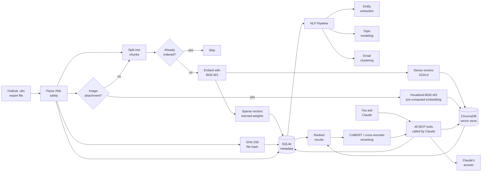
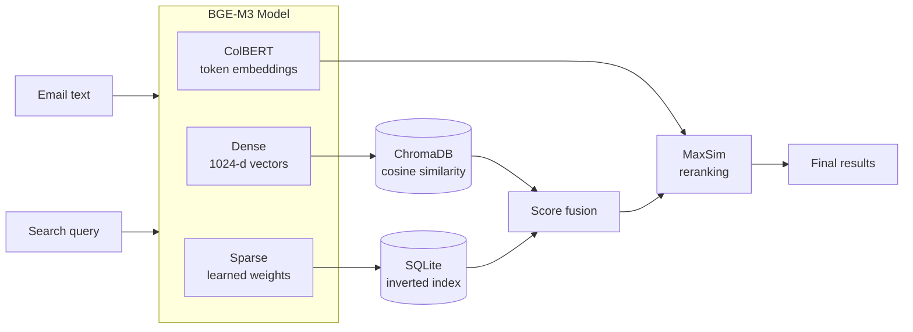
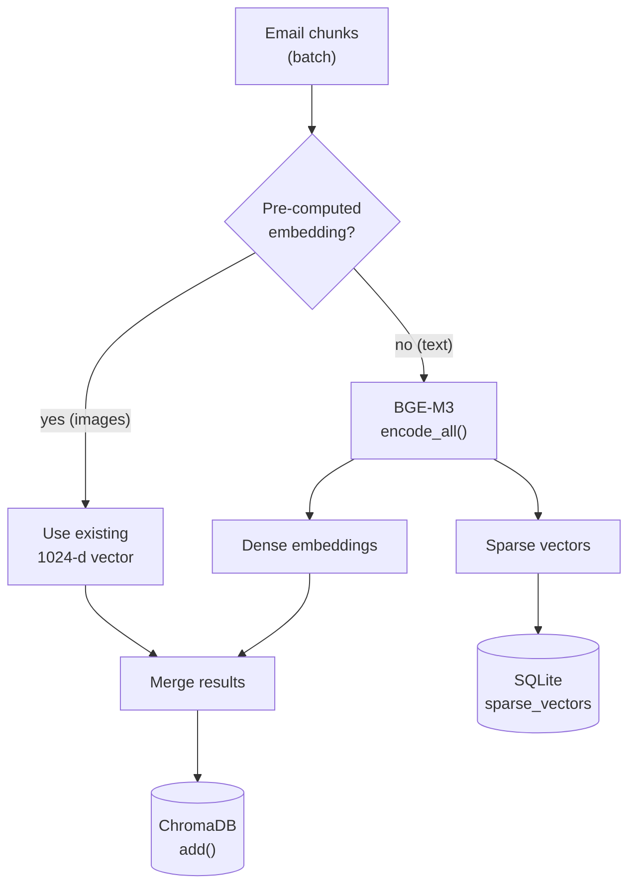
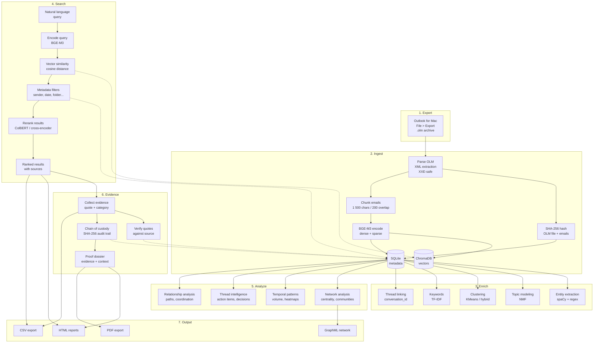

# Email RAG

Search your Outlook emails with natural language using Claude — no cloud, no subscriptions, everything stays on your Mac.

> **Claude-native:** Claude Code calls the built-in MCP tools directly. Your emails never leave your machine. No API keys required.

---

## What This Does

You export your mailbox from Outlook for Mac once, run a one-time indexing step, and then ask Claude questions like:

- *"Find emails about the Q3 budget from finance@company.com"*
- *"What did legal say about the contract renewal in January?"*
- *"Show me everything from Sarah about the product launch"*
- *"Who are my top 10 email contacts?"*
- *"Summarize the thread about the server migration"*
- *"What action items came out of last week's emails?"*
- *"What topics dominate my inbox?"*
- *"Find emails similar to this one about the contract"*
- *"Analyze the writing style of emails from marketing"*
- *"Export the conversation about the contract renewal as a PDF"*
- *"Browse through all my emails from January, 20 at a time"*

Claude reads the indexed emails and gives you precise, sourced answers — without touching Outlook again.

---

## How It Works




### Multi-vector embedding pipeline



### Evidence collection workflow


### Chunk embedding pipeline



**Key properties:**
- All processing runs on your Mac — CPU works, Apple Silicon GPU (MPS) accelerates 3-10×
- Emails are stored in local databases (`data/chromadb/`, `data/email_metadata.db`) that only you can access
- Re-indexing is safe and idempotent — already-indexed emails are skipped automatically
- Semantic search finds relevant emails even when you don't remember the exact words
- NLP pipeline provides topic modeling, clustering, entity extraction, and thread intelligence

---

## Before You Start

You need:

| Requirement | How to check |
|------------|-------------|
| **Mac** (Outlook for Mac .olm format) | — |
| **Python 3.11 or newer** | `python3 --version` in Terminal |
| **Claude Code** | `claude --version` in Terminal |
| **Git** | `git --version` in Terminal |

If you don't have Python 3.11+, download it from [python.org](https://python.org/downloads/).
If you don't have Claude Code, follow the [Claude Code quickstart](https://docs.anthropic.com/en/claude-code/quickstart).

---

## Setup (First Time Only)

### Step 1 — Get the code

Open Terminal and run:

```bash
git clone https://github.com/sebastianspicker/outlook-email-rag.git
cd outlook-email-rag
```

### Step 2 — Create a virtual environment

This keeps the project's dependencies isolated from the rest of your system:

```bash
python3 -m venv .venv
source .venv/bin/activate
pip install -r requirements.txt
```

You should see packages being installed. This takes a few minutes the first time (it downloads the embedding model).

> **Tip:** You need to run `source .venv/bin/activate` every time you open a new Terminal window for this project. You'll know it's active when you see `(.venv)` at the start of your prompt.

### Step 3 — Export your mailbox from Outlook

1. Open **Outlook for Mac**
2. Go to **File > Export...** (or **Tools > Export** depending on your version)
3. Choose **Outlook for Mac Data File (.olm)**
4. Select the folders you want to export (or all folders)
5. Save the `.olm` file into the `data/` folder inside the project

```
outlook-email-rag/
└── data/
    └── my-export.olm   <- put it here
```

### Step 4 — Index your emails

```bash
python -m src.ingest data/my-export.olm
```

This reads every email, splits them into searchable chunks, and stores them in local databases. You'll see progress output like:

```
[INFO] Parsing: data/my-export.olm
[INFO] Found 1 842 emails
[INFO] Warming up embedding model …
[INFO] Loaded SentenceTransformer from cache: BAAI/bge-m3 (device=mps)
[INFO] Model warmed up: BAAI/bge-m3 (backend=sentence_transformer, device=mps, batch_size=32)
[INFO] Model preload complete (5.5s)
[INFO] Batch 1 done (500 chunks, 98.2s, 5.1 chunks/s)
[INFO] Batch 2 done (500 chunks, 101.4s, 4.9 chunks/s)
...
=== Ingestion Summary ===
Emails parsed:   1 842
Chunks created:  4 210
Chunks added:    4 210
Chunks skipped:  0
Total in DB:     4 210
Elapsed:         14m 22s
```

> **Large mailboxes:** For a quick test first, you can limit to the first 200 emails:
> `python -m src.ingest data/my-export.olm --max-emails 200`

> **Re-running is safe:** If you export an updated `.olm` later, running ingest again skips emails that are already indexed.

### Step 5 — Open the project in Claude Code

```bash
claude .
```

The project includes a `.claude/settings.json` that automatically registers the MCP server. Claude Code will detect it and load the email search tools.

**That's it.** You can now ask Claude about your emails.

---

## Using with Claude Code (MCP Server)

This is the primary way to use Email RAG. Claude Code talks to your email index through 46 MCP tools — you just ask questions in plain English.

### How it connects

The project includes a `.claude/settings.json` file that tells Claude Code how to start the MCP server:

```json
{
  "mcpServers": {
    "email_search": {
      "command": ".venv/bin/python",
      "args": ["-m", "src.mcp_server"],
      "cwd": "."
    }
  }
}
```

When you run `claude .` from the project directory, Claude Code reads this file and starts the MCP server automatically. You don't need to configure anything manually.

### Verifying the connection

After opening the project in Claude Code, you can check that the tools loaded:

1. Type `/mcp` in the Claude Code prompt
2. Look for `email_search` in the server list — it should show as **connected**
3. You should see all 46 tools listed beneath it

If it shows as disconnected:
- Make sure the virtual environment exists: `ls .venv/bin/python`
- Make sure dependencies are installed: `.venv/bin/python -c "from src.mcp_server import mcp; print('OK')"`
- Restart Claude Code with `claude .` from the project root

### Asking questions

Just talk to Claude naturally. It picks the right MCP tool automatically based on your question. Here are examples organized by what you can do:

**Searching emails:**

```
Search my emails for anything about the annual budget review from Q1 2024.
```
```
Find emails from legal@company.com about the NDA we signed last year.
```
```
Show me emails about the product launch that were sent to marketing@company.com.
```
```
Find emails similar to this: "We need to reschedule the board meeting due to travel conflicts."
```

**Understanding your archive:**

```
What folders do I have in my archive? How many emails are in each?
```
```
Show me my archive statistics — how many emails, date range, top senders.
```
```
Who are my top 10 email contacts? Show communication stats for each.
```
```
Show me the communication patterns between me and john@company.com.
```

**Thread analysis:**

```
Summarize the thread about the server migration.
```
```
What action items came out of recent emails about the product launch?
```
```
What decisions were made in the thread about the Q4 hiring plan?
```

**Analytics and insights:**

```
Show me my email volume by month for the past year.
```
```
What's my activity pattern? When do I send the most emails?
```
```
What topics are most common in my inbox?
```
```
Show me the most frequently mentioned organizations in my emails.
```
```
Analyze the writing style of emails from marketing@company.com.
```
```
Are there duplicate emails in my archive?
```

**Reading and exporting emails:**

```
Get the full text of the email with UID abc123.
```
```
Browse all my emails from January, 20 at a time.
```
```
Export the thread about the server migration as an HTML file.
```
```
Export the email with UID xyz789 as a PDF.
```

**Evidence collection:**

```
Mark this email as evidence of bossing — the key quote is "You should consider leaving."
```
```
List all evidence items with relevance 4 or higher.
```
```
Export the evidence report as HTML for my lawyer.
```
```
Re-verify all evidence quotes against the source emails.
```

**Reporting:**

```
Generate an HTML report of my email archive.
```
```
Export my communication network as a graph file I can open in Gephi.
```

**Re-ingesting from within Claude:**

```
Ingest my new export at data/latest-export.olm
```

### What happens under the hood

When you ask a question like *"Find emails about the Q3 budget from finance"*, Claude:

1. Picks the most appropriate tool — typically `email_triage` for broad scans or `email_search_structured` for filtered searches
2. Sends parameters like `query="Q3 budget"`, `sender="finance"` to the MCP server
3. The server runs a semantic vector search in ChromaDB, filters by sender, deduplicates, and formats results
4. Claude reads the results and gives you a sourced answer

You never need to remember tool names or parameters — Claude handles that automatically.

### Available MCP Tools (46)

Claude picks the right tool automatically. For detailed parameter reference, see [docs/CLAUDE-TOOLS.md](docs/CLAUDE-TOOLS.md).

#### Search & Triage (6)

| Tool | What it does |
|------|-------------|
| `email_triage` | Fast scan: up to 100 ultra-compact results (~80 tokens each). Issue 3–5 calls with different queries; pass `scan_id` to auto-deduplicate across calls |
| `email_search_structured` | Semantic search with the full filter set: sender, date, folder, CC/To/BCC, attachments, priority, topic, cluster, hybrid search, reranking, query expansion |
| `email_find_similar` | Find emails most similar to a given email UID or text snippet |
| `email_search_by_entity` | Find emails mentioning a specific entity (person, org, URL, phone) |
| `email_thread_lookup` | Retrieve all emails in a thread by `conversation_id` or `thread_topic` |
| `email_scan` | Manage progressive scan sessions (status/flag/candidates/reset) |

#### Reading & Browsing (3)

| Tool | What it does |
|------|-------------|
| `email_deep_context` | Full body text + thread summary + existing evidence + sender stats in one call |
| `email_browse` | Page through emails with filters; `list_categories=True` lists Outlook categories; `is_calendar=True` browses meeting emails |
| `email_export` | Export a single email (by `uid`) or full thread (by `conversation_id`) as HTML or PDF |

#### Archive Info (3)

| Tool | What it does |
|------|-------------|
| `email_stats` | Archive statistics: total emails, date range, top senders, folders |
| `email_list_senders` | Top senders by frequency |
| `email_list_folders` | All folders with email counts |

#### Thread Intelligence (3)

| Tool | What it does |
|------|-------------|
| `email_thread_summary` | Extractive summary of a conversation thread |
| `email_action_items` | Extract action items and assignments from threads or recent emails |
| `email_decisions` | Extract decisions made in email threads |

#### Topics & Clusters (3)

| Tool | What it does |
|------|-------------|
| `email_topics` | Discovered topic labels with email counts; set `topic_id` to list emails in a topic |
| `email_clusters` | Email clusters with sizes; set `cluster_id` to list emails in a cluster |
| `email_discovery` | `mode='keywords'` for top TF-IDF keywords; `mode='suggestions'` for search suggestions |

#### Entities (3)

| Tool | What it does |
|------|-------------|
| `email_list_entities` | Most frequently mentioned entities with counts |
| `email_entity_network` | Entities that co-occur in the same emails |
| `email_entity_timeline` | Track how often an entity appears over time |

#### Attachments (1)

| Tool | What it does |
|------|-------------|
| `email_attachments` | `mode='list'` to browse, `mode='search'` to find emails with matching attachments, `mode='stats'` for aggregate stats (counts, sizes, type distribution) |

#### Temporal Analysis (1)

| Tool | What it does |
|------|-------------|
| `email_temporal` | `analysis='volume'` for trends (day/week/month); `analysis='activity'` for hour×day heatmap; `analysis='response_times'` for average response times per sender |

#### Data Quality (1)

| Tool | What it does |
|------|-------------|
| `email_quality` | `check='duplicates'` for near-duplicate pairs; `check='languages'` for language distribution; `check='sentiment'` for sentiment overview |

#### Network & Relationships (6)

| Tool | What it does |
|------|-------------|
| `email_network_analysis` | Centrality metrics, communities, and bridge nodes in the communication graph |
| `email_contacts` | Top contacts for an address; set `compare_with` for bidirectional stats between two addresses |
| `relationship_paths` | Communication paths between two people through intermediaries |
| `shared_recipients` | Recipients who received emails from multiple specified senders |
| `coordinated_timing` | Time windows where multiple senders were simultaneously active |
| `relationship_summary` | One-call profile: top contacts, community, bridge score, send/receive counts |

#### Evidence (9)

| Tool | What it does |
|------|-------------|
| `evidence_add` | Add an evidence item with auto-verification of the quote against the source email |
| `evidence_add_batch` | Add up to 20 evidence items in one call |
| `evidence_query` | List or search evidence items; set `query` for text search, `sort='date'` for timeline view |
| `evidence_get` | Get a single evidence item with full details |
| `evidence_update` | Update category, quote, summary, relevance, or notes |
| `evidence_remove` | Remove an evidence item |
| `evidence_verify` | Re-verify all quotes against current source email body text |
| `evidence_overview` | Combined statistics and category breakdown |
| `evidence_export` | Export evidence as HTML report or CSV |

#### Dossier & Chain of Custody (4)

| Tool | What it does |
|------|-------------|
| `email_dossier` | Proof dossier (HTML/PDF) combining evidence, emails, relationships, and custody chain; set `preview_only=True` to check scope first |
| `custody_chain` | View the audit trail filtered by email UID, event type, or date range |
| `email_provenance` | Full provenance for an email: OLM source hash, ingestion run, custody events |
| `evidence_provenance` | Full chain for an evidence item: details + source email provenance + history |

#### Reporting (1)

| Tool | What it does |
|------|-------------|
| `email_report` | `type='archive'` for an HTML overview report; `type='network'` for a GraphML export; `type='writing'` for writing style metrics per sender |

#### Ingestion & Admin (2)

| Tool | What it does |
|------|-------------|
| `email_ingest` | Trigger ingestion of an `.olm` file from within Claude (supports `extract_attachments`, `embed_images`) |
| `email_admin` | Diagnostics and maintenance: `action='diagnostics'` shows model/device/backend info; `action='reembed/reingest_bodies/reingest_metadata/reingest_analytics'` backfills missing data |
### Registering in other Claude environments

If you want to use the MCP server outside the project directory (for example, from a global Claude Code config or the Claude desktop app), you need to use **absolute paths**:

```json
{
  "mcpServers": {
    "email_search": {
      "command": "/Users/yourname/outlook-email-rag/.venv/bin/python",
      "args": ["-m", "src.mcp_server"],
      "cwd": "/Users/yourname/outlook-email-rag"
    }
  }
}
```

For **Claude Code** global config, add this to `~/.claude/settings.json`.

For the **Claude desktop app**, add this to `~/Library/Application Support/Claude/claude_desktop_config.json` (macOS) or `%APPDATA%\Claude\claude_desktop_config.json` (Windows).

---

## CLI

A standalone terminal interface for searching and analyzing your email archive — no Claude Code required.

```bash
# Interactive mode
python -m src.cli

# Single query
python -m src.cli search "Q3 budget" --sender finance --rerank

# Analytics
python -m src.cli analytics volume month
```

Supports 7 subcommand groups (`search`, `browse`, `export`, `evidence`, `analytics`, `training`, `admin`) with 58+ flags. See [docs/CLI_REFERENCE.md](docs/CLI_REFERENCE.md) for the full reference.

---

## Streamlit Web UI

A visual search interface that runs in your browser. This is a good option if you want a GUI but don't use Claude Code.

### Starting the UI

```bash
source .venv/bin/activate
streamlit run src/web_app.py
```

Then open [http://localhost:8501](http://localhost:8501) in your browser.

### Features

- **Search form** with fields for query, sender, subject, folder, CC, and To
- **Has-attachments** checkbox filter
- **Date pickers** for start and end dates
- **Relevance threshold** slider (0.0–1.0)
- **Advanced search options**: hybrid search (semantic + keyword), re-ranking (ColBERT or cross-encoder), and query expansion
- **Sort options**: by relevance, newest/oldest, or sender A-Z
- **Paginated results** (20 per page) with email type and attachment badges
- **Thread view** button to explore full conversation threads
- **CSV export** of search results
- **Folder sidebar** showing all folders with email counts
- **Empty-state guidance** when no emails are indexed yet

---

## Configuration

Create a `.env` file in the project root to override defaults (all settings are optional):

```bash
# .env
CHROMADB_PATH=data/chromadb       # where the vector database lives
EMBEDDING_MODEL=BAAI/bge-m3       # local embedding model (1024-d, 100+ languages)
COLLECTION_NAME=emails             # ChromaDB collection name
TOP_K=10                           # default number of results
LOG_LEVEL=INFO                     # INFO or DEBUG
DEVICE=auto                        # auto | mps | cuda | cpu
RERANK_ENABLED=false               # cross-encoder reranking (slower, more precise)
RERANK_MODEL=BAAI/bge-reranker-v2-m3  # reranking model (multilingual, BGE-M3 aligned)
HYBRID_ENABLED=false               # hybrid semantic + BM25 keyword search

# BGE-M3 multi-vector features (all optional, default: disabled)
SPARSE_ENABLED=false               # learned sparse vectors (replaces BM25)
COLBERT_RERANK_ENABLED=false       # ColBERT token-level reranking
EMBEDDING_BATCH_SIZE=0             # 0 = auto-detect (MPS: 32, CUDA: 64, CPU: 16)
MPS_CACHE_CLEAR_INTERVAL=1         # clear MPS GPU cache every N encode calls

# Ingestion performance tuning (Apple Silicon)
INGEST_BATCH_COOLDOWN=0            # seconds between batches (2 = recommended for thermal throttling)
INGEST_WAL_CHECKPOINT_INTERVAL=10  # checkpoint SQLite WAL every N batches
```

Copy `.env.example` as a starting point: `cp .env.example .env`

---

## Troubleshooting

### "No emails found" after ingesting

Check that ingestion completed successfully:

```bash
python -m src.cli --stats
```

If total is 0, try re-running ingest with verbose output:

```bash
LOG_LEVEL=DEBUG python -m src.ingest data/my-export.olm --max-emails 50
```

### MCP tools not appearing in Claude Code

1. Make sure you're in the project directory when you run `claude .`
2. Check that the virtual environment was created: `ls .venv/bin/python`
3. Reload the MCP server in Claude Code: type `/mcp` and look for `email_search`
4. If it shows as disconnected, check that `source .venv/bin/activate` was run before `claude .`

### Import errors when running ingest

Make sure the virtual environment is active:

```bash
source .venv/bin/activate
python -m src.ingest --help
```

### Ingest is slow

This is expected — each chunk requires a full BGE-M3 forward pass (560M parameters). On Apple M4 with MPS, expect **5 chunks/s initially, settling to ~3 chunks/s** after thermal throttling kicks in (~15 min). A mailbox with 20,000 emails (~47K chunks) takes roughly **4 hours** on M4/16GB.

**First run** is the slowest because HuggingFace downloads the model weights (~2.3 GB). Subsequent runs load from cache in ~5 seconds.

If throughput degrades over time (first batches fast, later batches slow), this is **thermal throttling on Apple Silicon**, not a software bug. The chip reduces GPU frequency under sustained load. Mitigations:

```bash
# Add to .env — 2-second cooldown between batches prevents sustained thermal throttling
INGEST_BATCH_COOLDOWN=2
```

To diagnose throughput, each batch now logs the encode/write split:

```
Stored 500 chunks (102.3s total: encode=78.1s, chromadb=24.2s, 5 chunks/s)
```

Use `--timing` for a full phase breakdown (parse, embed, sqlite, entities, analytics):

```bash
python -m src.ingest data/my-export.olm --timing
```

See [Performance & Hardware](#performance--hardware) for detailed benchmarks and tuning options.

### "command not found: claude"

Install Claude Code: follow the [official quickstart](https://docs.anthropic.com/en/claude-code/quickstart).

---

## Architecture


### MCP tool modules (46 tools)

```mermaid
block-beta
    columns 4

    block:search_tools["Search & Discovery"]:1
        s1["search.py\n6 tools"]
        s2["threads.py\n4 tools"]
        s3["topics.py\n4 tools"]
        s4["scan.py\n1 tool"]
    end

    block:analysis_tools["Analysis"]:1
        a1["network.py\n6 tools"]
        a2["temporal.py\n1 tool"]
        a3["entities.py\n4 tools"]
        a4["data_quality.py\n1 tool"]
    end

    block:evidence_tools["Evidence & Export"]:1
        e1["evidence.py\n13 tools"]
        e2["reporting.py\n1 tool"]
        e3["browse.py\n3 tools"]
        e4["attachments.py\n1 tool"]
    end

    block:admin_tools["Admin"]:1
        d1["diagnostics.py\n1 tool"]
        d2["utils.py\nshared helpers"]
    end
```



**Component responsibilities:**

| File | Role |
|------|------|
| `src/parse_olm.py` | Reads `.olm` ZIP archives, parses XML email messages safely (XXE-protected) |
| `src/chunker.py` | Splits emails into 1 500-char chunks with 200-char overlap; handles attachments |
| `src/embedder.py` | Generates embeddings with BGE-M3 (via MultiVectorEmbedder) and writes to ChromaDB |
| `src/retriever.py` | Semantic search, 16-param filter logic, hybrid search, reranking, stats |
| `src/email_db.py` | SQLite metadata store (mixin-based: schema, attachments, custody, entities, analytics, evidence) |
| `src/db_schema.py` | SQLite schema DDL and migrations (v3–v9) |
| `src/db_attachments.py` | Attachment query mixin |
| `src/db_custody.py` | Chain-of-custody mixin |
| `src/db_entities.py` | Entity storage mixin |
| `src/db_analytics.py` | Analytics mixin (language detection, sentiment) |
| `src/db_evidence.py` | Evidence CRUD mixin |
| `src/email_exporter.py` | Export threads/emails as styled HTML or PDF (Jinja2 + optional weasyprint) |
| `src/evidence_exporter.py` | Export evidence reports as HTML, CSV, or PDF for legal review |
| `src/dossier_generator.py` | Proof dossier combining evidence, emails, relationships, and custody chain |
| `src/mcp_models.py` | Pydantic input models for all MCP tool parameters |
| `src/mcp_server.py` | FastMCP server exposing 46 tools for Claude Code |
| `src/tools/` | MCP tool subpackage — 46 tools across 13 domain modules (search, browse, evidence, entities, network, scan, attachments, diagnostics, etc.) |
| `src/ingest.py` | Orchestrates parse -> chunk -> embed -> store pipeline |
| `src/cli.py` | Rich terminal interface with 7 subcommand groups and 58 flags — legacy flat-flag syntax still supported |
| `src/web_app.py` | Streamlit search UI with filters, thread view, CSV export |
| `src/web_ui.py` | Streamlit UI helpers and formatting |
| `src/config.py` | Settings from environment (`.env` support) |
| `src/storage.py` | ChromaDB client and collection helpers |
| `src/validation.py` | Shared input validators (dates, positive_int) |
| `src/sanitization.py` | Output safety (ANSI stripping, control character removal) |
| `src/formatting.py` | Result formatting for Claude and CLI |
| `src/html_converter.py` | HTML-to-text conversion preserving structure |
| `src/rfc2822.py` | RFC 2822 header, MIME, and iCalendar parsing |
| `src/result_filters.py` | Result filtering and deduplication logic |
| `src/attachment_extractor.py` | Extract text from PDF, DOCX, XLSX, CSV, HTML, TXT attachments |
| `src/network_analysis.py` | Communication network analysis with NetworkX (centrality, communities) |
| `src/temporal_analysis.py` | Time-series analysis with pandas (volume, heatmaps, response times) |
| `src/entity_extractor.py` | Regex-based entity extraction (orgs, URLs, phones, @mentions) |
| `src/nlp_entity_extractor.py` | spaCy NER for person/org/location extraction |
| `src/topic_modeler.py` | NMF topic modeling with TF-IDF |
| `src/keyword_extractor.py` | TF-IDF keyword extraction (global and per-sender/folder) |
| `src/email_clusterer.py` | KMeans email clustering with auto-labeling |
| `src/thread_summarizer.py` | Extractive thread summarization |
| `src/thread_intelligence.py` | Action item and decision extraction from threads |
| `src/query_expander.py` | Semantic query expansion using vocabulary similarity |
| `src/query_suggestions.py` | Search suggestion generation from indexed data |
| `src/multi_vector_embedder.py` | BGE-M3 multi-vector embedder — dense, sparse, ColBERT; MPS/CUDA/CPU auto-detection |
| `src/sparse_index.py` | In-memory inverted index for learned sparse vectors (replaces BM25 when available) |
| `src/colbert_reranker.py` | ColBERT token-level MaxSim reranking using BGE-M3 |
| `src/image_embedder.py` | Visualized-BGE-M3 cross-modal image embedding (1024-d) |
| `src/training_data_generator.py` | Contrastive triplet generation from email threads for fine-tuning |
| `src/fine_tuner.py` | Domain fine-tuning via FlagEmbedding or SentenceTransformers |
| `src/bm25_index.py` | BM25 keyword index for hybrid search (fallback when sparse vectors unavailable) |
| `src/reranker.py` | Cross-encoder reranking for result precision (fallback when ColBERT unavailable) |
| `src/dedup_detector.py` | Near-duplicate email detection using character n-grams |
| `src/language_detector.py` | Language detection and distribution statistics |
| `src/sentiment_analyzer.py` | Rule-based sentiment analysis |
| `src/writing_analyzer.py` | Writing style and readability metrics (Flesch, grade level) |
| `src/report_generator.py` | Self-contained HTML report generation (Jinja2) |
| `src/dashboard_charts.py` | Chart generation for Streamlit dashboard |
| `src/__main__.py` | `python -m src` entry point for MCP server |
| `src/__init__.py` | Package marker |

---

## Data Lifecycle



**Deduplication:** Each chunk has a stable ID derived from the email's `message_id` header (or a hash of subject + date + sender as fallback). Re-running ingest skips chunks that are already stored.

**Chain of custody:** Every ingestion, evidence addition, and modification is logged with SHA-256 content hashes, timestamps, and actor identity in the `custody_chain` SQLite table.

---

## Performance & Hardware

### Embedding model

The default model is [BAAI/bge-m3](https://huggingface.co/BAAI/bge-m3) — a 560M-parameter multilingual embedding model producing 1024-dimensional dense vectors. It runs entirely on-device using Apple Metal (MPS), NVIDIA CUDA, or CPU. No API calls, no data leaves your machine.

| Capability | Backend | Output |
|------------|---------|--------|
| Dense vectors (always on) | SentenceTransformers or FlagEmbedding | 1024-d float32 |
| Learned sparse vectors | FlagEmbedding only | token-weight dict |
| ColBERT token vectors | FlagEmbedding only | per-token 1024-d |

### Ingestion throughput

The ingestion bottleneck is the embedding forward pass — each chunk requires a full transformer inference. On a real-world run of **20,257 emails → 47,229 chunks**, GPU encoding consumed **95%** of the total 4-hour runtime (13,628s encode vs. 747s writes). ChromaDB and SQLite I/O are negligible.

| Hardware | Device | Batch size | Sustained rate | 20K emails (~47K chunks) |
|----------|--------|------------|----------------|---------------------------|
| **Apple M4 / 16 GB** | `mps` | 32 | **5→3 chunks/s** | **~4 hours** |
| Apple M1 Pro / 16 GB | `mps` | 32 | ~4–5 chunks/s | ~4.5 hours |
| Apple M2 Max / 32 GB | `mps` | 32 | ~5–6 chunks/s | ~3.5 hours |
| NVIDIA RTX 3090 / 4090 | `cuda` | 64 | ~15–30 chunks/s | ~30–60 min |
| Intel i7 (no GPU) | `cpu` | 16 | ~1–2 chunks/s | ~10+ hours |

The M4 row is a measured benchmark; other rows are estimates based on relative GPU throughput.

> **Rule of thumb:** Outlook exports average ~2–3 chunks per email (body + quoted content + attachments). Multiply your email count by 2.5 for a rough chunk estimate.

### Throughput degradation on Apple Silicon

On sustained runs (>30 minutes), throughput drops from ~5 chunks/s to ~3 chunks/s. This is **thermal throttling**, not a software bug — the M-series chip reduces GPU frequency after sustained MPS load to manage junction temperature. The pattern is visible in production logs:

| Phase | Batches | Rate | Cause |
|-------|---------|------|-------|
| Warm-up | 1–18 | 5 chunks/s | Chip at peak frequency |
| Steady | 19–40 | 4 chunks/s | Thermal envelope reached |
| Throttled | 41–96 | 2–4 chunks/s | Sustained thermal limiting |

Key evidence: intermittent recovery spikes (e.g., batch 66 recovering to 5 chunks/s after a parsing-heavy phase) confirm thermal cycling rather than linear degradation from data growth.

**Mitigations** (set in `.env`):
- `INGEST_BATCH_COOLDOWN=2` — 2-second sleep between batches (~3 min total overhead on a 96-batch run) breaks sustained GPU load, keeping the chip near peak frequency
- `INGEST_WAL_CHECKPOINT_INTERVAL=10` — periodic SQLite WAL checkpoint prevents unbounded WAL growth during long runs (minor impact, but keeps disk I/O predictable)

### What the pipeline does

```
Parse OLM (fast)
  ↓
Model preload — ~5 s (download on first run, cached after)
  ↓
Producer thread: parse → chunk → enqueue
Consumer thread: encode (GPU, 95% of time) → store ChromaDB + SQLite (5%)
  ↓
Per-batch enrichment: spaCy NER, language detection, sentiment analysis
```

Each batch logs a timing split so you can see exactly where time is spent:

```
Stored 500 chunks (102.3s total: encode=78.1s, chromadb=24.2s, 5 chunks/s)
```

1. **Model preloading** — BGE-M3 weights are loaded and a warmup encode runs before the ingestion loop starts, so the first batch isn't penalized by model initialization. On subsequent runs the model loads from HuggingFace's local cache (`~/.cache/huggingface/`), skipping ~30 HTTP HEAD requests to the Hub that `SentenceTransformer()` would otherwise make to check for model updates.

2. **Encode-then-store** — All chunks in a batch are encoded in a single `encode_all()` call, then written to ChromaDB and SQLite in separate storage-only batches. The naive approach — encode a small batch, write it, encode the next — creates GPU idle bubbles: ChromaDB's HNSW index construction is CPU-bound and holds a write lock, so the GPU sits waiting for each HNSW insert to finish before the next encode can start. By encoding everything first and then flushing to storage, the GPU runs at full utilization during the compute phase and the CPU handles the I/O phase without contention.

3. **MPS memory management** — Apple's Metal Performance Shaders uses macOS unified memory (shared between CPU and GPU). Unlike CUDA, MPS never releases allocated GPU memory back to the system — it only grows. On a sustained workload like embedding 10K+ chunks, this means GPU memory pressure eventually competes with system RAM, causing swap thrashing and a ~5× throughput drop after the first few hundred chunks. The fix is calling `torch.mps.empty_cache()` between sub-batches. This call is near-free (~0.1 ms vs. ~200 ms for the forward pass itself), so clearing after every sub-batch of 32 texts has negligible overhead while keeping memory stable. The interval is configurable via `MPS_CACHE_CLEAR_INTERVAL` for experimentation, but 1 (every sub-batch) is the right default for most Apple Silicon machines.

4. **MPS sub-batch encoding** — A single `model.encode(500_texts, batch_size=32)` call runs 16 internal forward passes, but the MPS cache is only cleared *after* the call returns — by which point memory has already accumulated. The pipeline instead calls `model.encode()` in explicit loops of `batch_size` texts, clearing the MPS cache between each iteration. This gives the same mathematical result but with bounded GPU memory usage. On CUDA this isn't necessary because CUDA's memory allocator handles fragmentation more gracefully.

5. **Threading** — A producer thread parses and chunks emails while a consumer thread encodes and stores. Queue depth of 4 batches keeps both threads busy. The producer is I/O-bound (XML parsing, ZIP extraction) while the consumer is GPU-bound, so they overlap well.

6. **HNSW deferred construction** — ChromaDB's HNSW index is configured with `batch_size=100,000` and `sync_threshold=100,000`, meaning the expensive graph construction is deferred until 100K elements are buffered. For most email archives (up to ~40K emails / ~100K chunks), this means the HNSW graph is built once at first query time rather than during ingestion — a much better trade-off since ingestion throughput is the primary bottleneck. The `construction_ef=128` and `M=16` settings balance recall quality with construction speed.

7. **Thermal cooldown** (opt-in) — On Apple Silicon, sustained GPU+CPU load (embedding + spaCy NER + analytics) causes thermal throttling after ~15 minutes. The `INGEST_BATCH_COOLDOWN` setting inserts a brief sleep between batches, breaking the sustained-load pattern and allowing the chip to stay near peak frequency. The overhead is minimal (e.g., 96 batches × 2s = ~3 min on a 4-hour run) relative to the throughput maintained.

8. **WAL checkpointing** — During long ingestions, SQLite's WAL file grows continuously. Every 10 batches (configurable via `INGEST_WAL_CHECKPOINT_INTERVAL`), a passive checkpoint transfers completed pages from the WAL to the main database file without blocking writes. This keeps disk I/O predictable and prevents the WAL from growing unboundedly.

### Tuning

These environment variables can be set in your `.env` file:

| Variable | Default | Description |
|----------|---------|-------------|
| `DEVICE` | `auto` | Force `mps`, `cuda`, or `cpu` (auto-detected by default) |
| `EMBEDDING_BATCH_SIZE` | `0` (auto) | Forward-pass batch size; auto = 32 on MPS, 64 on CUDA, 16 on CPU |
| `MPS_CACHE_CLEAR_INTERVAL` | `1` | Clear MPS GPU cache every N encode calls (increase to 2–3 if memory isn't an issue) |
| `INGEST_BATCH_COOLDOWN` | `0` | Seconds to sleep between batches; `2` recommended for Apple Silicon thermal throttling |
| `INGEST_WAL_CHECKPOINT_INTERVAL` | `10` | Checkpoint SQLite WAL every N batches; `0` to disable |
| `SPARSE_ENABLED` | `false` | Enable learned sparse vectors (requires FlagEmbedding; ~10% slower) |
| `COLBERT_RERANK_ENABLED` | `false` | Enable ColBERT reranking at query time |

> **First run is slowest.** HuggingFace downloads the BGE-M3 weights (~2.3 GB) on first use. Subsequent runs load from disk cache in ~5 seconds.

---

## Privacy & Security

- **All data stays local.** No email content is sent to any external service.
- **No API keys.** Claude Code reads MCP tool results directly — no Anthropic API calls are made by this project.
- **Safe XML parsing.** The OLM parser disables external entity resolution (XXE), network access, and resource-exhaustion attacks.
- **Output sanitization.** ANSI escape codes and control characters in email content are stripped before display.
- **Input validation.** All MCP tool inputs are validated with Pydantic before use.

---

## Development

```bash
pip install -r requirements-dev.txt

# or with pip install -e .[dev]

ruff check .          # linting
pytest -q             # tests (1342+)
bandit -r src -q      # security scan
```

See [docs/API_COMPATIBILITY.md](docs/API_COMPATIBILITY.md) for the interface stability policy.

---

## Project Structure

```text
outlook-email-rag/
├── src/
│   ├── __init__.py              # package marker
│   ├── __main__.py              # python -m src -> MCP server
│   ├── mcp_server.py            # 46 MCP tools for Claude Code
│   ├── retriever.py             # search, filters, hybrid, reranking
│   ├── ingest.py                # ingestion pipeline
│   ├── parse_olm.py             # OLM XML parser
│   ├── html_converter.py        # HTML-to-text conversion
│   ├── rfc2822.py               # RFC 2822 header/MIME/iCal parsing
│   ├── chunker.py               # email + attachment chunking
│   ├── embedder.py              # embedding + ChromaDB writes
│   ├── email_db.py              # SQLite metadata store (mixin-based)
│   ├── db_schema.py             # SQLite schema DDL + migrations (v3–v9)
│   ├── db_attachments.py        # attachment query mixin
│   ├── db_custody.py            # chain-of-custody mixin
│   ├── db_entities.py           # entity storage mixin
│   ├── db_analytics.py          # analytics mixin (language, sentiment)
│   ├── db_evidence.py           # evidence CRUD mixin
│   ├── email_exporter.py        # thread/email HTML/PDF export
│   ├── evidence_exporter.py     # evidence report HTML/CSV/PDF export
│   ├── config.py                # settings from environment
│   ├── storage.py               # ChromaDB helpers
│   ├── validation.py            # shared validators
│   ├── sanitization.py          # output safety
│   ├── formatting.py            # result formatting
│   ├── result_filters.py        # result filtering + dedup logic
│   ├── cli.py                   # terminal interface
│   ├── web_app.py               # Streamlit UI
│   ├── web_ui.py                # Streamlit helpers
│   ├── attachment_extractor.py  # PDF/DOCX/XLSX/CSV text extraction
│   ├── network_analysis.py      # communication network (NetworkX)
│   ├── temporal_analysis.py     # time-series analytics (pandas)
│   ├── entity_extractor.py      # regex entity extraction
│   ├── nlp_entity_extractor.py  # spaCy NER
│   ├── topic_modeler.py         # NMF topic modeling
│   ├── keyword_extractor.py     # TF-IDF keywords
│   ├── email_clusterer.py       # KMeans clustering
│   ├── thread_summarizer.py     # extractive summarization
│   ├── thread_intelligence.py   # action items + decisions
│   ├── query_expander.py        # semantic query expansion
│   ├── query_suggestions.py     # search suggestions
│   ├── multi_vector_embedder.py  # BGE-M3 multi-vector (dense+sparse+ColBERT)
│   ├── sparse_index.py          # learned sparse vector index
│   ├── colbert_reranker.py      # ColBERT MaxSim reranking
│   ├── image_embedder.py        # Visualized-BGE-M3 image embedding
│   ├── training_data_generator.py # contrastive triplets from threads
│   ├── fine_tuner.py            # domain fine-tuning
│   ├── bm25_index.py            # BM25 keyword index (fallback)
│   ├── reranker.py              # BGE-M3 reranking (cross-encoder fallback)
│   ├── dedup_detector.py        # duplicate detection
│   ├── language_detector.py     # language detection
│   ├── sentiment_analyzer.py    # sentiment analysis
│   ├── writing_analyzer.py      # writing style metrics
│   ├── report_generator.py      # HTML report generation
│   ├── dashboard_charts.py      # Streamlit chart helpers
│   ├── mcp_models.py            # Pydantic input models for MCP tools
│   ├── dossier_generator.py     # proof dossier (evidence + context)
│   ├── scan_session.py          # scan session state management
│   ├── tools/                   # MCP tool modules (46 tools in 13 domain modules)
│   │   ├── __init__.py          # register_all() dispatcher
│   │   ├── utils.py             # shared helpers (ToolDeps, formatters)
│   │   ├── search.py            # core search + triage (6 tools)
│   │   ├── browse.py            # email reading & export (3 tools)
│   │   ├── attachments.py       # attachment discovery (1 tool)
│   │   ├── diagnostics.py       # admin operations (1 tool)
│   │   ├── data_quality.py      # data quality checks (1 tool)
│   │   ├── entities.py          # entity search & NLP (4 tools)
│   │   ├── evidence.py          # evidence CRUD, custody, dossier (13 tools)
│   │   ├── network.py           # network & relationships (6 tools)
│   │   ├── reporting.py         # reports & writing analysis (1 tool)
│   │   ├── temporal.py          # temporal analysis (1 tool)
│   │   ├── threads.py           # thread intelligence (4 tools)
│   │   ├── topics.py            # topics, clusters, discovery (4 tools)
│   │   └── scan.py              # scan session management (1 tool)
│   └── templates/
│       ├── report.html          # archive report template
│       ├── thread_export.html   # email/thread export template
│       ├── evidence_report.html # evidence report template
│       └── dossier.html         # proof dossier template
├── tests/                       # 1360+ tests
├── data/                        # put your .olm file here
├── .claude/
│   └── settings.json            # auto-registers MCP server in Claude Code
├── docs/
│   ├── API_COMPATIBILITY.md
│   └── CLI_REFERENCE.md
├── .env.example
├── requirements.txt
├── requirements-dev.txt
├── pyproject.toml
└── CHANGELOG.md
```
