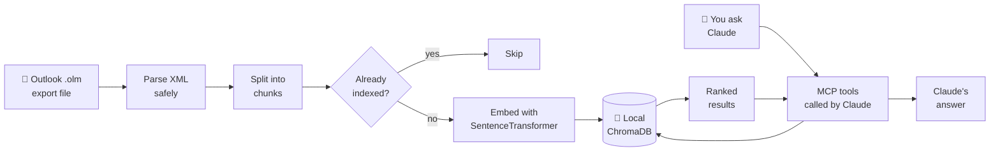
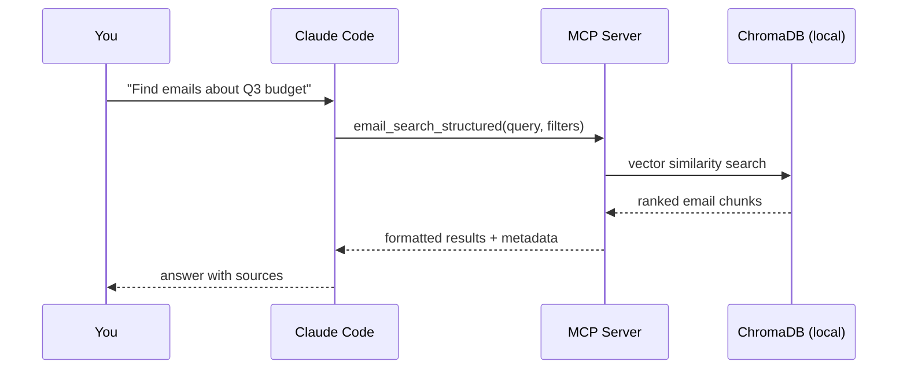
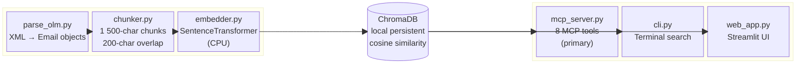
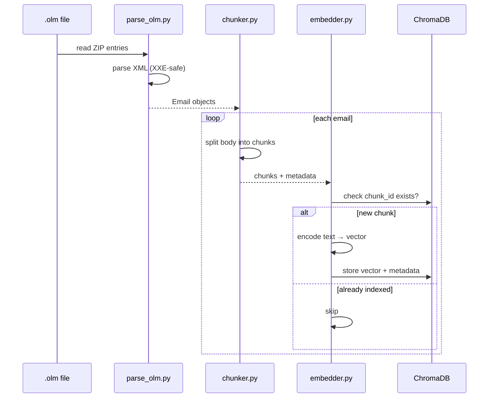

# Email RAG

Search your Outlook emails with natural language using Claude — no cloud, no subscriptions, everything stays on your Mac.

> **Claude-native:** Claude Code calls the built-in MCP tools directly. Your emails never leave your machine. No API keys required.

---

## What This Does

You export your mailbox from Outlook for Mac once, run a one-time indexing step, and then ask Claude questions like:

- *"Find emails about the Q3 budget from finance@company.com"*
- *"What did legal say about the contract renewal in January?"*
- *"Show me everything from Sarah about the product launch"*

Claude reads the indexed emails and gives you precise, sourced answers — without touching Outlook again.

---

## How It Works





**Key properties:**
- All processing runs on your Mac — CPU only, no GPU needed
- Emails are stored in a local database (`data/chromadb/`) that only you can access
- Re-indexing is safe and idempotent — already-indexed emails are skipped automatically
- Semantic search finds relevant emails even when you don't remember the exact words

---

## Before You Start

You need:

| Requirement | How to check |
|------------|-------------|
| **Mac** (Outlook for Mac .olm format) | — |
| **Python 3.11 or newer** | `python3 --version` in Terminal |
| **Claude Code** | `claude --version` in Terminal |
| **Git** | `git --version` in Terminal |

If you don't have Python 3.11+, download it from [python.org](https://python.org/downloads/).
If you don't have Claude Code, follow the [Claude Code quickstart](https://docs.anthropic.com/en/claude-code/quickstart).

---

## Setup (First Time Only)

### Step 1 — Get the code

Open Terminal and run:

```bash
git clone https://github.com/your-username/outlook-email-rag.git
cd outlook-email-rag
```

### Step 2 — Create a virtual environment

This keeps the project's dependencies isolated from the rest of your system:

```bash
python3 -m venv .venv
source .venv/bin/activate
pip install -r requirements.txt
```

You should see packages being installed. This takes a few minutes the first time (it downloads the embedding model).

> **Tip:** You need to run `source .venv/bin/activate` every time you open a new Terminal window for this project. You'll know it's active when you see `(.venv)` at the start of your prompt.

### Step 3 — Export your mailbox from Outlook

1. Open **Outlook for Mac**
2. Go to **File → Export…** (or **Tools → Export** depending on your version)
3. Choose **Outlook for Mac Data File (.olm)**
4. Select the folders you want to export (or all folders)
5. Save the `.olm` file into the `data/` folder inside the project

```
outlook-email-rag/
└── data/
    └── my-export.olm   ← put it here
```

### Step 4 — Index your emails

```bash
python -m src.ingest data/my-export.olm
```

This reads every email, splits them into searchable chunks, and stores them in a local database. You'll see progress output like:

```
[INFO] Parsing: data/my-export.olm
[INFO] Progress: 100 emails processed
[INFO] Progress: 200 emails processed
...
=== Ingestion Summary ===
Emails parsed:   1 842
Chunks created:  4 210
Chunks added:    4 210
Chunks skipped:  0
Total in DB:     4 210
Elapsed:         47.3s
```

> **Large mailboxes:** For a quick test first, you can limit to the first 200 emails:
> `python -m src.ingest data/my-export.olm --max-emails 200`

> **Re-running is safe:** If you export an updated `.olm` later, running ingest again skips emails that are already indexed.

### Step 5 — Open the project in Claude Code

```bash
claude .
```

The project includes a `.claude/settings.json` that automatically registers the MCP server. Claude Code will detect it and load the email search tools.

**That's it.** You can now ask Claude about your emails.

---

## Using the MCP Tools in Claude Code

Once set up, just talk to Claude naturally. Examples:

```
Search my emails for anything about the annual budget review from Q1 2024.
```

```
Find emails from legal@company.com about the NDA we signed last year.
```

```
What folders do I have in my archive? How many emails are in each?
```

```
Index my updated mailbox — the file is at /Users/me/Downloads/archive.olm
```

### Available MCP tools

Claude picks the right tool automatically, but here's what's available:

| Tool | What it does |
|------|-------------|
| `email_search` | Semantic search across all emails |
| `email_search_structured` | Search with filters: sender, subject, folder, CC, date range, relevance threshold |
| `email_search_by_sender` | Search scoped to a specific sender |
| `email_search_by_date` | Search within a date range |
| `email_list_senders` | List the most frequent senders in your archive |
| `email_list_folders` | List all folders with email counts |
| `email_stats` | Archive statistics (total emails, date range, senders, folders) |
| `email_ingest` | Trigger ingestion of an `.olm` file from within Claude |

---

## Alternative Interfaces

### Command-line search

If you prefer working in Terminal directly:

```bash
# Interactive mode (type queries, press Enter)
python -m src.cli

# Single query
python -m src.cli --query "Q3 budget approval"

# Filtered search
python -m src.cli --query "contract renewal" \
    --sender legal \
    --date-from 2024-01-01 \
    --date-to 2024-12-31

# Archive statistics
python -m src.cli --stats
```

### Streamlit web UI (optional)

A visual search interface you can run in your browser:

```bash
streamlit run src/web_app.py
```

Then open [http://localhost:8501](http://localhost:8501).

Features: query form, sender/subject/folder/CC/date filters, relevance threshold slider, paginated results, JSON export.

---

## Configuration

Create a `.env` file in the project root to override defaults (all settings are optional):

```bash
# .env
CHROMADB_PATH=data/chromadb      # where the vector database lives
EMBEDDING_MODEL=all-MiniLM-L6-v2 # local embedding model (CPU)
COLLECTION_NAME=emails            # ChromaDB collection name
TOP_K=10                          # default number of results
LOG_LEVEL=INFO                    # INFO or DEBUG
```

Copy `.env.example` as a starting point: `cp .env.example .env`

---

## Troubleshooting

### "No emails found" after ingesting

Check that ingestion completed successfully:

```bash
python -m src.cli --stats
```

If total is 0, try re-running ingest with verbose output:

```bash
LOG_LEVEL=DEBUG python -m src.ingest data/my-export.olm --max-emails 50
```

### MCP tools not appearing in Claude Code

1. Make sure you're in the project directory when you run `claude .`
2. Check that the virtual environment was created: `ls .venv/bin/python`
3. Reload the MCP server in Claude Code: type `/mcp` and look for `email_search`
4. If it shows as disconnected, check that `source .venv/bin/activate` was run before `claude .`

### Import errors when running ingest

Make sure the virtual environment is active:

```bash
source .venv/bin/activate
python -m src.ingest --help
```

### Ingest is slow

This is normal on first run — the embedding model needs to process every email. A mailbox with 5 000 emails typically takes 3–10 minutes on a modern Mac.

### "command not found: claude"

Install Claude Code: follow the [official quickstart](https://docs.anthropic.com/en/claude-code/quickstart).

---

## Architecture



**Component responsibilities:**

| File | Role |
|------|------|
| `src/parse_olm.py` | Reads `.olm` ZIP archives, parses XML email messages safely |
| `src/chunker.py` | Splits emails into 1 500-char chunks with 200-char overlap |
| `src/embedder.py` | Generates embeddings with SentenceTransformer and writes to ChromaDB |
| `src/retriever.py` | Semantic search, filter logic, stats, sender/folder aggregation |
| `src/mcp_server.py` | FastMCP server exposing 8 tools for Claude Code |
| `src/ingest.py` | Orchestrates parse → chunk → embed → store pipeline |
| `src/cli.py` | Rich terminal interface for interactive and scripted queries |
| `src/web_app.py` | Streamlit search UI |

---

## Data Lifecycle



**Deduplication:** Each chunk has a stable ID derived from the email's `message_id` header (or a hash of subject + date + sender as fallback). Re-running ingest skips chunks that are already stored.

---

## Privacy & Security

- **All data stays local.** No email content is sent to any external service.
- **No API keys.** Claude Code reads MCP tool results directly — no Anthropic API calls are made by this project.
- **Safe XML parsing.** The OLM parser disables external entity resolution (XXE), network access, and resource-exhaustion attacks.
- **Output sanitization.** ANSI escape codes and control characters in email content are stripped before display.
- **Input validation.** All MCP tool inputs are validated with Pydantic before use.

---

## Development

```bash
pip install -r requirements-dev.txt

# or with pip install -e .[dev]

ruff check .          # linting
pytest -q             # tests (103 tests, ~0.1s)
bandit -r src -q      # security scan
```

See [docs/API_COMPATIBILITY.md](docs/API_COMPATIBILITY.md) for the interface stability policy.

---

## Project Structure

```text
outlook-email-rag/
├── src/
│   ├── __main__.py         # python -m src → MCP server
│   ├── mcp_server.py       # 8 MCP tools for Claude Code
│   ├── retriever.py        # search, filters, stats
│   ├── ingest.py           # ingestion pipeline
│   ├── parse_olm.py        # OLM XML parser
│   ├── chunker.py          # email chunking
│   ├── embedder.py         # embedding + ChromaDB writes
│   ├── config.py           # settings from environment
│   ├── storage.py          # ChromaDB helpers
│   ├── validation.py       # shared validators
│   ├── sanitization.py     # output safety
│   ├── cli.py              # terminal interface
│   ├── web_app.py          # Streamlit UI
│   └── web_ui.py           # Streamlit helpers
├── tests/                  # 103 tests
├── data/                   # put your .olm file here
├── .claude/
│   └── settings.json       # auto-registers MCP server in Claude Code
├── docs/
│   └── API_COMPATIBILITY.md
├── .env.example
├── requirements.txt
├── requirements-dev.txt
├── pyproject.toml
└── CHANGELOG.md
```
