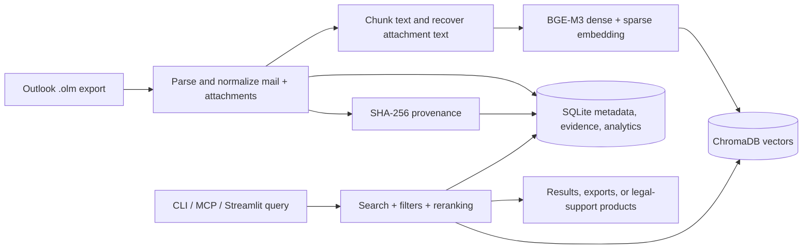
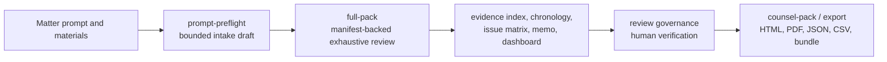

# Email RAG

Search Outlook `.olm` archives locally with natural language, structured filters, exports, and MCP-native workflows.

> **MCP-native and local-first:** Any compatible MCP client can call the built-in tools directly. Email content stays local on your machine. First-run model loading may still contact Hugging Face to download or validate cached weights unless you explicitly use offline mode.

## What This Does

You export your mailbox from Outlook for Mac once, index it locally, and then use one of three surfaces:

- CLI for direct operator workflows, batch exports, diagnostics, and local case-review execution
- MCP for assistant-driven search, evidence collection, and structured legal-support workflows
- Streamlit for exploratory browsing, quick inspection, and lightweight archive review

Typical questions and tasks:

- *"Find emails about the Q3 budget from finance@example.test"*
- *"Summarize the thread about the server migration"*
- *"Show me my top contacts and communication patterns"*
- *"Export the conversation about the contract renewal as a PDF"*
- *"Run a structured workplace case review from a matter prompt and materials directory"*

## How It Works

For the full architecture, retrieval mathematics, evaluation methodology, and
a synthetic end-to-end example, see
[docs/ARCHITECTURE_AND_METHODS.md](docs/ARCHITECTURE_AND_METHODS.md).





Key properties:

- All processing runs on your Mac. CPU works; Apple Silicon GPU (MPS) accelerates many workloads.
- Tracked demo/runtime examples can live under sanitized `data/`, but live operator runs should point at `private/runtime/current/chromadb` and `private/runtime/current/email_metadata.db`.
- Re-indexing is safe and idempotent. Already-indexed emails are skipped automatically.
- Semantic search works even when you do not remember the exact words.
- The same local runtime supports evidence, chronology, analytics, export, and legal-support workflows.

## Choose Your Interface

| Surface | Best use | Avoid when |
| --- | --- | --- |
| CLI | Direct operator use, repeatable commands, exports, diagnostics, local campaign/case workflows | You want an assistant to choose tools for you automatically |
| MCP | Assistant-driven search, evidence collection, structured workflow orchestration, client integrations | You want a human-readable shell workflow first |
| Streamlit | A visual search interface that runs in your browser. This is the exploratory GUI for browsing, search, analytics, network, and evidence review. | You need authoritative counsel-ready legal-support output |

Best-practice chooser:

- Start with CLI when you want predictable local commands and explicit outputs.
- Start with MCP when your assistant or MCP client should choose the right tool automatically.
- Use Streamlit for exploration, not as the authoritative legal-support surface.

## Privacy And First-Run Boundary

- Email content stays local. This repository does not send email bodies to a cloud provider API.
- No API keys are required for the built-in workflows.
- First-run model loading may contact Hugging Face to download or validate cached model weights.
- If you need deterministic offline behavior, use `RUNTIME_PROFILE=offline-test` and `EMBEDDING_LOAD_MODE=local_only`.
- Exports can contain sensitive content. Review HTML, PDF, CSV, JSON, and bundle outputs before sharing them with third parties.
- Checked-in examples, fixtures, and documentation scenarios are synthetic and must stay free of personal records or private actor references.

## Runtime Layout

Use one canonical layout for real operator runs:

```text
<repo-root>/
├── private/
│   ├── ingest/
│   │   └── example-export.olm
│   ├── runtime/
│   │   └── current/
│   │       ├── chromadb/
│   │       └── email_metadata.db
│   ├── files/
│   └── matter.md
├── data/
│   └── ... sanitized examples only ...
└── tests/fixtures/
    └── ... sanitized fixtures only ...
```

Best practices:

- `private/` is ignored by Git and is the right place for real mailbox exports, matter files, and live runtime state.
- Keep tracked `data/` and `tests/fixtures/` content sanitized.
- Use tracked `data/` only for demos, tests, checked-in examples, or intentionally published artifacts.
- Write/output paths are validated against allowlisted local roots and must not overwrite existing files. Defaults write below `private/exports/`; extend roots explicitly with `EMAIL_RAG_ALLOWED_OUTPUT_ROOTS` when needed.

## Setup

### Before You Start

You need:

| Requirement | How to check |
| --- | --- |
| Mac with Legacy Outlook for Mac export support | Microsoft documents `.olm` export as a Legacy Outlook for Mac feature |
| Python 3.11 or newer | `python3 --version` |
| Git | `git --version` |

### Step 1: Get the code

```bash
git clone https://github.com/sebastianspicker/outlook-email-rag.git
cd outlook-email-rag
```

### Step 2: Create a virtual environment and install

```bash
python3 -m venv .venv
source .venv/bin/activate
pip install -r requirements.txt
pip install -e .
```

After `pip install -e .`, both packaged entry points and module entry points are available:

```bash
email-rag --help
email-rag-ingest --help
python -m src.cli --help
python -m src.ingest --help
```

### Step 3: Create `.env` from the tracked example

```bash
cp .env.example .env
```

Profile-first runtime setup remains `RUNTIME_PROFILE=quality`.

Recommended starting point for a normal local workstation:

```bash
CHROMADB_PATH=private/runtime/current/chromadb
SQLITE_PATH=private/runtime/current/email_metadata.db
RUNTIME_PROFILE=quality
EMBEDDING_LOAD_MODE=auto

# Uncomment only when you intentionally want to override the profile defaults.
# RERANK_ENABLED=false
# HYBRID_ENABLED=false
# SPARSE_ENABLED=false
# COLBERT_RERANK_ENABLED=false
```

### Step 4: Export your mailbox from Outlook

1. Open Legacy Outlook for Mac.
2. In Legacy Outlook for Mac, go to `File > Export...` or `Tools > Export`.
3. Choose `Outlook for Mac Data File (.olm)`.
4. Save the export into `private/ingest/`.

```text
<repo-root>/
└── private/
    └── ingest/
        └── example-export.olm
```

### Step 5: Ingest the archive

```bash
email-rag-ingest private/ingest/example-export.olm
# or: python -m src.ingest private/ingest/example-export.olm
```

For a short smoke run first:

```bash
python -m src.ingest private/ingest/example-export.olm --max-emails 200
```

### Step 6: Verify that the runtime is alive

```bash
email-rag analytics stats
email-rag admin diagnostics
```

`email_admin(action='diagnostics')` shows resolved runtime settings, embedder/backend state, MCP budgets, and sparse-index status.

### First-run expectations

- The first model load may take longer because model weights may be downloaded or validated.
- Large archives can take hours to ingest on smaller Apple Silicon machines.
- Re-running ingest is safe and skips already-indexed emails.
- PDF export may require optional dependencies in your environment; HTML export is the safer baseline.

## Using With An MCP Client

Email RAG exposes 68 MCP tools. Any compatible client can talk to your local email index in plain English.

### MCP server command

```bash
.venv/bin/python -m src.mcp_server
```

Example MCP client configuration:

```json
{
  "mcpServers": {
    "email_search": {
      "command": ".venv/bin/python",
      "args": ["-m", "src.mcp_server"],
      "cwd": "."
    }
  }
}
```

Use absolute paths if your client launches servers from a different working directory.

### Verifying the connection

1. Open the client’s MCP server/status view.
2. Look for `email_search` in the server list.
3. You should see all 68 tools listed beneath it.

If it shows as disconnected:

- Make sure `.venv/bin/python` exists.
- Make sure project dependencies were installed.
- Restart the client after updating its server command.

### Example prompts

Search and archive understanding:

```text
Find emails about the annual budget review from Q1 2024.
```

```text
Show me my archive statistics and top senders.
```

Reading and export:

```text
Get the full text of the email with UID abc123.
```

```text
Export the thread about the server migration as an HTML file.
```

Evidence and workflow:

```text
Mark this email as evidence of exclusion and keep the exact quote.
```

```text
Ingest my new export at private/ingest/latest-export.olm
```

## Workplace Case And Legal-Support Boundaries

Use the dedicated `email_case_*` workflows when you need a structured review of potentially hostile, exclusionary, retaliatory, discriminatory, manipulative, or mobbing-like communication patterns.

Important boundaries:

- `email_case_analysis` is exploratory and retrieval-bounded.
- `case execute-wave`, `case execute-all-waves`, and `case gather-evidence` share the campaign execution contract with the corresponding MCP `email_case_*` campaign tools.
- Dedicated legal-support analytical products remain MCP-governed even where the CLI exposes a local wrapper for operator convenience.
- Counsel-facing export remains human-gated by persisted review state.

Best-practice escalation path:

1. Start with `case prompt-preflight` or `email_case_prompt_preflight` when you only have a long narrative matter description.
2. Use wave execution and evidence harvest while you are still stabilizing scope, sources, and anchors.
3. Promote to `case full-pack` or dedicated `email_case_*` product tools only when the record is ready for manifest-backed exhaustive review.
4. Review exports manually before external sharing.

## Available MCP Tool Families (68 tools)

For exact parameters, examples, and legal-support refresh behavior, see [docs/MCP_TOOLS.md](docs/MCP_TOOLS.md).

| Family | What it covers |
| --- | --- |
| Search and triage | semantic search, fast triage, answer-context assembly, scan sessions, similar-email discovery |
| Reading and browsing | deep context, browse, export, folder/category/calendar views |
| Archive understanding | stats, senders, folders, discovery, clusters, conditional topics |
| Entities and relationships | entity lookup, co-occurrence, timelines, contact/network analysis |
| Thread intelligence | thread lookup, summaries, action items, decisions |
| Evidence and custody | evidence CRUD, export, overview, provenance, dossier, custody chain |
| Admin and diagnostics | ingest, diagnostics, reingest, reembed, runtime inspection |
| Case and legal-support workflows | prompt preflight, full-pack, wave execution, evidence index, chronology, issue matrix, dashboard, export |

Temporal analysis includes recent-sample response times per sender based on canonical reply pairs.

## Best Practices

- Keep real operator data under `private/`, not tracked `data/`.
- Use `scan_id` with `email_triage`, `email_search_structured`, and `email_find_similar` when you are iteratively scanning a large archive.
- Use Streamlit for exploration, not as the authoritative legal-support surface.
- Prefer `email_admin(action='diagnostics')` over guessing runtime state from `.env`.
- Review every export before sharing; HTML/PDF/CSV/JSON outputs can contain raw source content and sensitive metadata.
- Use `bash scripts/clean_ingest_reset.sh --dry-run` before destructive cleanup.
- Keep offline expectations explicit in CI-like or air-gapped environments: `RUNTIME_PROFILE=offline-test` plus `EMBEDDING_LOAD_MODE=local_only`.

## Documentation Map

- [docs/README.md](docs/README.md) for the public docs hub and reading order
- [docs/ARCHITECTURE_AND_METHODS.md](docs/ARCHITECTURE_AND_METHODS.md) for architecture, retrieval mathematics, evaluation methodology, and a synthetic example
- [docs/README_USAGE_AND_OPERATIONS.md](docs/README_USAGE_AND_OPERATIONS.md) for configuration, runtime layout, troubleshooting, lifecycle, and go-live practices
- [docs/CLI_REFERENCE.md](docs/CLI_REFERENCE.md) for terminal usage
- [docs/MCP_TOOLS.md](docs/MCP_TOOLS.md) for the detailed MCP tool surface
- [docs/RUNTIME_TUNING.md](docs/RUNTIME_TUNING.md) for performance and model-loading guidance
- [docs/API_COMPATIBILITY.md](docs/API_COMPATIBILITY.md) for interface-stability expectations
- [docs/agent/README.md](docs/agent/README.md) for advanced legal-support product docs, operator runbooks, fixtures/goldens, and archive/history surfaces

## Additional Guides

- CLI, Streamlit UI, configuration, troubleshooting, architecture, lifecycle, and development details live in `docs/README_USAGE_AND_OPERATIONS.md`.
- `email_deep_context.max_body_chars` uses `None` as a profile-default sentinel (`MCP_MAX_FULL_BODY_CHARS`), while `0` means unlimited.
- `email_ingest` ingests into the requested target but does not silently switch the active runtime archive for later searches.
- Topic contract note: the default ingest workflow does not populate topic tables yet.
- Write/output paths are validated against allowlisted local roots and must not overwrite existing files; defaults write below `private/exports/`. Extend roots explicitly with `EMAIL_RAG_ALLOWED_OUTPUT_ROOTS` when needed.
- Privacy boundary remains unchanged: Email content stays local.
- First-run model weights are downloaded from Hugging Face when not cached.
