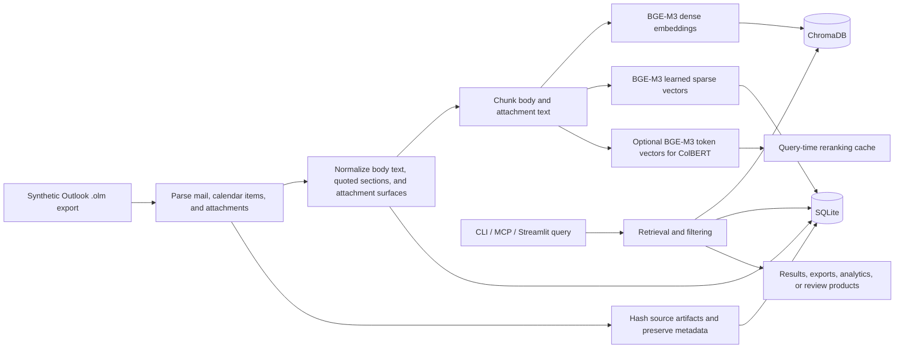
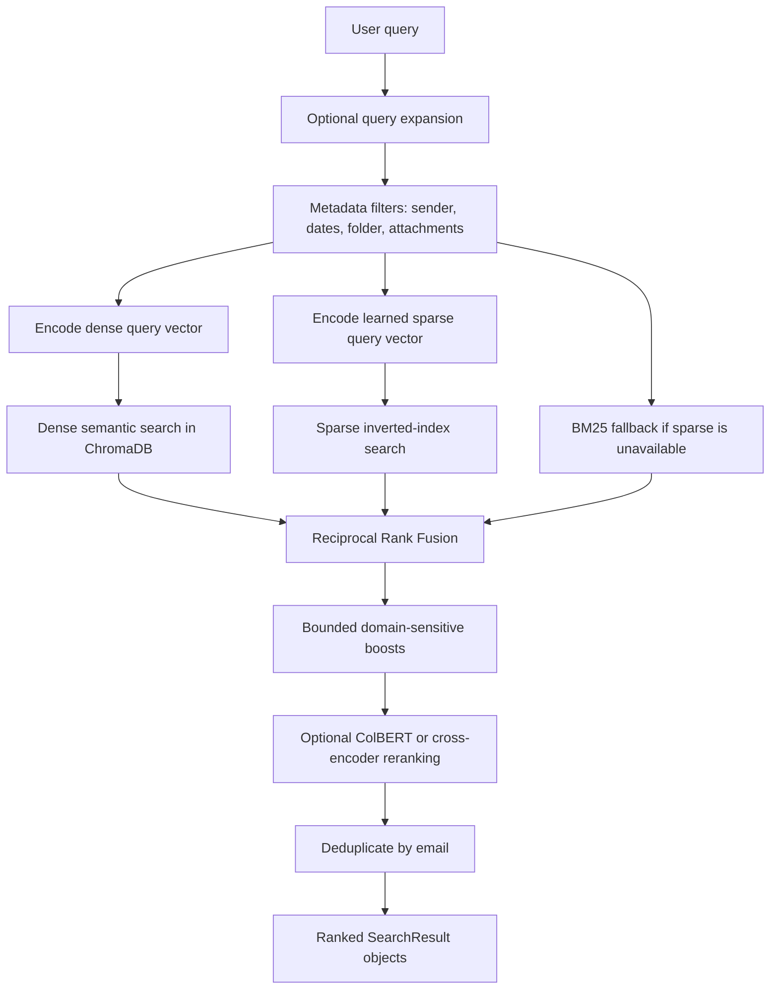
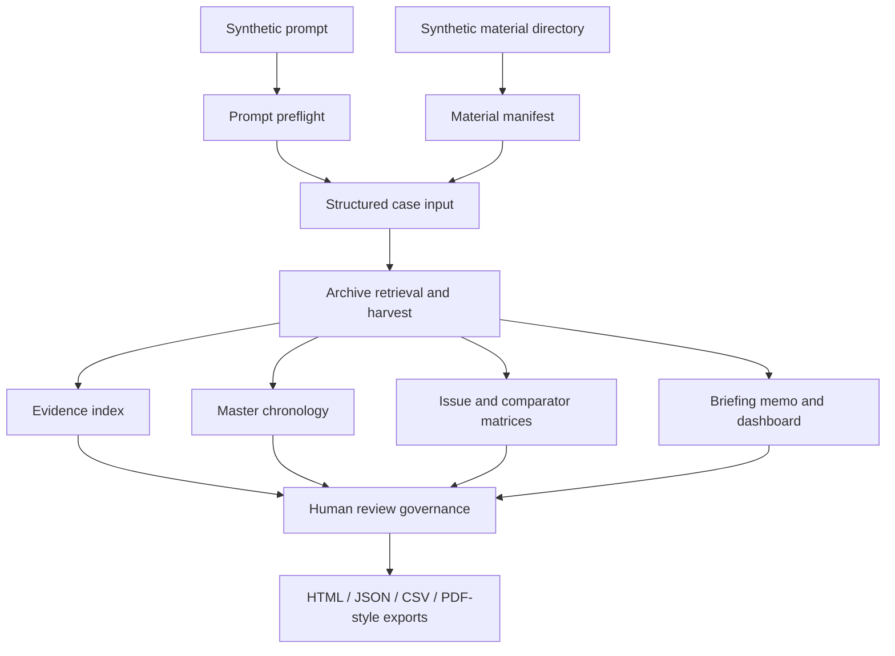
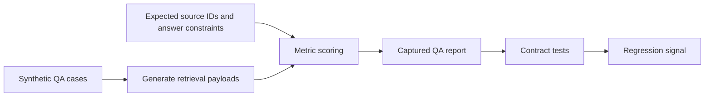

# Email RAG: Architecture, Retrieval Mathematics, and Evaluation Methodology

Email RAG is a local-first retrieval and analysis system for Outlook `.olm`
archives. It parses exported mail, normalizes message and attachment text, builds
search indexes, and exposes the result through a command-line interface, an MCP
server, and an exploratory Streamlit application.

The repository is designed for three related tasks:

- finding and inspecting messages when exact wording is unknown
- exporting threads, evidence, analytics, and reports from a local archive
- running structured, evidence-bounded review workflows over synthetic or local
  case material

All examples in this document are synthetic. The example mailbox belongs to a
role account, `researcher@example.test`; all other actors use reserved
`example.test` addresses. The example organization is the generic
`Example Research Unit`.

## Source Standard

The mathematical descriptions below are intentionally tied to primary or
project-official sources:

- BM25 is grounded in Robertson and Zaragoza's probabilistic relevance
  framework.
- ColBERT-style late interaction is grounded in Khattab and Zaharia's MaxSim
  retrieval model.
- BGE-M3 behavior is grounded in the BGE-M3 paper and the official BGE
  documentation for dense, sparse, multi-vector, and hybrid scoring.
- ChromaDB behavior is grounded in the official Chroma collection and query
  documentation.
- MCP behavior is grounded in the Model Context Protocol tools specification.
- Outlook `.olm` export behavior is grounded in Microsoft Support's Outlook for
  Mac export documentation.
- spaCy entity extraction is described as statistical NER, consistent with
  spaCy's own usage documentation.

These sources justify the retrieval mechanics and interface descriptions. They
do not make any case-specific output true; truth still depends on archive
completeness, provenance, quote verification, and human review.

## System Overview

The system keeps two complementary stores:

- ChromaDB stores dense text vectors for semantic nearest-neighbor search.
- SQLite stores message metadata, normalized body text, sparse vectors,
  attachments, entities, analytics, evidence state, provenance, and workflow
  outputs.



The runtime can be used directly by a human operator:

```bash
email-rag search "budget approval after March review" --hybrid --rerank
email-rag browse --sender alice@example.test
email-rag analytics stats
```

The same runtime can be exposed to an MCP client. In that mode, the client calls
typed tools such as `email_search_structured`, `email_deep_context`,
`email_answer_context`, `evidence_add`, and the structured case-review tools.

## Synthetic End-to-End Example

Assume a research operator exports an Outlook archive from
`Example Research Unit`. The synthetic archive contains:

- project update threads between `researcher@example.test` and
  `reviewer@example.test`
- budget approvals from `finance@example.test`
- calendar invitations for review meetings
- attachments such as `budget-plan.pdf` and `attendance-summary.csv`
- a synthetic case prompt describing a disputed assignment change

The operator first ingests the archive:

```bash
email-rag-ingest private/ingest/example-export.olm
email-rag analytics stats
email-rag admin diagnostics
```

She then searches for a budget decision:

```bash
email-rag search "budget approval after March review" --hybrid --rerank
```

The query flows through semantic retrieval, keyword or sparse retrieval, rank
fusion, optional reranking, metadata filtering, and per-email deduplication. A
strong result can be inspected as a full thread, exported, or promoted into an
evidence item with an exact quote. For a structured review, the operator can
provide a synthetic prompt plus material directory and run the case workflow:

```bash
email-rag case prompt-preflight --prompt-file examples/synthetic_case_prompt.md
email-rag case full-pack --prompt-file examples/synthetic_case_prompt.md --materials-dir examples/materials
```

The output is not a proof of truth. It is a reproducible, provenance-aware
analysis bundle that identifies support, gaps, contradictions, and reviewable
evidence.

## Retrieval Pipeline



### Dense Semantic Search

Dense retrieval maps a query and each text chunk into a continuous vector space:

```text
q = f_theta(x_q),    d_i = f_theta(x_i),    q, d_i in R^m
```

`f_theta` is the configured embedding model, normally BGE-M3. ChromaDB returns
nearest neighbors with a distance value `delta_i`. The public result score uses
the repository convention:

```text
s_i = clip(1 - delta_i, 0, 1)
```

This score is a relevance signal, not a probability of factual truth. It is most
useful for ranking candidates inside the same retrieval run. It should not be
interpreted as calibrated evidence strength across unrelated runs, model
versions, or indexes.

Dense vectors are useful because semantically related phrases can be close even
when they share few surface tokens. For example, a query about "approval after
the review" can retrieve a chunk saying "the committee accepted the proposal
following the March meeting."

### Learned Sparse Retrieval

When the FlagEmbedding BGE-M3 backend is available and sparse retrieval is
enabled, the same model family also emits learned sparse lexical weights:

```text
v(x) in R^|V|,    v_t(x) >= 0
```

The sparse index stores non-zero weights in SQLite and builds an in-memory
inverted index. Query-time sparse scoring is a raw dot product:

```text
s_sparse(q, d) = sum_{t in supp(q) cap supp(d)} w_{q,t} w_{d,t}
```

This favors chunks that share high-value lexical evidence with the query. It is
especially useful for identifiers, short phrases, attachment names, rare terms,
and issue-specific vocabulary that dense embeddings can blur.

The sparse score is not on the same scale as dense distance. That is why the
hybrid pipeline fuses ranks rather than directly adding dense and sparse
scores.

### BM25 Fallback

If learned sparse retrieval is unavailable, the repository can build a BM25
keyword index from ChromaDB documents. For a query term `t` and document `d`,
BM25 has the form:

```text
BM25(q, d) = sum_{t in q} IDF(t) *
    (tf(t,d) * (k_1 + 1)) /
    (tf(t,d) + k_1 * (1 - b + b * |d| / avgdl))
```

where:

- `tf(t,d)` is term frequency in document `d`
- `IDF(t)` downweights terms common across the archive
- `|d| / avgdl` normalizes for document length
- `k_1` and `b` control saturation and length normalization

The implementation adds conservative morphology variants for German compound
and inflection patterns. These variants are recall aids. They do not prove
semantic equivalence; they increase the chance that plausible lexical matches
enter the candidate set.

### Reciprocal Rank Fusion

Hybrid search combines semantic and lexical rankings using Reciprocal Rank
Fusion:

```text
RRF(d) = sum_j 1 / (k + rank_j(d))
```

The implementation uses the standard smoothing constant `k = 60`. RRF is robust
because it depends on ordinal rank rather than raw score magnitude. This matters
because dense distance, sparse dot product, and BM25 scores live on different
scales. A chunk that appears high in both semantic and lexical lists receives a
strong fused rank; a keyword-only result can still be recovered when semantic
search misses it.

### ColBERT MaxSim Reranking

ColBERT reranking compares query and document at token-vector level. For query
token vectors `q_i` and document token vectors `d_j`, the implemented MaxSim
score is:

```text
S(q, d) = (1 / |q|) * sum_i max_j cos(q_i, d_j)
```

Each query token finds its best matching document token. Averaging those maxima
gives a high-precision relevance signal. This is useful when a result must match
specific terms, compound words, or evidence-bearing phrases rather than only the
overall topic.

The ColBERT path uses the same BGE-M3 family as the dense and sparse paths. It
therefore adds query-time precision without requiring a separate reranking model.

### Cross-Encoder Reranking

The alternative reranker jointly scores `(query, document)` pairs:

```text
z_i = g_phi(q, d_i)
p_i = 1 / (1 + exp(-z_i))
delta_i = 1 - p_i
```

The cross-encoder can be more precise than a bi-encoder because the query and
candidate text interact inside the model. The tradeoff is cost: each candidate
pair must be scored separately, so it is normally applied only to a bounded
candidate set.

## Entity, Language, and Analytics Layer

Entity extraction has two paths:

- deterministic regex extraction for URLs, email addresses, phone numbers, and
  mentions
- optional spaCy NER for people, organizations, locations, money expressions,
  and events

spaCy entities and regex entities are merged by normalized identity:

```text
key(e) = (entity_type(e), normalized_form(e))
```

This is deliberately conservative. Regex handles exact structured tokens well;
NER adds typed spans where a statistical language model is available. The
fallback is explicit: if spaCy or its language models are absent, regex
extraction still works.

Language detection is lightweight and stopword-based. It is useful for routing
and diagnostics, especially on medium or long texts. It is less reliable for
short, quoted, formulaic, or mixed-language messages. The system records
confidence metadata so downstream workflows can treat weak language signals as
operational hints rather than ground truth.

## Structured Review Workflow



The structured review workflow is intentionally bounded. It can organize
records, surface contradictions, quote evidence, and identify missing documents.
It cannot infer facts that are absent from the archive. Strong outputs therefore
combine:

- source identifiers and provenance
- direct quote verification when possible
- explicit distinction between direct retrieval support and expanded thread or
  attachment context
- overclaim guards for ambiguous or weak evidence
- human review state before external use

## Evaluation Methodology



The QA evaluator scores outputs against labeled synthetic cases. Important
metrics include:

```text
precision = TP / (TP + FP)
recall    = TP / (TP + FN)
hit@k     = 1 if any expected support appears in the top k candidates else 0
```

For evidence-grounded answers, the system also tracks support-source recall,
quote attribution coverage, product completeness, and overclaim-guard matches.
These metrics answer different questions:

- Top-1 correctness: did the first result identify the intended source?
- Support hit at top 3: did the retrieval set contain a known support source
  near the top?
- Evidence precision: how much of the returned candidate set is expected
  support?
- Grounding recall: how much required support appears in the generated product?
- Overclaim-guard match: did the output avoid stronger conclusions than the
  evidence permits?

These measurements are reliable in the engineering sense: they are repeatable,
contract-tested, and traceable to labeled synthetic fixtures. They do not make a
retrieved statement true. They make the system's retrieval and synthesis
behavior auditable.

Formally, a metric value is only interpretable relative to a fixture set
`F = {(q_i, S_i, C_i)}` containing a question `q_i`, expected support sources
`S_i`, and answer constraints `C_i`. The measured recall estimate is:

```text
recall_hat(F) = (1 / |F|) * sum_i |retrieved_k(q_i) cap S_i| / |S_i|
```

Its validity is therefore conditional on fixture representativeness. It is a
regression and comparability measure for this system, not a universal statement
about all possible mail archives.

## Why the Values Are Trustworthy, and Where They Are Not

The strongest reliability signal is agreement between independent mechanisms:

```text
confidence_pattern(d) =
    dense_rank_high(d)
    + lexical_rank_high(d)
    + rerank_rank_high(d)
    + source_verification(d)
    + quote_verification(d)
```

This expression is conceptual rather than a hidden scalar in the code. It
captures the operating principle: a candidate supported by semantic similarity,
lexical overlap, reranking, provenance, and exact quote verification is more
actionable than one supported by only one weak signal.

The system is most reliable when:

- the archive is complete enough for the question
- the relevant messages have recoverable body or attachment text
- dense and sparse retrieval agree
- reranking preserves the same top candidates
- exact quotes can be verified against stored text
- QA fixtures exercise the same feature path

The system is less reliable when:

- source exports are incomplete
- attachments are missing, encrypted, image-only, or OCR-degraded
- the query relies on implied context outside the archive
- messages are extremely short or heavily quoted
- thread inference must rely on weak headers
- model weights, runtime profile, or index state changed since the last run

The correct interpretation is therefore evidential, not absolute. Email RAG
provides a reproducible retrieval and analysis substrate. It improves the chance
that relevant records are found, quoted, and reviewed consistently. It does not
replace human judgment, source inspection, or domain-specific review.

## References

- Robertson, S. E., and Zaragoza, H. "The Probabilistic Relevance Framework:
  BM25 and Beyond." Foundations and Trends in Information Retrieval, 2009.
  <https://www.nowpublishers.com/article/Details/INR-019>
- Khattab, O., and Zaharia, M. "ColBERT: Efficient and Effective Passage Search
  via Contextualized Late Interaction over BERT." SIGIR 2020 / arXiv:2004.12832.
  <https://arxiv.org/abs/2004.12832>
- Chen, J., Xiao, S., Zhang, P., Luo, K., Lian, D., and Liu, Z.
  "M3-Embedding: Multi-Linguality, Multi-Functionality, Multi-Granularity Text
  Embeddings Through Self-Knowledge Distillation." arXiv:2402.03216.
  <https://arxiv.org/abs/2402.03216>
- BAAI. "BGE-M3." Official BGE documentation.
  <https://bge-model.com/bge/bge_m3.html>
- Chroma. "Adding Data to Chroma Collections" and "Query and Get."
  <https://docs.trychroma.com/docs/collections/add-data> and
  <https://docs.trychroma.com/docs/querying-collections/query-and-get>
- Model Context Protocol. "Tools." Official MCP specification.
  <https://modelcontextprotocol.io/specification/draft/server/tools>
- Microsoft Support. "Export items to an archive file in Outlook for Mac."
  <https://support.microsoft.com/en-us/office/export-items-to-an-archive-file-in-outlook-for-mac-281a62bf-cc42-46b1-9ad5-6bda80ca3106>
- spaCy. "Linguistic Features: Named Entity Recognition." Official usage
  documentation. <https://spacy.io/usage/linguistic-features>
