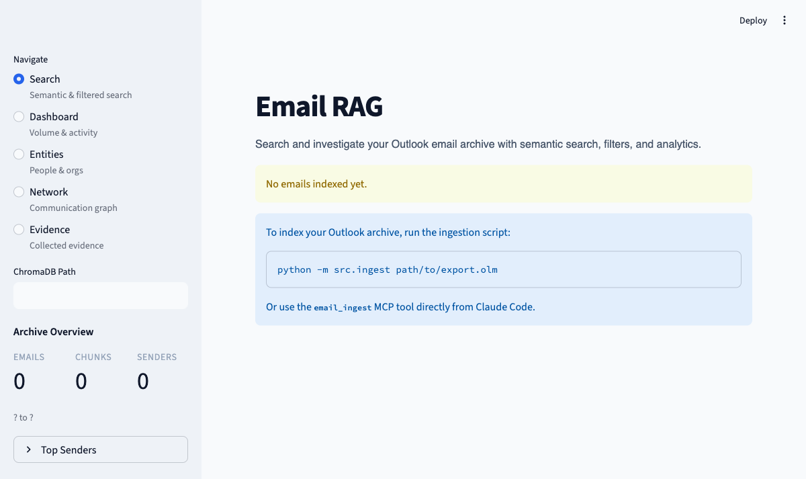
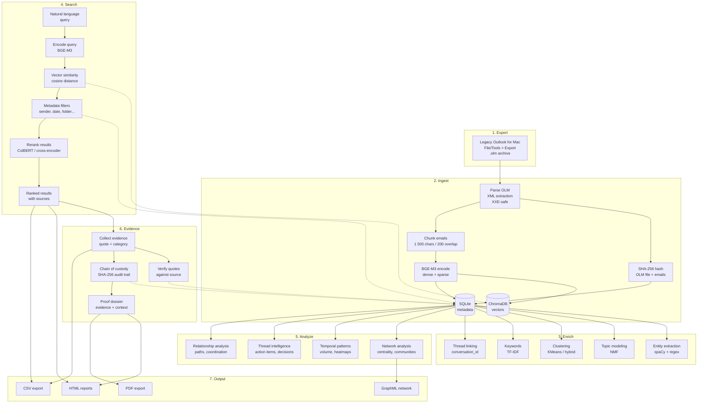

# Usage And Operations

This is the canonical operations guide for Email RAG. Use it after reading the top-level [README.md](../README.md) when you need configuration detail, runtime layout rules, troubleshooting steps, or go-live hygiene.

For the system architecture, retrieval mathematics, evaluation methodology, and
a fully synthetic end-to-end example, see
[ARCHITECTURE_AND_METHODS.md](ARCHITECTURE_AND_METHODS.md).

## Use The Right Surface

| Surface | Best use | Best-practice note |
| --- | --- | --- |
| CLI | repeatable local commands, exports, diagnostics, operator workflows | start here when you want deterministic command output and saved artifacts |
| MCP | assistant-driven search and structured tool orchestration | use when your MCP client should choose the right tools automatically |
| Streamlit | exploratory search, browsing, network, evidence inspection | keep it exploratory; counsel-ready analytical output still belongs to CLI or MCP legal-support workflows |

## First-Run Expectations

- Email content stays local, but first-run model loading may contact Hugging Face to download or validate cached model weights.
- A large archive may take hours to ingest on smaller Apple Silicon systems.
- Re-running ingest is safe and skips already-indexed content.
- HTML export is the safest baseline. PDF export may depend on optional runtime support in your environment.
- `email_admin(action="diagnostics")` is the fastest way to confirm what runtime profile, backend, and limits are actually active.

## Environment Bootstrap

Start from a clean virtual environment:

```bash
python3 -m venv .venv
source .venv/bin/activate
python -m pip install --upgrade pip
pip install -e .
# or: pip install -e .[dev]
```

Use `pip install -e .[dev]` when you also want the repo verification tools such as `pytest`, `ruff`, `mypy`, `bandit`, and `pip-audit`.

If attachment OCR matters, make sure the local OCR binaries exist before relying on OCR-related environment variables:

- `tesseract`
- `pdftoppm` for scanned PDF OCR fallback

## CLI

A standalone terminal interface for searching and analyzing your email archive — no MCP client required.

```bash
# Interactive mode
email-rag

# Single query
email-rag search "Q3 budget" --sender finance --rerank

# Analytics
email-rag analytics volume month

# Root-level flags can come before the subcommand
email-rag --log-level INFO analytics heatmap
```

Module entry points remain fully supported:

```bash
python -m src.cli --help
python -m src.ingest --help
```

Supports 8 subcommand groups (`search`, `browse`, `export`, `case`, `evidence`, `analytics`, `training`, `admin`). See [docs/CLI_REFERENCE.md](docs/CLI_REFERENCE.md) for the full reference.
Temporal analytics bucket timestamps in `ANALYTICS_TIMEZONE` (default: local system timezone). Set an IANA zone such as `Europe/Berlin` to make charts and heatmaps use one explicit display timezone.
Topic filters and `email_topics` remain present in the codebase, but the default ingest workflow does not populate topic tables yet.

---

## Streamlit Web UI

A visual search interface that runs in your browser. This is the exploratory GUI for search, analytics, network, and evidence browsing. Counsel-ready legal-support review still belongs to the CLI or MCP `case full-pack` / `case counsel-pack` workflows.



### Starting the UI

```bash
source .venv/bin/activate
streamlit run src/web_app.py
```

Then open [http://localhost:8501](http://localhost:8501) in your browser.

### Features

- **Search form** with fields for query, sender, subject, folder, CC, and To
- **Has-attachments** checkbox filter
- **Date pickers** for start and end dates
- **Relevance threshold** slider (0.0–1.0)
- **Advanced search options**: hybrid search (semantic + keyword), re-ranking (ColBERT or cross-encoder), and query expansion
- **Sort options**: by relevance, newest/oldest, or sender A-Z
- **Paginated results** (20 per page) with email type and attachment badges
- **Thread view** button to explore full conversation threads
- **CSV export** of search results
- **Folder sidebar** showing all folders with email counts
- **Empty-state guidance** when no emails are indexed yet

---

## Configuration

Create a `.env` file in the project root to override defaults (all settings are optional):

```bash
# .env
CHROMADB_PATH=private/runtime/current/chromadb  # active private runtime vector store
SQLITE_PATH=private/runtime/current/email_metadata.db  # active private runtime metadata DB
EMBEDDING_MODEL=BAAI/bge-m3                     # local embedding model (1024-d, 100+ languages)
COLLECTION_NAME=emails                          # ChromaDB collection name
TOP_K=10                                        # default number of results
LOG_LEVEL=INFO                                  # INFO or DEBUG
DEVICE=auto                                     # auto | mps | cuda | cpu
RUNTIME_PROFILE=quality                         # balanced | quality | low-memory | offline-test
EMBEDDING_LOAD_MODE=auto                        # auto | local_only | download
RERANK_MODEL=BAAI/bge-reranker-v2-m3  # reranking model (multilingual, BGE-M3 aligned)

# `quality` already enables hybrid search, reranking, sparse retrieval, and ColBERT.
# Uncomment any of the following only when you intentionally want to override the profile:
# RERANK_ENABLED=false
# HYBRID_ENABLED=false
# SPARSE_ENABLED=false
# COLBERT_RERANK_ENABLED=false

EMBEDDING_BATCH_SIZE=0             # 0 = auto-detect (MPS: 32, CUDA: 32, CPU: 16)
MPS_CACHE_CLEAR_ENABLED=0          # opt-in; some Torch/MPS stacks crash on empty_cache()
MPS_CACHE_CLEAR_INTERVAL=1         # only used when MPS_CACHE_CLEAR_ENABLED=1

# Ingestion performance tuning (Apple Silicon)
INGEST_BATCH_COOLDOWN=1            # seconds between batches (2 = stronger thermal protection)
INGEST_WAL_CHECKPOINT_INTERVAL=10  # checkpoint SQLite WAL every N batches
```

Copy `.env.example` as a starting point: `cp .env.example .env`

Use tracked `data/` only for sanitized demos, fixtures, and checked-in examples. Keep real Outlook exports in `private/ingest/` and point live operator runs at `private/runtime/current/...`.

For runtime profiles, offline/cache-only model loading, Apple Silicon guidance, and detailed performance notes, see [docs/RUNTIME_TUNING.md](docs/RUNTIME_TUNING.md).

### Recommended workspace layout

```text
<repo-root>/
├── private/
│   ├── ingest/
│   │   └── example-export.olm
│   ├── runtime/
│   │   └── current/
│   │       ├── chromadb/
│   │       └── email_metadata.db
│   ├── files/
│   └── matter.md
├── data/
│   └── ... sanitized examples only ...
└── tests/fixtures/
    └── ... sanitized fixtures only ...
```

Best-practice rules:

- Keep live archives, case files, and runtime state in `private/`.
- Keep tracked `data/` and `tests/fixtures/` sanitized.
- Export defaults write below `private/exports/`; output paths must resolve inside allowlisted roots and must not overwrite existing files.
- Extend output roots explicitly with `EMAIL_RAG_ALLOWED_OUTPUT_ROOTS` when you need to write outside the default allowlist.
- Treat `private/runtime/current/` as the stable active runtime contract for operator use.

### Clean Ingest Reset

Use the dedicated reset script when you want a genuinely fresh ingestion baseline without stale runtime or generated-case artifacts, while still preserving the live case inputs.

```bash
# Inspect what would be removed
bash scripts/clean_ingest_reset.sh --dry-run

# Execute the destructive reset
bash scripts/clean_ingest_reset.sh --yes
```

The reset preserves:

- `private/files/`
- `private/matter.md`
- `private/ingest/example-export.olm`
- `private/README.local.md`
- `private/tests/materials/`

It purges:

- `private/runtime/` runtime stores, run history, ledgers, and lock files
- generated outputs under `private/tests/results/` and `private/tests/exports/`
- stale runtime DB / Chroma leftovers under `data/`
- root scratch files such as `tmp_*.txt`

After the purge, the script recreates empty `private/runtime/current/`, `private/tests/results/`, and `private/tests/exports/` directories so the next clean ingest can start immediately.

### Go-live checklist

Before relying on the runtime for serious operator or counsel-handoff work:

1. Confirm `CHROMADB_PATH` and `SQLITE_PATH` resolve under `private/runtime/current/` for live runs.
2. Run `email-rag analytics stats` or the equivalent MCP diagnostics to confirm the archive is populated.
3. Run `email-rag admin diagnostics` or `email_admin(action="diagnostics")` and review the resolved runtime profile, device, and budgets.
4. Decide whether the environment may download model weights. If not, set `RUNTIME_PROFILE=offline-test` and `EMBEDDING_LOAD_MODE=local_only`.
5. Verify output destinations before exporting, especially if you extended `EMAIL_RAG_ALLOWED_OUTPUT_ROOTS`.
6. Review generated HTML/PDF/CSV/JSON artifacts manually before sharing them outside your local machine.

### Recommended evidence-heavy ingest and case workflow

For a German-heavy, attachment-relevant local matter run:

```bash
export CHROMADB_PATH=private/runtime/current/chromadb
export SQLITE_PATH=private/runtime/current/email_metadata.db
export RUNTIME_PROFILE=quality
export EMBEDDING_LOAD_MODE=auto
export ATTACHMENT_OCR_LANG=deu+eng
export ATTACHMENT_PDF_OCR_MAX_PAGES=10
export ATTACHMENT_OCR_PSM=6
```

Recommended sequence:

1. Reset deliberately.

```bash
python -m src.ingest --reset-index --yes \
  --sqlite-path "$SQLITE_PATH" \
  --chromadb-path "$CHROMADB_PATH"
```

Use `bash scripts/clean_ingest_reset.sh --yes` instead when you also want stale runtime artifacts, exports, and generated-case outputs removed.

2. Run one full ingest.

```bash
python -m src.ingest private/ingest/latest-export.olm \
  --sqlite-path "$SQLITE_PATH" \
  --chromadb-path "$CHROMADB_PATH" \
  --extract-attachments \
  --embed-images \
  --extract-entities \
  --timing
```

3. Run degraded-attachment recovery only when scanned or degraded attachments matter.

```bash
python -m src.ingest private/ingest/latest-export.olm \
  --sqlite-path "$SQLITE_PATH" \
  --chromadb-path "$CHROMADB_PATH" \
  --reprocess-degraded-attachments \
  --force
```

4. Skip `--reingest-analytics` and `--reextract-entities --force` on a fresh successful ingest unless you are backfilling an older runtime or repairing a known ingest defect.

5. Build a reusable strict `case.json` from `case prompt-preflight`, then keep `case gather-evidence` and `case full-pack` aligned from that same curated source.

```bash
python -m src.cli case prompt-preflight \
  --input private/matter.md \
  --output private/cases/preflight.json \
  --output-language de

python scripts/prepare_case_inputs.py \
  --preflight private/cases/preflight.json \
  --case-json-out private/cases/case.json
```

That generated `case.json` preserves any heading-based factual matter text from `private/matter.md` in `matter_factual_context`. It also carries forward bounded structured `context_people` and `institutional_actors` when `private/matter.md` explicitly lists named people, mailboxes, or workflow surfaces. The helper normalizes the readable top-level preflight mirrors back into the canonical machine payload, so curated edits to `draft_case_scope`, `recommended_source_scope`, or top-level `matter_factual_context` are preserved in the emitted `case.json`.

Edit `private/cases/case.json` with the operator-verified `trigger_events`, `alleged_adverse_actions`, comparator facts, and role hints. Unknown human email addresses may still remain `null`; explicit shared mailboxes and routing surfaces are tracked separately under `institutional_actors`.

6. Run durable evidence harvest from that curated `case.json`.

```bash
python -m src.cli case gather-evidence \
  --input private/cases/case.json \
  --run-id run_2026_04_18 \
  --phase-id phase_1 \
  --scan-id-prefix matter-2026-04 \
  --output private/results/evidence-harvest.json \
  --harvest-limit-per-wave 24 \
  --promote-limit-per-wave 6 \
  --include-payloads

python -m src.cli evidence verify --sqlite-path "$SQLITE_PATH"
```

7. Reuse that same curated structure for full-pack by generating matching overrides.

```bash
python scripts/prepare_case_inputs.py \
  --case-json private/cases/case.json \
  --overrides-out private/cases/full_pack_overrides.json

python -m src.cli case full-pack \
  --prompt private/matter.md \
  --materials-dir private/files \
  --overrides private/cases/full_pack_overrides.json \
  --output-language de \
  --translation-mode source_only \
  --default-source-scope mixed_case_file \
  --privacy-mode full_access \
  --delivery-target counsel_handoff_bundle \
  --delivery-format bundle \
  --compile-only
```

Best-practice note:

- Do not curate `private/cases/case.json` and then switch back to `case full-pack` from `private/matter.md` alone. Pass `--overrides` or use `case counsel-pack` with a curated structured scope so the exhaustive run sees the same repaired triggers, adverse actions, and source-scope decisions that drove evidence harvest.
- Treat `private/cases/case.json` as the canonical reusable structured intake. Preflight remains the review surface; `scripts/prepare_case_inputs.py` is the normalization bridge that keeps `case.json` and `full_pack_overrides.json` aligned.

---

## Troubleshooting

### "No emails found" after ingesting

Check that ingestion completed successfully:

```bash
python -m src.cli --stats
```

If total is 0, try re-running ingest with verbose output:

```bash
LOG_LEVEL=DEBUG python -m src.ingest private/ingest/example-export.olm --max-emails 50
```

### MCP tools not appearing in your client

1. Make sure the client is launching the project-local server command
2. Check that the virtual environment was created: `ls .venv/bin/python`
3. Reload the MCP server in the client and look for `email_search`
4. If it shows as disconnected, check that the configured command points at this repo's `.venv/bin/python`

### Import errors when running ingest

Make sure the virtual environment is active:

```bash
source .venv/bin/activate
python -m src.ingest --help
```

### Ingest is slow

This is expected — each chunk requires a full BGE-M3 forward pass. The upstream
BGE documentation lists `BAAI/bge-m3` at 569M parameters and about 2.27 GB.
On Apple M4 with MPS, local measurements in this repo have shown roughly
**5 chunks/s initially, settling to ~3 chunks/s** after sustained load. A
mailbox with 20,000 emails (~47K chunks) takes roughly **4 hours** on the
documented M4/16GB baseline.

**First run** is the slowest because Hugging Face may download or validate the
model weights when `EMBEDDING_LOAD_MODE` allows network access. Subsequent runs
load from the local cache when the weights are present.

If throughput degrades over time (first batches fast, later batches slow), this
is usually sustained-load behavior on Apple Silicon rather than an ingest logic
defect. Mitigations:

```bash
# Add to .env — 1 second is the current default; 2 seconds gives stronger thermal protection
INGEST_BATCH_COOLDOWN=2
```

To diagnose throughput, each batch now logs the encode/write split:

```
Stored 500 chunks (102.3s total: encode=78.1s, chromadb=24.2s, 5 chunks/s)
```

Use `--timing` for a full phase breakdown (parse, embed, sqlite, entities, analytics):

```bash
python -m src.ingest private/ingest/example-export.olm --timing
```

See [Performance & Hardware](#performance--hardware) for detailed benchmarks and tuning options.

## Architecture

```mermaid
block-beta
    columns 4

    block:inputs["Inputs"]:1
        olm["Outlook .olm"]
        files["Supplied matter files"]
    end

    block:processing["Processing"]:1
        parse["Parse + normalize"]
        enrich["Entities, threads,\nanalytics, evidence"]
        legal["Manifest-backed\nlegal-support products"]
    end

    block:storage["Storage"]:1
        chromadb[("ChromaDB vectors")]
        sqlite[("SQLite metadata,\nevidence, custody")]
    end

    block:interfaces["Interfaces"]:1
        cli["CLI"]
        mcp["MCP server\n68 tools"]
        ui["Streamlit\nexploratory UI"]
        export["HTML / PDF / CSV /\nJSON / bundle exports"]
    end

    olm --> parse
    files --> legal
    parse --> enrich
    parse --> chromadb
    parse --> sqlite
    enrich --> sqlite
    sqlite --> legal
    chromadb --> cli
    sqlite --> cli
    chromadb --> mcp
    sqlite --> mcp
    sqlite --> ui
    legal --> export
```



**Component responsibilities:**

| Area | Current structure |
|------|-------------------|
| Ingest and normalization | `src/ingest.py`, `src/ingest_pipeline.py`, `src/ingest_embed_pipeline.py`, `src/ingest_reingest.py`, `src/parse_olm*.py`, `src/chunker.py`, `src/attachment_*.py` |
| Retrieval and ranking | `src/retriever*.py`, `src/result_filters.py`, `src/query_expander.py`, `src/bm25_index.py`, `src/multi_vector_embedder.py` |
| SQLite metadata and evidence | `src/email_db.py`, `src/email_db_persistence.py`, `src/db_*.py`, `src/db_schema*.py` |
| Case-analysis and legal-support workflows | `src/case_*.py`, `src/matter_*.py`, `src/master_chronology*.py`, `src/lawyer_issue_matrix.py`, `src/document_request_checklist.py`, `src/skeptical_employer_review.py`, `src/promise_contradiction_analysis.py` |
| MCP surfaces | `src/mcp_server.py`, `src/mcp_models*.py`, `src/tools/` |
| CLI surfaces | `src/cli.py`, `src/cli_parser.py`, `src/cli_commands*.py`, packaged entry points `email-rag` and `email-rag-ingest` |
| Web UI | `src/web_app.py`, `src/web_app_pages.py` |
| Exports and reporting | `src/report_generator.py`, `src/dossier_generator.py`, `src/legal_support_exporter.py`, `src/controlled_factual_drafting.py` |
| Analytics and interpretation | `src/language_detector*.py`, `src/writing_analyzer.py`, `src/cross_message_patterns.py`, `src/actor_resolution.py`, `src/actor_witness_map.py` |

---

## Data Lifecycle



**Deduplication:** Each chunk has a stable ID derived from the email's `message_id` header (or a hash of subject + date + sender as fallback). Re-running ingest skips chunks that are already stored.

**Chain of custody:** Every ingestion, evidence addition, and modification is logged with SHA-256 content hashes, timestamps, and actor identity in the `custody_chain` SQLite table.

---

## Performance & Hardware

The default model is [BAAI/bge-m3](https://huggingface.co/BAAI/bge-m3). Inference runs on-device using Apple Metal (MPS), NVIDIA CUDA, or CPU. Email content stays local, but first-run model loading may contact Hugging Face to download or validate cached weights.

For the full runtime guide, see [docs/RUNTIME_TUNING.md](docs/RUNTIME_TUNING.md).

Quick guidance:

- Apple MacBook Air M4 / 16 GB: `DEVICE=auto`, `RUNTIME_PROFILE=quality`, `EMBEDDING_LOAD_MODE=auto`, `EMBEDDING_BATCH_SIZE=0`, `MPS_FLOAT16=false`
- Offline or CI-like runs: `RUNTIME_PROFILE=offline-test`, `EMBEDDING_LOAD_MODE=local_only`
- Diagnostics: use ingestion startup logs or `email_admin(action="diagnostics")` to inspect the resolved runtime state instead of inferring it from `.env`
- Sustained Apple Silicon ingest still slows down over time because of thermal throttling; `INGEST_BATCH_COOLDOWN=1` is the safer default on fanless hardware

---

## Privacy & Security

- **All data stays local.** No email content is sent to any external service.
- **No API keys.** MCP clients read tool results directly — this project does not make provider API calls.
- **Safe XML parsing.** The OLM parser disables external entity resolution (XXE), network access, and resource-exhaustion attacks.
- **Output sanitization.** ANSI escape codes and control characters in email content are stripped before display.
- **Input validation.** All MCP tool inputs are validated with Pydantic before use.

---

## Development

```bash
pip install -r requirements-dev.txt

# or with pip install -e .[dev]

ruff check .          # linting
ruff format --check .
mypy src
pytest -q --tb=short --cov=src --cov-report=term-missing --cov-fail-under=80
python scripts/streamlit_smoke.py
bandit -r src -q -ll -ii
python scripts/dependency_audit.py            # bounded pip-audit wrapper
bash scripts/run_acceptance_matrix.sh local   # developer-local verification; may skip dependency audit if offline
bash scripts/run_acceptance_matrix.sh release # go-live verification; requires a real dependency-audit result
```

See [docs/API_COMPATIBILITY.md](docs/API_COMPATIBILITY.md) for the interface stability policy.

---

## Project Structure

```text
<repo-root>/
├── src/
│   ├── ingest*.py               # ingest, reingest, attachment, and embedding pipelines
│   ├── retriever*.py            # retrieval, ranking, thread, and admin surfaces
│   ├── db_*.py                  # SQLite storage, schema, evidence, custody, analytics
│   ├── case_*.py                # case-intake, campaign, and full-pack workflows
│   ├── matter_*.py              # manifests, evidence index, and file ingestion
│   ├── mcp_server.py            # FastMCP server
│   ├── mcp_models*.py           # MCP and case-analysis input models
│   ├── cli*.py                  # CLI parser and subcommand handlers
│   ├── tools/                   # MCP tool families
│   ├── web_app*.py              # Streamlit UI and pages
│   └── templates/               # export and reporting templates
├── tests/                       # tests grouped gradually by workflow/component family
├── private/                     # ignored local-only mailbox exports, runtimes, and live matter files
│   ├── files/                   # supplied case corpus and dossier
│   ├── ingest/                  # real .olm exports
│   ├── runtime/current/         # stable active private runtime contract
│   └── matter.md                # synthetic matter prompt
├── data/                        # sanitized demos, examples, and checked-in local runtime examples
├── docs/
│   ├── README.md                # docs index
│   ├── README_USAGE_AND_OPERATIONS.md
│   ├── CLI_REFERENCE.md
│   ├── MCP_TOOLS.md
│   ├── API_COMPATIBILITY.md
│   ├── RUNTIME_TUNING.md
│   └── agent/                   # runbooks, contracts, fixtures, goldens, and archives
├── .env.example
├── requirements.txt
├── requirements-dev.txt
├── pyproject.toml
└── CHANGELOG.md
```
