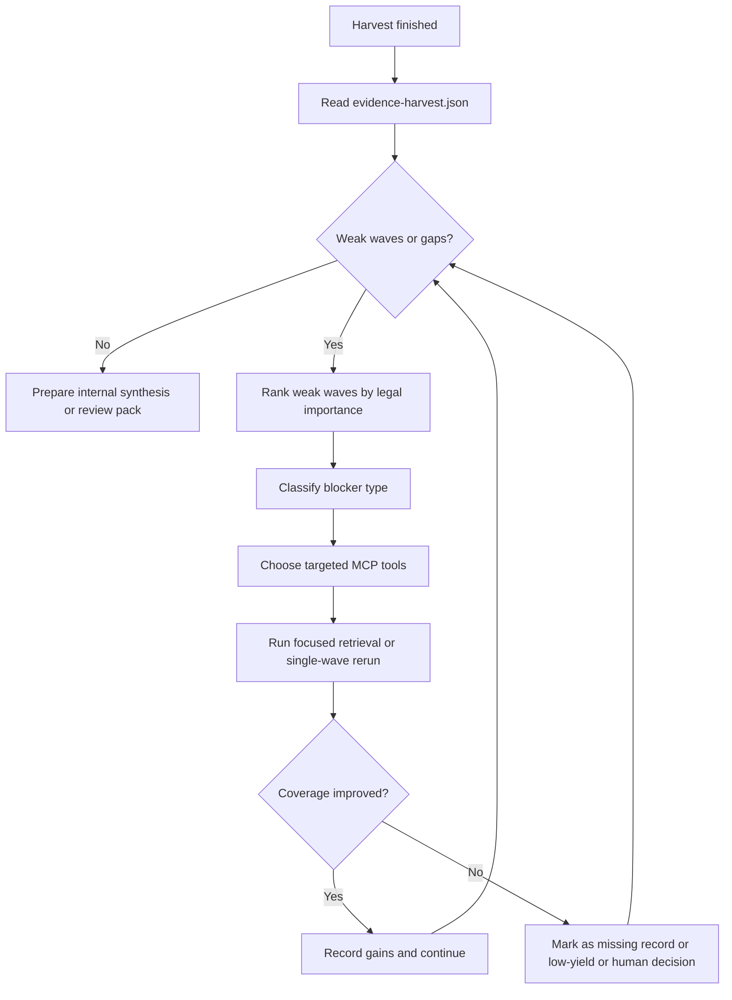

# Post-Harvest Evidence Refinement Manual

Status: `operator-facing`

Purpose:

- define the post-harvest MCP refinement contract after `case gather-evidence` or `email_case_gather_evidence`
- stop the agent from improvising its own evidence-refinement logic
- make wave triage, targeted reruns, evidence review, and internal-only closure repeatable
- provide copy-paste prompts that tell the agent what to do, when to do it, what to ignore, and when to stop

Use with:

- `docs/agent/Plan.md`
- `docs/agent/question_execution_companion.md`
- `docs/agent/question_execution_prompt_pack.md`
- `docs/agent/question_execution_query_packs.md`
- `docs/agent/email_matter_analysis_single_source_of_truth.md`
- `docs/MCP_TOOLS.md`
- `docs/CLI_REFERENCE.md`

## Scope And Boundary

This manual starts only after archive harvest has already been made durable.

It is for:

- post-harvest triage
- weak-wave recovery
- chronology, actor, attachment, and comparator refinement
- internal-only readiness summaries

It is not for:

- first-pass prompt preflight
- replacing `case gather-evidence`
- replacing `email_case_gather_evidence`
- inventing new case scope outside `case.json`
- counsel-facing export before review governance clears the gate

Human-review boundary:

- autonomous internal completion is allowed after harvest
- counsel-facing export remains blocked until persisted review state is `human_verified` or `export_approved`

## Entry Gate

Start this manual only when all of the following are true:

1. `case gather-evidence` or `email_case_gather_evidence` has finished.
2. The durable output exists, normally `private/results/evidence-harvest.json`.
3. The run did not terminate with `db_unavailable` or an equivalent runtime failure.
4. The evidence database contains harvested candidates and any auto-promoted exact quotes that were eligible.

If the harvest is still running, do not start refinement.

## Mandatory Inputs

The agent must read these first:

- the strict case input, usually `private/cases/case.json`
- the completed harvest output, usually `private/results/evidence-harvest.json`
- the active identifiers:
  - `run_id`
  - `phase_id`
  - `scan_id_prefix`
- any operator-verified corrections already applied to the matter:
  - trigger events
  - alleged adverse actions
  - comparator facts
  - role hints
  - institutional actors or mailbox surfaces

The agent should not infer its own scope from free-form recollection when those artifacts already exist.

## Goal Hierarchy

Prioritize evidence refinement in this order:

1. trigger events
2. alleged adverse actions
3. direct evidence involving target person and suspected actors
4. chronology anchors
5. exact verified quotes
6. attachment and documentary support
7. comparator evidence already bounded in `case.json`
8. institutional notice, routing, and mailbox surfaces
9. broader contextual actor discovery

Do not elevate low-signal thematic enrichment above direct case theory support.

## Decision Policy

Use this loop:



This loop is how the agent decides what to do next.

## Trigger Conditions

The agent should act when any of these are true:

- `archive_harvest.coverage_gate.status == "needs_more_harvest"`
- `archive_harvest.quality_gate.status == "weak"`
- `promoted_count` is too low for a legally important wave
- a key actor, date, or attachment surface is absent
- chronology is incomplete around known trigger dates
- comparator evidence is required but thin
- institutional notice path matters and mailbox evidence is weak

The agent should not blindly rerun all waves first.

Prefer:

- targeted retrieval
- `email_case_execute_wave` for one weak wave
- only broader reruns when focused recovery clearly fails

## Focus Priority Rules

### Focus High

- wave has weak coverage
- wave has weak quality
- wave touches known trigger or adverse-action period
- wave involves target-plus-suspected-actor interaction
- wave may contain exact quote candidates
- wave may anchor chronology
- wave may prove institutional notice or routing

### Focus Medium

- actor discovery that could materially change interpretation
- attachments referenced by key mails
- comparator evidence already bounded in the case scope

### Focus Low

- broad thematic enrichment with no direct tie to case theory
- speculative actor discovery
- repetitive near-duplicates
- broad network exploration with no wave-level gap attached

## Blocker Taxonomy And Required Action

Use the documented blocker taxonomy from the live runbook.

### Retrieval mismatch

Symptoms:

- key actors or dates should be present but are missing
- weak recall despite known anchors in the corpus

Required action:

- rewrite the query
- widen or narrow filters
- switch among:
  - `email_search_structured`
  - `email_triage`
  - `email_find_similar`
- rerun immediately before treating the issue as sparse evidence

### Language detection or language-lane mismatch

Symptoms:

- German-dominant matter but English-first retrieval lanes
- `detected_language` drift on short or header-heavy messages

Required action:

- inspect `email_quality(check='languages')`
- sample affected messages
- widen German-native and umlaut or ASCII fallback lanes
- rerun `email_admin(action='reingest_analytics')` if analytics are missing or stale
- rerun the wave step without over-trusting `detected_language`

### Missing context expansion

Symptoms:

- direct hit exists but thread or attachment context is missing
- exact support likely sits in quoted context or attachments

Required action:

- add one or more of:
  - `email_thread_lookup`
  - `email_attachments`
  - `email_deep_context`
  - `email_provenance`
- reassess only after context expansion

### Tool-contract mismatch

Symptoms:

- MCP tool surface and expected schema disagree
- workflow produces structurally invalid output

Required action:

- treat as a repo-side bug
- repair the model, alias, or workflow bug if the execution context allows code fixes
- run targeted verification
- rerun the failed MCP call in the same wave

### Truncation or budget failure

Symptoms:

- wording-sensitive evidence is trimmed away
- deep context arrives but the crucial wording is cut off

Required action:

- repair the payload surface or fallback path
- use `email_export` or a less truncated read path if needed
- rerun the same call and preserve the repaired source anchor

### Runtime or checkpoint issue

Symptoms:

- MCP disconnects
- active runtime drift
- stale checkpoint or corrupted resume state

Required action:

- restart MCP
- reload the latest valid checkpoint if checkpointing is in use
- rerun the failed wave step

### Phase-order or workflow misuse

Symptoms:

- wrong product tool for current evidence state
- trying to skip durable harvest or use counsel export too early

Required action:

- switch to the correct exploratory, campaign, or dedicated product path
- rerun the question on the correct surface

### True external missing record

Symptoms:

- evidence is genuinely absent from the corpus
- repeated focused recovery produces no new support

Required action:

- mark the question or wave as depending on a missing record
- state the exact missing item explicitly
- continue the rest of the refinement sequence

Hard rule:

- no weak-wave refinement loop closes while a locally fixable blocker remains unresolved

## MCP Tool Ladder

Use the smallest tool that can repair the gap.

### Campaign refinement tools

- `email_case_execute_wave`
  - first choice for one weak wave
- `email_case_execute_all_waves`
  - use only if targeted reruns fail or the run state is broadly stale
- `email_case_gather_evidence`
  - use for a new durable harvest pass, not for casual exploration

### Evidence store inspection tools

- `evidence_overview`
- `evidence_query`
- `evidence_verify`
- `evidence_provenance`
- `custody_chain`

### Message-level verification tools

- `email_deep_context`
- `email_export`
- `email_provenance`
- `email_thread_lookup`
- `email_attachments`

### Analytical support tools

- `email_contacts`
- `email_network_analysis`
- `relationship_summary`
- `email_entity_timeline`
- `email_temporal`

Use analytical support only when it helps explain a concrete weak wave or gap. Do not run broad network exploration without a wave-level reason.

## Working Loop

Use this numbered loop after harvest:

1. Read `case.json` and `evidence-harvest.json`.
2. Rank weak waves by legal importance, not by curiosity.
3. Classify the blocker for each weak wave.
4. Choose the smallest MCP action that can repair that blocker.
5. Prefer direct evidence, chronology anchors, and exact quotes before thematic breadth.
6. Measure whether coverage improved.
7. Record gains, unresolved gaps, and true missing records.
8. Move to the next weak wave.
9. Stop when the matter is good enough for internal analysis or when the remaining deficits are human-gated or externally missing.

## Prompt Contract

A good prompt for this agent must always specify:

- goal
- inputs
- priority order
- allowed tools
- decision rules
- stop rules
- output format

## Required Substitutions

Replace these placeholders before use:

- `<case_json_path>`
- `<evidence_harvest_path>`
- `<run_id>`
- `<phase_id>`
- `<scan_id_prefix>`
- `<wave_id>`
- `<focus_surface>`
- `<known_human_corrections>`

## Prompt 1: Post-Harvest Triage

Use this first.

```text
You are the post-harvest evidence refinement operator for this matter.

Goal:
Triage the completed evidence harvest and decide what to refine next.

Inputs:
- <case_json_path>
- <evidence_harvest_path>
- run_id=<run_id>
- phase_id=<phase_id>
- scan_id_prefix=<scan_id_prefix>
- known_human_corrections=<known_human_corrections>

Priority order:
1. trigger events
2. adverse actions
3. direct actor evidence
4. chronology anchors
5. exact verified quotes
6. attachment or documentary support
7. comparators
8. institutional mailbox or notice paths

Allowed tools:
- evidence_overview
- evidence_query
- evidence_verify
- evidence_provenance
- custody_chain
- email_case_execute_wave only if the triage clearly shows a weak wave needs rerun-ready follow-up

Decision rules:
1. Read the harvest summary and rank waves by urgency.
2. Flag every wave where archive_harvest.coverage_gate.status != "pass" or archive_harvest.quality_gate.status == "weak".
3. For each weak wave, classify the blocker as one of:
   - retrieval mismatch
   - language-lane mismatch
   - missing context expansion
   - tool-contract mismatch
   - truncation or budget failure
   - runtime or checkpoint issue
   - phase-order or workflow misuse
   - true external missing record
4. Do not recommend rerunning all waves unless targeted recovery is clearly insufficient.

Stop rules:
- stop once the top weak waves are ranked and the next 3 remediation actions are clear
- do not begin broad reruns inside this triage step

Output format:
- ranked weak-wave list
- blocker classification per wave
- top 3 remediation actions
- stop or go recommendation for further MCP refinement
```

## Prompt 2: Weak-Wave Recovery

Use this after triage.

```text
Refine only the weak waves from the completed evidence harvest.

Goal:
Recover evidence for waves with weak coverage or weak quality without broadening scope beyond the current case input.

Inputs:
- <case_json_path>
- <evidence_harvest_path>
- run_id=<run_id>
- phase_id=<phase_id>
- scan_id_prefix=<scan_id_prefix>

Priority order:
1. trigger events
2. adverse actions
3. direct actor evidence
4. chronology anchors
5. exact verified quotes
6. attachment or documentary support

Allowed tools:
- evidence_query
- evidence_provenance
- email_case_execute_wave
- email_thread_lookup
- email_attachments
- email_deep_context
- email_provenance

Decision rules:
- prefer targeted retrieval and single-wave reruns over full-campaign reruns
- preserve provenance and exact wording
- prioritize exact quoted support over vague thematic matches
- identify whether the missing support is:
  - actually absent from the corpus
  - present but retrieval-missed
  - present only in thread or attachment context
  - present only in institutional mailbox routes
- for each targeted wave:
  1. inspect current harvested evidence and promoted exact quotes
  2. identify the missing legal-support surface
  3. use the smallest MCP action that can repair it
  4. report whether coverage improved measurably

Stop rules:
- stop when the weak wave becomes acceptable for internal analysis
- or when the remaining gap is a true external missing record
- or when further retrieval produces no meaningful gain

Output format:
- wave-by-wave recovery note
- evidence gains
- remaining deficits
- rerun recommendation if any
```

## Prompt 3: Chronology-First Refinement

Use when timeline quality is the main issue.

```text
Reconstruct the strongest defensible chronology for this matter.

Goal:
Repair chronology quality around trigger events, adverse actions, responses, escalations, and institutional notice points.

Inputs:
- <case_json_path>
- <evidence_harvest_path>
- run_id=<run_id>
- phase_id=<phase_id>

Priority order:
1. trigger events
2. adverse actions
3. response sequence
4. escalation sequence
5. institutional notice points
6. attachments or documents that anchor dates

Allowed tools:
- evidence_query
- email_deep_context
- email_thread_lookup
- email_export
- email_provenance
- email_case_execute_wave when a chronology-critical wave remains weak

Decision rules:
- prefer dated, attributable, provenance-stable evidence
- distinguish direct evidence from inferred sequence
- identify missing chronology anchors explicitly
- surface contradictions in dates, summaries, or follow-up actions
- call out where thread expansion or attachments change the chronology materially

Stop rules:
- stop when the chronology is strong enough for internal analysis
- or when the remaining anchors are genuinely external missing records

Output format:
- chronology gaps
- best anchor messages or documents
- contradictions needing human review
- recommended focused follow-up retrieval
```

## Prompt 4: Actor-Focused Refinement

Use when the main issue is people, roles, and mailbox routing.

```text
Refine actor evidence for this matter.

Goal:
Strengthen evidence involving target person, suspected actors, comparators, institutional actors, and mailbox-routing surfaces.

Inputs:
- <case_json_path>
- <evidence_harvest_path>
- run_id=<run_id>
- phase_id=<phase_id>

Priority order:
1. target person
2. suspected actors
3. comparators
4. institutional actors and mailbox surfaces
5. newly discovered actors that materially affect notice, authority, or chronology

Allowed tools:
- evidence_query
- email_deep_context
- email_thread_lookup
- email_contacts
- relationship_summary
- email_case_execute_wave

Decision rules:
- distinguish natural persons from institutional actors
- do not invent human email addresses
- treat shared mailboxes and routing surfaces as separate evidence objects
- look for direct communications, quoted speech, routing evidence, and copied recipients
- identify whether institutional knowledge or notice can be evidenced through mailbox or workflow surfaces

Stop rules:
- stop when actor-specific support is good enough for internal analysis
- or when the unresolved ambiguity requires human identity resolution

Output format:
- actor-specific evidence gains
- strongest direct evidence per actor
- notice or routing evidence through institutional actors
- unresolved role or identity ambiguities
```

## Prompt 5: Attachment And Document Support

Use when body quotes are thin but attachments may matter.

```text
Strengthen documentary support for this matter.

Goal:
Recover attachment and document support that materially strengthens harvested body evidence.

Inputs:
- <case_json_path>
- <evidence_harvest_path>
- run_id=<run_id>
- phase_id=<phase_id>

Priority order:
1. harvested attachment candidates
2. promoted exact quotes needing documentary backup
3. supplied or inferred document references
4. time records, meeting notes, participation records, formal documents, and screenshots

Allowed tools:
- evidence_query
- email_attachments
- email_deep_context
- email_export
- email_provenance
- email_case_execute_wave if a document-heavy wave is still weak

Decision rules:
- prioritize attachments with extractable text and clear provenance
- link attachment evidence back to the triggering wave or question
- distinguish attachment reference from attachment text support
- identify missing documentary support that should remain marked as missing

Stop rules:
- stop when documentary support is sufficient for internal analysis
- or when remaining documents are genuinely absent from the corpus

Output format:
- strongest attachment or documentary supports
- attachment candidates worth promotion
- documentary gaps that remain external missing records
```

## Prompt 6: Comparator Or Unequal-Treatment Refinement

Use only if comparator logic already exists in `case.json`.

```text
Evaluate comparator evidence only within the bounded comparator scope already present in the case input.

Goal:
Strengthen or weaken comparator theory without inventing comparator facts.

Inputs:
- <case_json_path>
- <evidence_harvest_path>
- run_id=<run_id>
- phase_id=<phase_id>

Priority order:
1. same-manager comparators
2. same-process comparators
3. same-timeframe comparators
4. routing and decision differences

Allowed tools:
- evidence_query
- email_deep_context
- email_thread_lookup
- email_contacts
- email_temporal
- email_case_execute_wave when a comparator-heavy wave is weak

Decision rules:
- compare treatment, timing, routing, and decisions
- do not invent comparator facts
- prefer same-manager, same-process, same-timeframe comparisons
- separate real comparators from loose peers
- identify where evidence supports, weakens, or fails comparator claims

Stop rules:
- stop when comparator theory is either sufficiently supported or clearly unsupported within the bounded record
- or when the missing comparator record is external

Output format:
- strongest comparator-backed evidence
- weak assumptions that should not be overstated
- missing comparator records that require human or external follow-up
```

## Prompt 7: Internal Closure Summary

Use after refinement, before any counsel-facing step.

```text
Prepare an internal-only evidence refinement summary.

Goal:
Summarize what is well-supported, what remains weak, and what still requires human review.

Inputs:
- <case_json_path>
- <evidence_harvest_path>
- run_id=<run_id>
- phase_id=<phase_id>

Priority order:
1. direct evidence
2. exact verified quotes
3. chronology anchors
4. attachment or documentary support
5. institutional routing or notice evidence
6. remaining true missing records

Allowed tools:
- evidence_overview
- evidence_query
- evidence_verify
- evidence_provenance
- custody_chain

Decision rules:
- summarize what is now well-supported
- list remaining weak waves
- list true external missing records
- distinguish:
  - exact verified quotes
  - attachment or documentary support
  - thread or context support
  - institutional routing or notice evidence
- do not treat the matter as counsel-exportable
- internal completion is acceptable; counsel export is still human-gated

Stop rules:
- stop after producing an internal readiness summary and human-review priority list

Output format:
- internal readiness summary
- remaining evidence risks
- recommended human review priorities
```

## Stop Conditions

Stop and escalate to a human when:

- repeated reruns do not improve coverage
- evidence is genuinely absent from the corpus
- chronology conflict cannot be resolved from source material
- comparator theory depends on missing records
- identity ambiguity cannot be resolved responsibly from the record
- counsel or export language is requested before review state is `human_verified` or `export_approved`

## What The Agent Must Ignore

Ignore or defer these unless a weak-wave gap directly requires them:

- broad thematic enrichment without case-theory value
- speculative actor discovery
- repetitive near-duplicate messages
- broad network exploration with no concrete refinement target
- counsel-facing phrasing before human review governance clears the export gate

## Practical Three-Step Sequence

Use this sequence for most post-harvest work:

1. Triage prompt
   - rank weak waves and classify blockers
2. One focused refinement prompt
   - chronology, actors, attachments, or comparators depending on triage
3. Internal closure prompt
   - summarize gains, remaining gaps, and human review priorities

This sequence is the cleanest way to make the agent know:

- what to do
- when to do it
- what to ignore
- when to stop

## Completion Standard

The post-harvest refinement loop is complete when all of these are true:

- the highest-value weak waves have been triaged
- locally fixable blockers have been repaired or ruled out
- important chronology, actor, quote, and attachment gaps have been revisited
- true external missing records are explicitly named
- the final summary is framed as internal-only unless review governance has already cleared export

Do not overstate completion beyond those boundaries.
